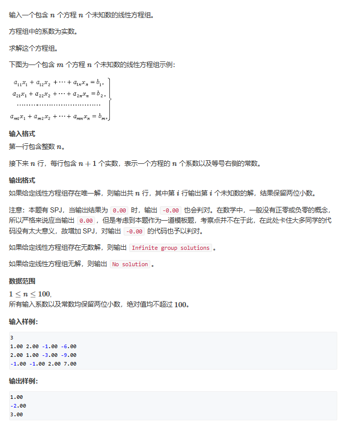
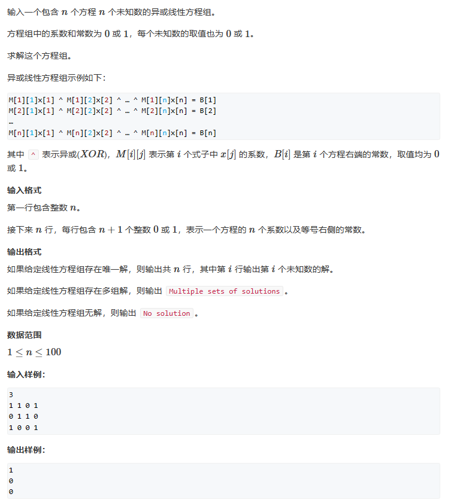

# 高斯消元

## 数学知识补充

高斯消元可以让我们在$O(n^3)$的时间复杂度内算出以下这样的方程组：

$$
\begin{cases} a_{11}x_1+a_{12}x_2+...+a_{1n} x_n=b_1
\\a_{21}x_1+a_{22}x_2+...+a_{2n} x_n=b_2
\\\quad.
\\\quad.
\\\quad.
\\
a_{n1}x_1+a_{n2}x_2+...+a_{nn} x_n=b_n\end{cases}$$

关于这个方程组，我们有三种情况的解：
$$\begin{cases}
1.无解
\\
2.无穷组解
\\
3.唯一解
\end{cases}
$$


那么对于一个这样的方程组，我们可以通过抽离它们的系数来创建一个矩阵

||||$b_i$|
|-----|---|---|---|
|$a_{11}$|$a_{12}$|$a_{13}$|$b_{1}$|
|$a_{21}$|$a_{22}$|$a_{23}$|$b_{2}$|
|$a_{31}$|$a_{32}$|$a_{33}$|$b_{3}$|


这个时候我们有三个初等行列变化的基本性质：

1. 某一行（列）乘一个非零的数
2. 交换某两行（列）
3. 将某行（列）的若干倍加到另一行（列）   

做以上三种操作，矩阵的解不变    
我们的目的是：**通过这三个初等变换，将行列式变成上三角矩阵**

如下：

||||$b_i$|
|-----|---|---|---|
|$a_{11}$ |$a_{12}$|$a_{13}$|$b_{1}$|
||$a_{22}$|$a_{23}$|$b_{2}$|
|||$a_{33}$|$b_{3}$|

同时上三角有三种类型：
$$一、完美阶梯型（唯一解）\begin{cases} a_{11}x_1+a_{12}x_2+...+a_{1n} x_n=b_1\\\quad\quad\quad\quad a_{22}x_2+...+a_{2n} x_n=b_2\\\qquad\qquad\quad.\\\qquad\qquad\quad\qquad.\\\qquad\qquad\quad\qquad\qquad.\\\qquad\qquad\qquad\qquad\qquad a_{nn}x_n=b_n\end{cases}$$
$$二、无解，出现0 = 非零的数\begin{cases} a_{11}x_1+a_{12}x_2+...+a_{1n} x_n=b_1\\\quad\quad\quad\quad\qquad\qquad\qquad\quad 0=b_2\\\qquad\qquad\quad.\\\qquad\qquad\quad\qquad.\\\qquad\qquad\quad\qquad\qquad.\\\qquad\qquad\qquad\qquad\qquad a_{nn}x_n=b_n\end{cases}$$
$$三、无穷多个解，出现0 = 0\begin{cases} a_{11}x_1+a_{12}x_2+...+a_{1n} x_n=b_1\\\quad\quad\quad\quad\qquad\qquad\qquad\quad 0=0\\\qquad\qquad\quad.\\\qquad\qquad\quad\qquad.\\\qquad\qquad\quad\qquad\qquad.\\\qquad\qquad\qquad\qquad\qquad a_{nn}x_n=b_n\end{cases}$$

## 高斯消元 + 题一


将例题的系数抽象为矩阵：

||||$b_i$|
|---|---|---|---|
|1|2|-1|-6|
|2|1|-1|-9|
|-1|-1|2| 7|

1. 枚举每一列c，然后找到绝对值最大的那一行
2. 将该行换到最上面（同时此行被锁定）
3. 将此列第一个数变为1，那么相当于行一所有数同时除以$a_{11}$
4. 将下面所有行的第c列消成0

操作至此矩阵变为：

||||$b_i$|
|---|---|---|---|
|1|0.5|-1.5|-4.5|
|0|1|$-\frac{1}{3}$ |-1|
|0|0|$\frac{2}{3}$  | 2|

此时我们可知方程具有唯一解

接下来我们求唯一解：

1. 将最后一个系数变为1

||||$b_i$|
|---|---|---|---|
|1|0.5|-1.5|-4.5|
|0|1|$-\frac{1}{3}$ |-1|
|0|0|1| 3|

2. 第二行+第三行 * $(-\frac{1}{3})$

||||$b_i$|
|---|---|---|---|
|1|0.5|-1.5|-4.5|
|0|1|0|-2|
|0|0|1| 3|

1. 第一行 - 第二行 * 0.5

||||$b_i$|
|---|---|---|---|
|1|0|-1.5|-3.5|
|0|1|0|-2|
|0|0|1| 3|

4. 第一行 + 第三行 * 1.5

||||$b_i$|
|---|---|---|---|
|1|0|0|1|
|0|1|0|-2|
|0|0|1| 3|

此时，唯一一个$x_i$就对应唯一一个$b_i$

$$\begin{cases}
1*x_1 = 1\\
1*x_2 = -2\\
1*x_3 =3
\end{cases}
$$

最后我们根据思路写出代码：

```cpp
#include <iostream>
#include <cmath>
const int N = 110;
const double eps = 1e-6;
int n;
double a[N][N];
int gauss()
{
	int c, r;
	for(c=0,r=0;c<n;c++) //c代表列，r代表行
	{
		int t = r;
		for(int i = r;i<n;i++)
		{
			if (std::fabs(a[i][c]) > std::fabs(a[r][c]))
				t = i;
		}
		if(std::fabs(a[t][c])<=eps) continue;
		for (int i = c; i <= n; i++) std::swap(a[t][i], a[r][i]);
		for (int i = n; i >= c;i--) a[r][i]/=a[r][c];	//从后往前操作，避免将因为算式中的定值改变导致计算错误
		for(int i = r+1;i<n;i++)
		{
			if (std::fabs(a[i][c]) > eps)
				for (int j = n; j >= c; j--)
					a[i][j] -= a[r][j] * a[i][c];
		}
		r++;
	}
	if(r<n) //当我们省下的行小于n时，说明我们有部分行因为左式等于0被去掉了（实际上被移到了矩阵的最下方）
	{
		for (int i = r; i < n; i++)     //检查右值，右值为0，则说明去掉的是多余项，否则就是矛盾项
			if (fabs(a[i][n]) > eps)
				return 2;	//无解
		return 1;	//有无穷解
	}
	for(int i = n-1;i>=0;i--)
	{
		for(int j = i+1;j<n;j++)
		{
			a[i][n] -= a[i][j] * a[j][n];
		}
	}
	return 0;	//有唯一解
}

int main()
{
	std::cin >> n;
	for (int i = 0; i < n; i++)
		for (int j = 0; j < n + 1; j++)
			std::cin >> a[i][j];

	int t = gauss();
	if (t == 0)
	{
		for (int i = 0; i < n; i++) printf("%.2lf\n", a[i][n]);
	}
	else if (t == 1) puts("Infinite group solutions");
	else puts("No solution");
	return 0;
}
```

```cpp
for(int i = n-1;i>=0;i--)	
	{
		for(int j = i+1;j<n;j++)
		{
			a[i][n] -= a[i][j] * a[j][n];
		}
	}
```
这里的回退操作是最难想通的地方，在我们模拟的时候，我们除了$x_i$留了下来，其他项都消掉了，但在代码中我们没必要，因为$x_i$的系数是1 ，那么我们只需要将$b_i$的值回退就可以了，最后$x_i$的值就是更新后的$b_i$的值，我们看一下回退前的矩阵：

||||$b_i$|
|---|---|---|---|
|1|0.5|-1.5|-4.5|
|0|1|$-\frac{1}{3}$ |-1|
|0|0|1  | 3|

只需要记住j指向i的下一个，那么我们就知道a[i][j]、a[i][n]和a[j][n]在矩阵中的对应关系了，如：   
第一次循环：

||||$b_i$|
|---|---|---|---|
|1|0.5|-1.5|-4.5|
|0|1|$-\frac{1}{3}$<--a[i][j] |-1<--a[i][n]|
|0|0|1  | 3<--a[j][n]|

第二次循环：

||||$b_i$|
|---|---|---|---|
|1|0.5<--a[i][j]|-1.5<--a[i][j]|-4.5<--a[i][n]|
|0|1|0|-2<--a[j][n]|
|0|0|1| 3|

得出答案：

||||$b_i$|
|---|---|---|---|
|1|0|0|1|
|0|1|0|-2|
|0|0|1| 3|


## 题二

异或运算也被称为不进位的加法

||||$B_i$|
|---|---|---|---|
|1|1|0|1|
|0|1|1|0|
|1|0|0|1|

其步骤与高斯消元类似：

1. 转换为上三角矩阵

   1. 枚举列
   2. 找到非0行
   3. 换到循环到的行
   4. 下消0
2. 判断解的情况

这一题其实就是运算的方式发生的变化，我们只需要改变我们的运算方式就可以了，理解了线性高斯消元的代码后这题其实就特别简单
```cpp
#include <iostream>
#include <cmath>
const int N = 110;

int n;
int a[N][N];
void show()
{
	for (int i = 0; i < n; i++)
	{
		for (int j = 0; j <= n; j++)
			std::cout << a[i][j] << " ";
		std::cout << std::endl;
	}
	std::cout << std::endl;
}
int gauss()
{
	int c, r;
	for (c = 0, r = 0; c < n; c++) //c代表列，r代表行
	{
		int t = r;	//记录绝对值最大的数字所在的行
		for (int i = r; i < n; i++)
		{
			if (std::fabs(a[i][c]) > std::fabs(a[r][c]))
				t = i;
		}
		if (std::fabs(a[t][c]) ==0 ) continue;
		for (int i = c; i <= n; i++) std::swap(a[t][i], a[r][i]);
		//for (int i = n; i >= c; i--) a[r][i] /= a[r][c];	//因为本身首元素最大就是1，那么我们就没有必要进行约1的操作
		for (int i = r + 1; i < n; i++)
		{
			if (std::fabs(a[i][c]) > 0)
				for (int j = n; j >= c; j--)
					a[i][j] ^= a[r][j];		//计算的逻辑更改了，之前是加减法，我们需要将a[i][c]下面的元素消0，同样的，与运算的消0操作只需要非0项与a[i][c]进行与运算即可
		}
		//show();
		r++;
	}
	if (r < n)
	{
		for (int i = r; i < n; i++)
			if (fabs(a[i][n]) > 0)
				return 2;	//无解
		return 1;	//有无穷解
	}
	for (int i = n - 1; i >= 0; i--)	//这样子更好理解，我们只处理非0项，如果a[i][j]指向的系数是1，那么我们是要进行与运算的，如果为0，我们就不需要处理它
		for (int j = i + 1; j < n; j++)
		    if(a[i][j])
			    a[i][n] ^=a[j][n];
		
	return 0;	//有唯一解
}
int main()
{
	std::cin >> n;
	for (int i = 0; i < n; i++)
		for (int j = 0; j < n + 1; j++)
			std::cin >> a[i][j];

	int t = gauss();
	if (t == 0)
	{
		for (int i = 0; i < n; i++) printf("%d\n", a[i][n]);
	}
	else if (t == 1) puts("Multiple sets of solutions");
	else puts("No solution");
	return 0;
}

```
同样的，我们再次来解释一下回退的操作：
```cpp
for (int i = n - 1; i >= 0; i--)	
		for (int j = i + 1; j < n; j++)
		    if(a[i][j])
			    a[i][n] ^=a[j][n];
```
相比于y总的

a[i][j] ^= a[i][n] * a[j][n] 或 a[i][j] ^= a[i][n] & a[j][n]

来说这样子更好理解，我们只处理非0项，如果a[i][j]指向的系数是1，那么我们是要进行与运算的，如果为0，我们就不需要处理它

