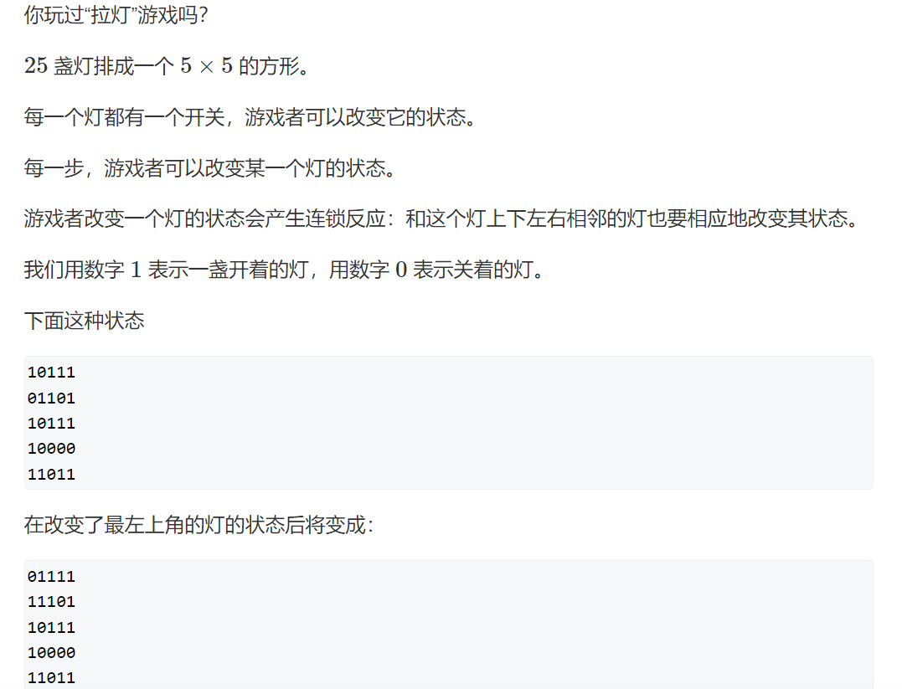

# 递归与递推

此类型题主要是理解一个遍历，也就是暴力枚举的方法，我们知道我们的遍历方法常常有DFS（深度优先搜索）和BFS（广度优先搜索），而前者经常使用递归来实现，但同样的，递归本身可理解为循环（递归需要注意判断递归终点的问题和递归深度以免爆栈），两者常常可以互相转换。

## 例题一


这题很简单，就根据y总的思路和大家解释一遍：

### 利用二进制和位运算来处理每个值的选取与否

我们知道二进制的0和1和与运算恰好可以帮助我们枚举每一个数字的一个选取与否（状态压缩dp中这点很重要）。

那么数字暴力枚举的算法复杂度是$O(2^n)$，在此题中是$2^{15}$是一个万级别的数字很小，放心暴力即可。

递归写法：

```cpp
#pragma GCC optimize(2)
#include <iostream>

int n;
void dfs(int u, int state)
{
    if(u==n)
    {
        for(int i = 0;i<n;i++)
            if(state>>i&1)
                std::cout<<i+1<<' ';    //注意输出是从1开始
        std::cout<<std::endl;
        return;
    }
    dfs(u+1,state); //第u+1位数字选取状态不变
    dfs(u+1,state|1<<u);    //第u+1位数字选
    //给不懂的同学解释一下 state|1<<u 、
    //这里的<<的运算优先级高于|，计算时，计算机让1左移u位变成10000...(u个0)，或运算后第u+1位的数字一定会变成1也就选上了。
}

int main()
{
    std::ios::sync_with_stdio(false);
    std::cin.tie(0);
    std::cout.tie(0);
    std::cin>>n;
    dfs(0,0);
}
```

就像我说的，递归和循环可以相互转换，循环写法：

```cpp
#pragma GCC optimize(2)
#include <iostream>

int n;

int main()
{
    std::ios::sync_with_stdio(false);
    std::cin.tie(0);
    std::cout.tie(0);
    std::cin>>n;
    for(int i = 0;i<(1<<n);i++) //这个循环应该是很好理解的了
    {
        for(int j = 0;j<n;j++)
            if(i>>j&1) std::cout<<j+1<<" ";
        std::cout<<std::endl;
    }
}
```

## 例题二


此题也是很经典的题目，枚举排列的问题，唯一的区别是要求字典序输出，其实正常的写法也就是字典序的输出，此题注意递归终点的判断是在第n+1位时输出，以为我们是从第1位开始枚举的，此题具体的题解见我另一篇题解。

[题解](https://www.acwing.com/activity/content/code/content/6972500/)

```cpp
#include <iostream>
const int N = 20;
int ans[N];

bool st[N];
int n;


void dfs(int u)
{
    if(u>n)
    {
        for(int i = 1;i<=n;i++)
            std::cout<<ans[i]<<' ';
        std::cout<<std::endl;
        return;
    }
    
    for(int i = 1;i<=n;i++)
    {
        if(!st[i])
        {
            st[i] = true;
            ans[u] = i;
            dfs(u+1);
            st[i] = false;
        }
    }
}

int main()
{
    std::cin>>n;
    dfs(1);
}
```

## 例题三


斐波那契数列相信是各位学计算机必遇到的考试题目了吧，此题之前根据y总的分享写过几个方法的总结，但是没上传到站上（毕竟有y总的了），这里我正好就上传一份吧，感兴趣的同学可以几个方法都试一试，研究研究。

此题代码：

```cpp
#include <iostream>

int main()
{
    int n;
    scanf("%d",&n);
    int a = 0,b = 1;
    
    for(int i = 1;i<=n;i++)
    {
        std::cout<<a<<" ";
        int c = a + b;
        a = b, b = c;
    }
}
```

## 斐波那契数列的几种求法

写此文是恰好学校校队第一次选拔练习题里有，当时就有些好奇其他解法，恰好结合y总的分享和大家分享几种斐波那契数列的求法，其中的解法涉及很多算法思想，很有启发性。

***
题目：定义$a_0=1，a_1=1，a_n=a_{n-1}+a_{n-2}$，求$a_n$ % $10^9+7$是多少。

### 法一：递归

利用递归进行简单的计算过程模拟。

写递归的三个要点：

1. 确定递归参数：递归参数为第n个斐波那契数。
2. 确定递归终点：n-1与n-2会返回第1个和第2个斐波那契数，所以当n=0和1时初始化斐波那契数列为1.
3. 递归从最后一层开始计算。

但是很明显能看出这个算法时间复杂度较高，为$O(n^2)$很容易TLE。

```cpp
#include <iostream>

const int MOD = 1000000007;

int f(int n)
{
    if (n <= 1) return 1;
    return (f(n - 1) + f(n - 2)) % MOD;
}

int main()
{
    int n;
    scanf("%d",&n);
    printf("%d",f(n-1));
}
```

### 法二：记忆化搜索

我们发现，在法一中，假设n = 5，那么会重复计算f(2)、f(1)、f(0)，为了避免重复计算，我们将计算好的值存储到数组中，构成记忆化搜索，如此，每一个f(n) 就只计算了一次，故而时间复杂度为$O(n)$。

但这个方法也有缺点，和法一一样，容易爆栈。计算规模大概在$n=10^5$级别。

```cpp
#include <iostream>

const int MOD = 1000000007,N = 1000000;
int st[N];
int f(int n)
{
	if (st[n]) return st[n];
	if (n <= 1) return 1;
	st[n] = f(n - 1) + f(n - 2);
	st[n] %= MOD;
	return st[n];
}

int main()
{
	int n;
	scanf("%d", &n);
	printf("%d", f(n-1));
}
```

### 法三：递推

其实就是暴力把前n 个数的斐波那契数也算出来，这样自然就能算出第n 个斐波那契岁数了。

但是如此做法空间复杂度会极高，消耗内存极大，很可能被程序规定大小所限制。

```cpp
#include <iostream>

const int MOD = 1000000007,N = 100000000;
int st[N];
int f(int n)
{
	st[0] = st[1] = 1;
	for (int i = 2; i <= n; i++)
		st[i] = (st[i - 1] + st[i - 2])%MOD;
	return st[n];
}

int main()
{
	int n;
	scanf_s("%d", &n);
	printf("%d", f(n-1));
}
```

### 法四：递归 + 滚动数组

观察一下公式：f(n) = f(n-1) + f(n-2)，很容易得出对于f(n+1) = f(n) + f(n-1)，所以可以想到使用滚动数组去优化我们的空间复杂度，对于每一个f(n)，我们只需要两层数据，上一层的结果是我们的第一个数据，第一个加数是我们的第二个数据。从而写出时间复杂度$O(n)$，空间复杂度$O(1)$的代码。

```cpp
#include <iostream>

const int MOD = 1000000007;
int st[N];
int f(int n)
{
	int x, y, z;
	x = y = z = 1;
	for(int i = 1;i<n;i++)
	{
		z = (x + y) % MOD;
		y = x;
		x = z;
	}
	return z;
}

int main()
{
	int n;
	scanf_s("%d", &n);
	printf("%d", f(n-1));
}
```

### 法五：矩阵运算 + 快速幂

关于快速幂的学习参考此文：[快速幂](https://www.acwing.com/solution/content/15293/)

我们首先定义矩阵：
$$M_n=\begin{bmatrix}
	a_{n}&a_{n-1}
\end{bmatrix} \quad n\geq 1$$

根据已知的信息，我们可以推出通式：
$$M_n = M_{n-1}\times A$$
$$A = \begin{bmatrix}
	1&1\\
	1&0
\end{bmatrix}$$

（你不信可以试试，因为刚看到我也不信 XD）

由此，我们可以得出：
$$M_n=M_1\times A^{n-1}$$

我们的答案太大需要对MOD取模，因为矩阵的结合性，我们可以利用快速幂先求$A^{n-1}$%$P$

其实这题代码上的难点在于对矩阵运算的模拟实现，对于稍微复杂的代码建议分块实现且写一下伪代码防止思维逻辑的错误。

```cpp
#include <iostream>
const int MOD = 1000000007;

//模拟矩阵X乘
void matrix_mul(int a[][2],int b[][2],int M[][2])
{
	int temp[][2] = { {0,0},{0,0} };
	for(int i = 0;i<2;i++)
	{
		for(int j = 0;j<2;j++)
		{
			for(int k = 0;k<2;k++)
			{
				long long x = temp[i][j] + static_cast<long long>(a[i][k]) * b[k][j];
				temp[i][j] = x % MOD;
			}
		}
	}
	for (int i = 0; i < 2; i++)
		for (int j = 0; j < 2; j++)
			M[i][j] = temp[i][j];
}

int f(long long n)
{
	if (n < 2) return 1;
	int M_0[2] = { 1,1 };
	int A[][2] = { {1,1},{1,0} };
	//将答案初始化为单位矩阵I
	int res[][2] = { {1,0},{0,1} };
	long long k = n - 1;
	while(k)
	{
		if (k & 1) matrix_mul(res, A, res);
		matrix_mul(A, A, A);
		k >>= 1;
	}
	int M_n[2] = { 0,0 };
	for(int i = 0;i<2;i++)
	{
		for(int j = 0;j<2;j++)
		{
			long long x = M_n[i] + static_cast<long long>(M_0[j]) * res[j][i];
			M_n[i] = x % MOD;
		}
	}

	return M_n[0];
}

int main()
{
	//从下标为1开始计算
	long long n;
	scanf_s("%lld", &n);
	printf("%d", f(n-1));
}
```

## 例题四




此题的思路比较巧妙，但其实是一种贪心的思想：**若此灯为关闭状态，则改变此灯下面的那盏灯的状态**

如此，我们只需要枚举第一行的状态就能确定整个矩阵的按法，从$2^{25}$（三千多万）的计算量降到了$2^{5}$（32）的计算量，最终的检查也不用检查整个矩阵，因为这个方法保证了除了第n行的灯都均为打开状态，那么我们只需要检查第n行的灯是否全为打开状态即可。

我们来证明一下这个做法的正确性：

我们将问题分割成这样的若干个子问题：**使第 $i$ 行的所以灯变成打开状态最少需要操作几次**

我们知道，直接操作第 $i$ 行会导致左右两侧灯的状态的改变，所以我们操作下一行或上一行可保证实现子问题的最优解。

那么操作 **n-1** 行后我们就能得出此状态下整体的最佳方案。

那为什么我们需要枚举第一行的状态来求得最值呢？

这其实就是DFS的过程，根据我们的算法，只要确定第一行，那么这个情况下的操作数就是确定的，枚举第一行一共32种按法就能找出最优解，记住，只是为了枚举第一行，不要纠结为什么取 1 的时候按，你取 0 去按也是AC的结果。

递推 AC代码：

```cpp
#pragma GCC optimize(2)
#include <iostream>
#include <cstring>

const int N = 7;
using G = char[N][N];
int T;
int X[] = { 0,1,0,-1,0 },Y[] = {1, 0, -1, 0,0};

G Game,backup;

bool check()
{
	for (int i = 0; i < 5; i++)
			if (Game[4][i] == '0') return false;
	return true;
}

void change(int x,int y)
{
	for (int i = 0; i <= 4; i++)
	{
		int a = x + X[i], b = Y[i] + y;
		if (a<0||a>4||b<0||b>4) continue;
		Game[a][b] ^= 1;
	}
}
int bfs()
{
	int ans = 100;
	for(int k = 0;k < (1<<5);k++)
	{
		int res = 0;
		memcpy(backup, Game, sizeof Game);
		for(int j = 0;j<5;j++)
		{
			if(k>>j&1)
			{
				res++;
				change(0, j);
			}
		}
		for(int i = 0;i<4;i++)
			for(int j =0;j<5;j++)
			{
				if(Game[i][j] == '0')
				{
					res++;
					change(i + 1, j);
				}
			}
		
		if(check())
		{
			ans = std::min(ans, res);
		}
		std::memcpy(Game, backup, sizeof backup);
	}
	if (ans > 6) return -1;
	return ans;
}


int main()
{
	std::ios::sync_with_stdio(false);
	std::cout.tie(0);
	std::cin.tie(0);

	std::cin >> T;
	while(T--)
	{
		for (int i = 0; i < 5; i++)
			std::cin >> Game[i];

		std::cout<<bfs()<<std::endl;
	}
}
```

TLE DFS（完全枚举法）代码：

```cpp
#pragma GCC optimize(2)
#include <iostream>
int T;
const int N = 10;
char g[N][N];
int map[N][N];
int X[] = { 0,1,0,-1,0}, Y[] = { 1,0,-1,0,0 };
int ans = 0x3f3f3f3f;
bool check()
{
	for (int i = 0; i < 5; i++)
	{
		for (int j = 0; j < 5; j++)
			if (map[i][j] != 1) return false;
	}
	return true;
}
void change(int x, int y)
{
	for (int i = 0; i <= 4; i++) {
		int a = x + X[i], b = Y[i] + y;
		if (a < 0 || a>4 || b < 0 || b>4) continue;
		if (map[a][b] == 0) map[a][b] = 1;
		else map[a][b] = 0;
	}
}
void dfs(int x, int y, int cnt)
{
    if(cnt>6) return;
	if (x > 4)
	{
		if (check())
		{
			if (ans > cnt) ans = cnt;
		}
		return;
	}
	change(x, y);
	if (y == 4) dfs(x + 1, 0, cnt + 1);
	else dfs(x, y + 1, cnt + 1);
	change(x, y);
	if (y == 4) dfs(x + 1, 0, cnt);
	else dfs(x, y + 1, cnt);
}

int main()
{
    std::ios::sync_with_stdio(false);
    std::cin.tie(0);
    std::cout.tie(0);
	std::cin >> T;
	while (T--)
	{
		ans = 0x3f3f3f3f;
		for (int i = 0; i < 5; i++)
		{
			std::cin >> g[i];
		}
		for (int i = 0; i < 5; i++)
		{
			for (int j = 0; j < 5; j++)
			{
				map[i][j] = g[i][j] - '0';
			}
		}
		dfs(0, 0, 0);
		if (ans == 0x3f3f3f3f) std::cout << "-1\n";
		else std::cout << ans << "\n";
	}
	return 0;
}
```