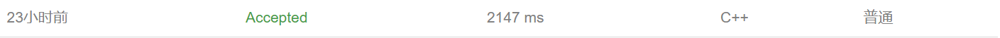

# 练习题

## 练习题一


此题的思路不难，按位置去枚举数字并放置即可，唯一的难点在于发现升序输出时，若剩余的合法数字少于空闲位置时的无效枚举。

个人题解思路：可以注意到，我们的后一位数一定是大于前一位	的，那么枚举起点从前一位数字的后面开始枚举即可，此时若剩余数字少于空闲位置就提前返回，也就实现了剪枝，避免了很大一部分无意义的枚举。

个人AC代码：

```cpp
#include <iostream>

const int N = 50;
int ans[N];
int st[N];
int n,m;
int idx;
void dfs(int u)
{
    if(n-ans[u-1]<m-u) return;
    if(u==m+1)
    {
        for(int i = 1;i<=m;i++) std::cout<<ans[i]<<' ';
        std::cout<<std::endl;
        return;
    }
    for(int i = ans[u-1];i<n;i++)
    {
        ans[u] = i+1;
        st[i] = true;
        //若从1重新开始枚举，那么我们还需要判断 if(i>ans[u-1])
        dfs(u+1);
        st[i] = false;
    }
}

int main()
{
    std::cin>>n>>m;
    dfs(1);
}
```

y总法代码：

```cpp
#include <cstdio>
#include <cstring>
#include <iostream>
#include <algorithm>

using namespace std;

const int N = 30;

int n, m;
int way[N];

void dfs(int u, int start)
{
   if(u+n-start<m) return;
   if(u==m+1) 
   {
        for(int i = 1;i<=m;i++)
            std::cout<<way[i]<<' ';
        std::cout<<std::endl;
        return;
   }
   for(int i = start;i<=n;i++)
   {
       way[u] = i;
       dfs(u+1,i+1);
   }
}

int main()
{
    std::cin>>n>>m;

    dfs(1, 1);

    return 0;
}
```

非字典序输出代码（WA代码只是参考一下）：

```cpp
#include <iostream>

const int N = 50;
int ans[N];
int n,m;
int idx;
void dfs(int state)
{
    if(state == 1<<n) return;
    int cnt = 0;
    int copy = state;
    while(copy!=0)
    {
        int lowbit = copy&(-copy);
        copy -= lowbit;
        ++cnt;
    }
    
    if(cnt==m)
    {
        idx = 0;
        for(int k = 0;k<1<<n;k++)
        {
            if(state>>k&1)
                ans[idx++] = k+1;
        }
        for(int i = 0;i<m;i++) std::cout<<ans[i]<<' ';
        std::cout<<std::endl;
    }
    dfs(state+1);
    
}


int main()
{
    std::cin>>n>>m;
    dfs(0);
}
```

## 练习题二


先观察原式，在C++种如果我们枚举 $int$ ，那么使用除法去判断会向下取整容易出错，所以我们左右同乘一个分母将原始切换成：

$$n c = a c + b$$

而后我们暴力枚举 1 ~ 9 的全排列，通过长度分割来枚举我们的 $a、b、c$ 三个数，而后检查是否满足条件即可。

***

但是这题是否还有可以优化的地方呢？

再观察一下等式，我们发现当确定唯一的 $a、c$ 时我们唯一确定一个 $b$ 也就是说当 $a、c$ 相同的情况下，全排列枚举了很大一部分非法状态。

解决方法也很简单：


但是问题来了，你熟悉C++吗？

当我通过更改AC一的代码至AC二的代码后，我发现了一个问题

这是AC一消耗的时间:

<center>未O2优化</center>


<center>O2优化</center>


这是AC二消耗的时间:

<center>未O2优化</center>



<center>O2优化</center>


这意味着什么呢？

这意味着我们对于空间的遍历的次数很多严重影响了我们的程序运行速度，对于为什么这样读者可以去搜索C++ $O2$ 优化的原理

那么我们如何减少对空间的遍历呢？

很简单，我们将记录 $a、c$ 的方式变成一个全局变量即可（详见AC代码三）。

这是AC三消耗的时间（比y总代码快100ms左右）:

<center>未O2优化</center>


<center>O2优化</center>


个人AC代码（全枚举法）一：

```cpp
#pragma GCC optimize(2)
#include <iostream>

bool st[12];
int num[12];
int cnt = 0;
int n;

int Count(int l,int r)
{
	int res = 0;
	for(int i = l;i<=r;i++)
	{
		res = res * 10 + num[i];
	}
	return res;
}

void dfs(int u)
{
	if (u > 9)
	{
		for(int i = 1;i<=7;i++)
		{
			for(int j = 1;j<9-i;j++)
			{
				int a = Count(1, i);
				int b = Count(i + 1, i + 1 + j);
				int c = Count(i + j + 2, 9);
				if (n * c == a * c + b)
				{
					cnt++;
				}
			}
		}
		return;
	}
	for(int i = 1;i<=9;i++)
	{
		if(!st[i])
		{
			num[u] = i;
			st[i] = true;
			dfs(u + 1);
			st[i] = false;
		}
	}
}

int main()
{
	std::ios::sync_with_stdio(false);
	std::cin.tie(0);
	std::cout.tie(0);

	std::cin >> n;

	dfs(1);
	std::cout << cnt;
}
```

个人AC代码（剪枝优化法）二：

```cpp
#pragma GCC optimize(2)
#include <iostream>

bool st[12];
int num_a[12];
int cnt = 0;
int n;
int enda;

int Count(int l, int r)
{
	int res = 0;
	for (int i = l; i <= r; i++)
	{
		res = res * 10 + num_a[i];
	}
	return res;
}

bool check(int u)
{
	int a = Count(1, enda);
	int c = Count(enda+1,u);
	long long b = (long long)n*c-(long long)a*c;
	if (b <= 0) return false;

	bool stt[10] = {false};
	
	long long B = b;
	while(b)
	{
		if (st[b % 10]||stt[b%10]||!(b%10)) return false;
		stt[b % 10] = true;
		b /= 10;
	}
	int count = 0;
	for(int i = 1;i<=9;i++)
	{
		if (!st[i] && !stt[i]) return false;
	}
	
	
	return true;
}

void dfs_c(int u)
{
	if (u > 8) return;
	
	for(int i = 1;i<=9;i++)
	{
		if(!st[i])
		{
			st[i] = true;
			num_a[u] = i;
			if (check(u)) cnt++;
			dfs_c(u + 1);
			st[i] = false;
		}
	}
}

void dfs_a(int u)
{
	if (u > 7) return;
	
	for(int i = 1;i<=9;i++)
	{
		if(!st[i])
		{
			st[i] = true;
			num_a[u] = i;
			enda = u;
			dfs_c(u + 1);
			dfs_a(u + 1);
			st[i] = false;
		}
	}
}

int main()
{
	std::ios::sync_with_stdio(false);
	std::cin.tie(0);
	std::cout.tie(0);

	std::cin >> n;

	dfs_a(1);
	std::cout << cnt;
}
```

个人AC代码（剪枝优化 + 空间优化法）三：

```cpp
#pragma GCC optimize(2)
#include <iostream>
bool st[12];
int num_a[12];
int cnt = 0;
int nums_a = 0, nums_c = 0;
int n;

bool check(int u)
{
	
	long long b = (long long)n*nums_c-(long long)nums_a*nums_c;
	if (b <= 0) return false;
	bool stt[10] = {false};
	long long B = b;
	while(b)
	{
		if (st[b % 10]||stt[b%10]||!(b%10)) return false;
		stt[b % 10] = true;
		b /= 10;
	}
	int count = 0;
	for(int i = 1;i<=9;i++)
	{
		if (!st[i] && !stt[i]) return false;
	}
	
	return true;
}

void dfs_c(int u)
{
	if (u > 8) return;
	
	for(int i = 1;i<=9;i++)
	{
		if(!st[i])
		{
			st[i] = true;
			nums_c = nums_c * 10 + i;
			if (check(u)) cnt++;
			dfs_c(u + 1);
			st[i] = false;
			nums_c /= 10;
		}
	}
}

void dfs_a(int u)
{
	if (u > 7) return;
	
	for(int i = 1;i<=9;i++)
	{
		if(!st[i])
		{
			st[i] = true;
			nums_a = nums_a * 10 + i;
			dfs_c(u + 1);
			dfs_a(u + 1);
			st[i] = false;
			nums_a /= 10;
		}
	}
}

int main()
{
	std::ios::sync_with_stdio(false);
	std::cin.tie(0);
	std::cout.tie(0);

	std::cin >> n;

	dfs_a(1);
	std::cout << cnt;
}
```

y总法：

```cpp
#include <cstdio>
#include <cstring>
#include <iostream>
#include <algorithm>

using namespace std;

const int N = 10;

int n;
bool st[N], backup[N];
int ans;

bool check(int a, int c)
{
    long long b = n * (long long)c - a * c;

    if (!a || !b || !c) return false;

    memcpy(backup, st, sizeof st);
    while (b)
    {
        int x = b % 10;     // 取个位
        b /= 10;    // 个位删掉
        if (!x || backup[x]) return false;
        backup[x] = true;
    }

    for (int i = 1; i <= 9; i ++ )
        if (!backup[i])
            return false;

    return true;
}

void dfs_c(int u, int a, int c)
{
    if (u > 9) return;

    if (check(a, c)) ans ++ ;

    for (int i = 1; i <= 9; i ++ )
        if (!st[i])
        {
            st[i] = true;
            dfs_c(u + 1, a, c * 10 + i);
            st[i] = false;
        }
}

void dfs_a(int u, int a)
{
    if (a >= n) return;
    if (a) dfs_c(u, a, 0);

    for (int i = 1; i <= 9; i ++ )
        if (!st[i])
        {
            st[i] = true;
            dfs_a(u + 1, a * 10 + i);
            st[i] = false;
        }
}

int main()
{
    cin >> n;

    dfs_a(0, 0);

    cout << ans << endl;

    return 0;
}
```

## 练习题三


此题和例题中的费解的开关是一样的，这里不再重复，以下给出两种解法

此题需要注意的是路径的记录，第一个方法中我选择在找最值的时候将其棋盘状态记录下来，第二个方法就简单了，将数字转换成二维坐标输出输出即可。

dfs 枚举记录法：

```cpp
#pragma GCC optimize(2)
#include <iostream>
#include <cstring>
const int N = 4;
int ans = INT32_MAX;
char map[N][N];
bool st[N][N],st_ans[N][N];
int X[] = { 0,1,0,-1,0 }, Y[] = { 1,0,-1,0,0 };

bool check()
{
	for (int i = 0; i <= 3; i++)
		for (int j = 0; j <= 3; j++)
			if (map[i][j] == '+') return false;
	return true;
}

void change(int i,int j)
{
	for(int k = 0;k<=3;k++)
	{
		if (map[i][k] == '-') map[i][k] = '+';
		else map[i][k] = '-';
		if (map[k][j] == '-') map[k][j] = '+';
		else map[k][j] = '-';
	}
	if (map[i][j] == '-') map[i][j] = '+';
	else map[i][j] = '-';
}

void dfs(int i,int j,int cnt)
{
	if (i > 3)
	{
		if(check())
		{
			if (cnt < ans)
			{
				ans = cnt;
				std::memcpy(st_ans, st, sizeof st);
			}
		}
		return;
	}
	change(i, j);
	st[i][j] = true;
	if (j == 3) dfs(i + 1, 0, cnt + 1);
	else dfs(i, j + 1, cnt + 1);
	change(i, j);
	st[i][j] = false;
	if (j == 3) dfs(i + 1, 0, cnt);
	else dfs(i, j + 1, cnt);
}

int main()
{
	std::ios::sync_with_stdio(false);
	std::cin.tie(0);
	std::cout.tie(0);
	for (int i = 0.; i <= 3; i++)
		std::cin >> map[i];
	dfs(0, 0, 0);

	std::cout << ans<<std::endl;
	for (int i = 0; i <= 3; i++)
		for (int j = 0; j <= 3; j++)
			if (st_ans[i][j]) std::cout << i + 1 << ' ' << j + 1 << std::endl;

}
```

二进制枚举模拟法（y总的方法使用了vector去存路径，太慢了，未开O2优化和流同步的情况下能在2000ms左右完成样例，比y总的快4000ms左右）：

```cpp
#pragma GCC optimize(2)
#include <iostream>
const int N = 4 ;
int ans = INT32_MAX;
using ll = long long;
ll way;
char map[N][N],backup[N][N];
bool check()
{
	for (int i = 0; i <= 3; i++)
		for (int j = 0; j <= 3; j++)
			if (map[i][j] == '+') return false;
	return true;
}
void change(int i, int j)
{
	for (int k = 0; k <= 3; k++)
	{
		if (map[i][k] == '-') map[i][k] = '+';
		else map[i][k] = '-';
		if (map[k][j] == '-') map[k][j] = '+';
		else map[k][j] = '-';
	}
	if (map[i][j] == '-') map[i][j] = '+';
	else map[i][j] = '-';
}

void dfs()
{
	for(ll i = 0;i<1<<16;i++)
	{
		std::memcpy(backup, map, sizeof map);
		for(int j = 0;j<16;j++)
		{
			if (i >> j & 1)
				change(j / 4, j % 4);
		}
		if(check())
		{
			int cnt = 0;
			ll t = i;
			while(t)
			{
				cnt++;
				ll lowbit = t & (-t);
				t -= lowbit;
			}
			if(cnt<ans)
			{
				ans = cnt;
				way = i;
			}
		}
		std::memcpy(map, backup, sizeof backup);
	}
}

int main()
{
	std::ios::sync_with_stdio(false);
	std::cin.tie(0);
	std::cout.tie(0);

	for (int i = 0; i <= 3; i++)
		std::cin >> map[i];
	dfs();
	std::cout << ans << std::endl;
	for(int i = 0;i<16;i++)
		if (way >> i & 1) std::cout << i / 4 + 1 << ' ' << i % 4 + 1 << std::endl;
}
```

## 练习题四


注意，此题目的是理解递推，极端情况下100个字母的全枚举将会达到 &O(2^{100})& 是极大的一个数字，所以在考虑使用暴力搜索的时候一定要检查一下题目给的数据范围，以免白做工

根据题意，此题必定有解，并且找最少操作数，那么大胆猜测遇到不同的就翻一次即可，然后AC了......

正确性证明推导：

从第一个字母遍历到倒数第二个字母，若遇到不同的就进行一次操作（操作为更改当前字母和下一个字母），因为下一次操作不会改变上一个已经被更改正确的字母所以推导到倒数第二个字母时一定能得到目标状态。

接下来证明这是最少的方法：假设我们多操作了一次，无论在哪个位置，那么一定会造成此位置状态与目标状态不同，那么我们就得再操作一次，那么这两次操作就都是多余的。

```cpp
#pragma GCC optimize(2)
#include <iostream>
#include <string>
const int N = 110;

std::string str, target;
int ans = INT32_MAX;

int main()
{
	std::ios::sync_with_stdio(false);
	std::cin.tie(0);
	std::cout.tie(0);
	std::cin >> str >> target;
	int n = str.size();
	int cnt = 0;
	for(int i = 0;i<n-1;i++)
	{
		if(str[i]!=target[i])
		{
			++cnt;
			if (str[i] == '*')
				str[i] = 'o';
			else
				str[i] = '*';

			if (str[i+1] == '*')
				str[i+1] = 'o';
			else
				str[i+1] = '*';
		}
	}
	std::cout << cnt;
}
```