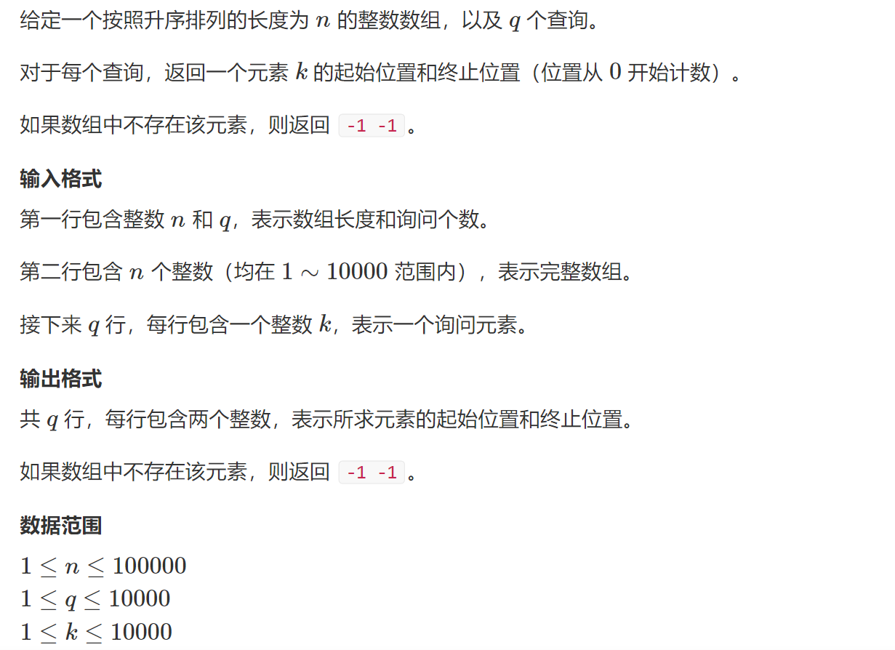
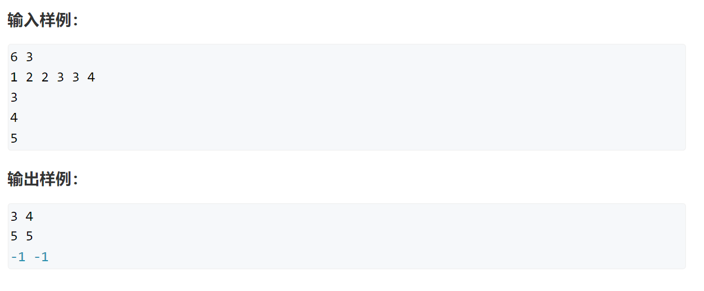

# 例题

二分与前缀和常常被用在数据处理和查询过程中，在稍复杂的算法题中会作为考察的一部分出现，往往可以优化不少时间复杂度。

## 例题一




这题很明显是使用二分了，强调一个事，二分本质不是寻找某个数，而是寻找一个范围，是一种寻找边界的算法。

二分法其实大家都很熟悉，在接二元一次方程时我们会用其去逼近根的结果。

```cpp
#pragma GCC optimize(2)
#include <iostream>
const int N = 100010;
int n, m;
int q[N];

int main()
{
	std::ios::sync_with_stdio(false);
	std::cout.tie(0);
	std::cin.tie(0);

	std::cin >> n >> m;

	for (int i = 0; i < n; i++)
		std::cin >> q[i];
	while(m--)
	{
		int target;
		std::cin >> target;
		int l = 0, r = n-1;
		while(l<r)
		{
			int mid = l + r >> 1;
			if (q[mid] >= target) r = mid;
			else l = mid + 1;
		}
		if(q[l]!=target)
		{
			std::cout << "-1 -1"<<std::endl;
		}
		else
		{
			std::cout << l << ' ';
			r = n-1;
			while(l<r)
			{
				int mid = l + r + 1>> 1;
				if (q[mid] <= target) l = mid;
				else r = mid - 1;
			}
			std::cout << l << std::endl;
		}	
	}
}
```