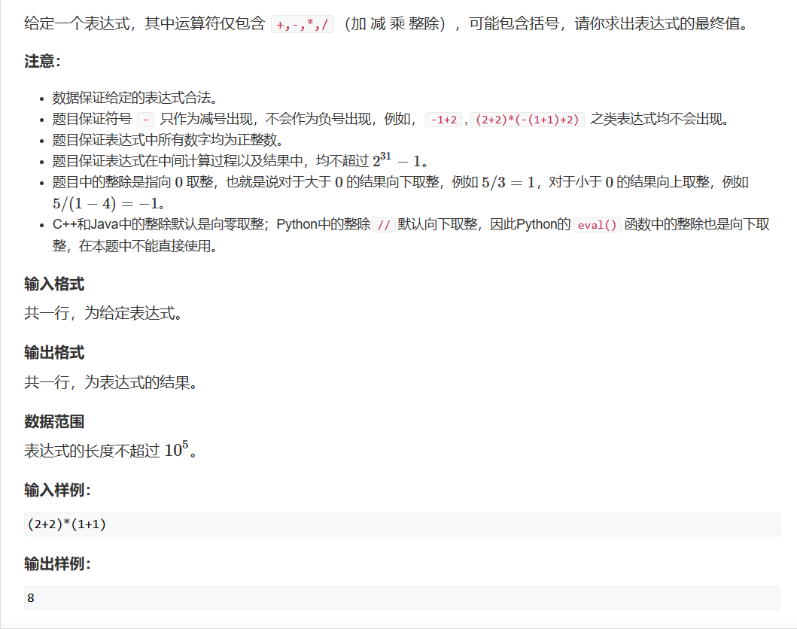

# 表达式求值

在求表达式例如：1 * 3 + 4 ，我们都能一眼看出答案是 7，但计算机要如何去计算呢？    
计算机不会像我们一样明白'+'、'-'、'*'和'/' 的运算优先级，我们需要告诉他。所以此题需要使用栈的概率。     
首先用map定义运算优先级：
```cpp
std::unordered_map<char, int> myMap{{'+', 1}, { '-',1 }, { '*',2 }, { '/',2 }};
```
我们先理一下计算的顺序，如果我们检测到输入的字符是一个数字，那么我们需要将将数字累加至字符不再是数字：
```cpp
if(isdigit(c))
		{
			int x = 0, j = i;
			while (j < str.size() && isdigit(str[j]))
				x = x * 10 + str[j++] - '0';
			i = j - 1;
			num.push(x);
		}
```
而如果我们遇到的括号呢？    
在实际计算中，我们总是先计算括号中的内容再去计算外面的内容，那么遇到括号时我们直接进行计算操作就行。      
```cpp
else if (c == '(') op.push(c);  //先把左括号加进去，
	else if(c==')')
		{
			while (op.top() != '(') eval();
			op.pop();
        }
```
如果遇到其他的运算符，那我们需要知道这个运算符的优先级是否高于上一个运算符的优先级，如果高于，那么我们将其存入，如果低于，那么我们需要将上一个运算符进行计算，然后再存入此运算符：
```cpp
else
		{
			while (op.size() && op.top()!='('&&myMap[op.top()] >= myMap[c]) eval();
			op.push(c);
		}
```
最后我们将剩下没计算的进行计算：
```cpp
	while (op.size()) eval();
```
最后我们需要实现eval()函数，实现原理很简单，只不过我们需要注意一下运算的顺序，因为头元素是后一个数字：
```cpp
void eval()
{
	auto b = num.top();
	num.pop();
	auto a = num.top();
	num.pop();
	auto c = op.top();
	op.pop();
	int x;
	if (c == '+')
		x = a + b;
	else if (c == '-')
		x = a - b;
	else if (c == '*')
		x = a * b;
	else
	{
		x = a / b;
	}
	num.push(x);
}
```
现在是完整代码：
```cpp
#include <iostream>
#include <cstring>
#include <algorithm>
#include <unordered_map>
#include <stack>

std::stack<int > num;
std::stack<char> op;

void eval()
{
	auto b = num.top();
	num.pop();
	auto a = num.top();
	num.pop();
	auto c = op.top();
	op.pop();
	int x;
	if (c == '+')
		x = a + b;
	else if (c == '-')
		x = a - b;
	else if (c == '*')
		x = a * b;
	else
	{
		x = a / b;
	}
	num.push(x);
}

int main()
{
	std::unordered_map<char, int> myMap{{'+', 1}, { '-',1 }, { '*',2 }, { '/',2 }};
	std::string str;
	std::cin >> str;
	for(int i = 0;str[i];++i)
	{
		auto c = str[i];
		if(isdigit(c))
		{
			int x = 0, j = i;
			while (j < str.size() && isdigit(str[j]))
				x = x * 10 + str[j++] - '0';
			i = j - 1;
			num.push(x);
		}
		else if (c == '(') op.push(c);
		else if(c==')')
		{
			while (op.top() != '(') eval();
			op.pop();
		}else
		{
			while (op.size() && op.top()!='('&&myMap[op.top()] >= myMap[c]) eval();
			op.push(c);
		}
	}
	while (op.size()) eval();
	std::cout << num.top() << std::endl;
}
```
