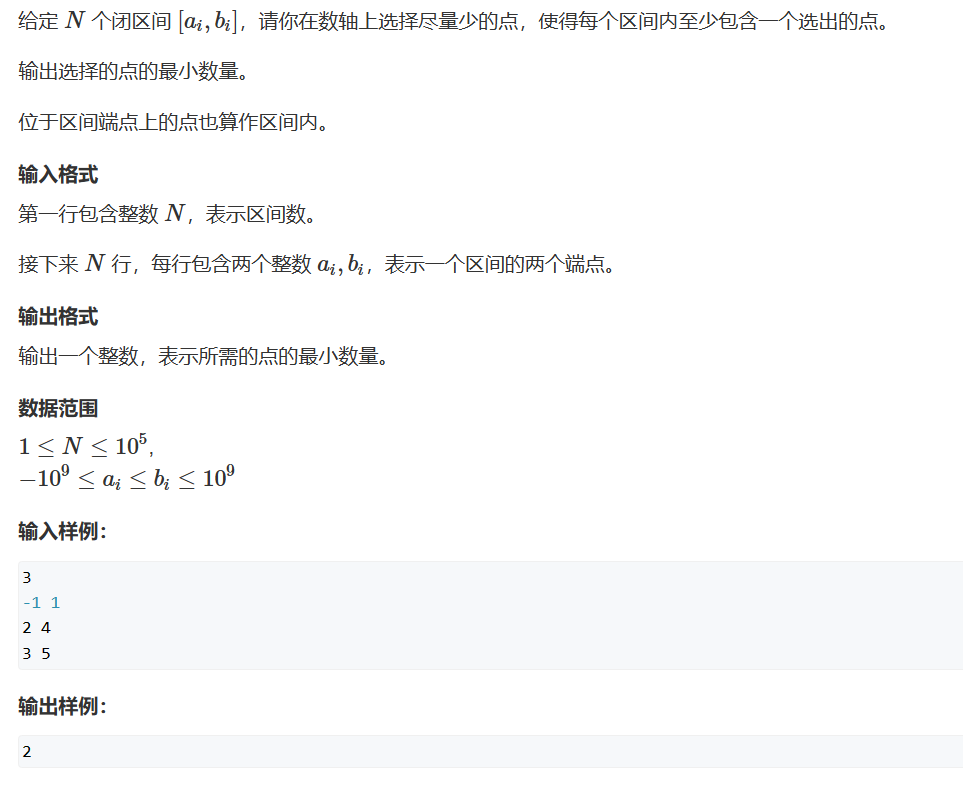
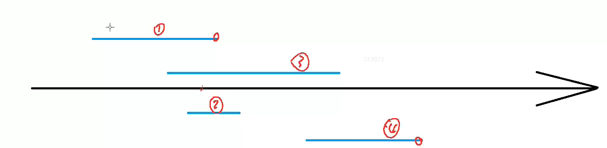
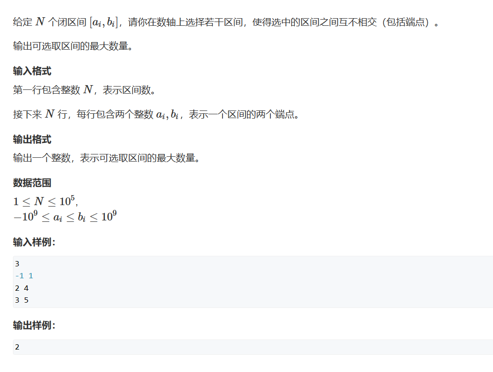
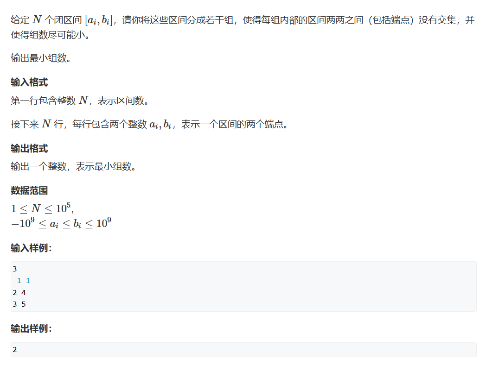
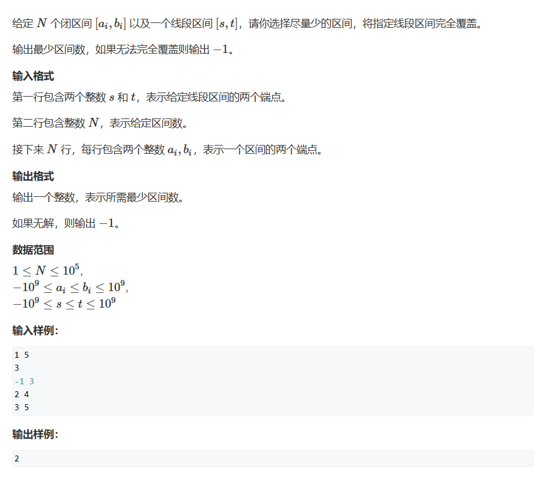
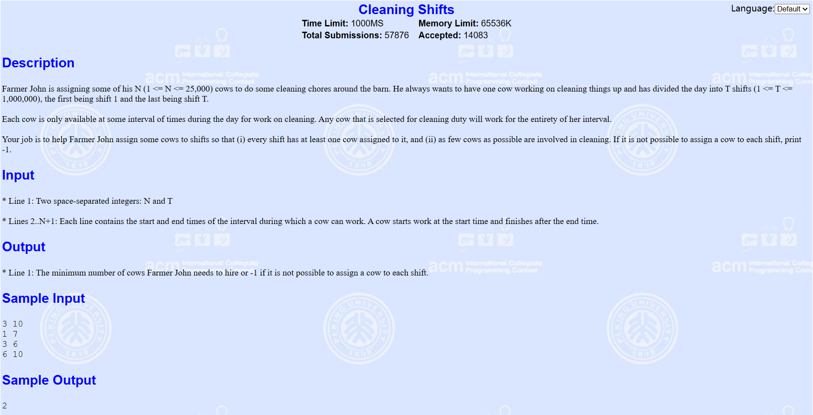
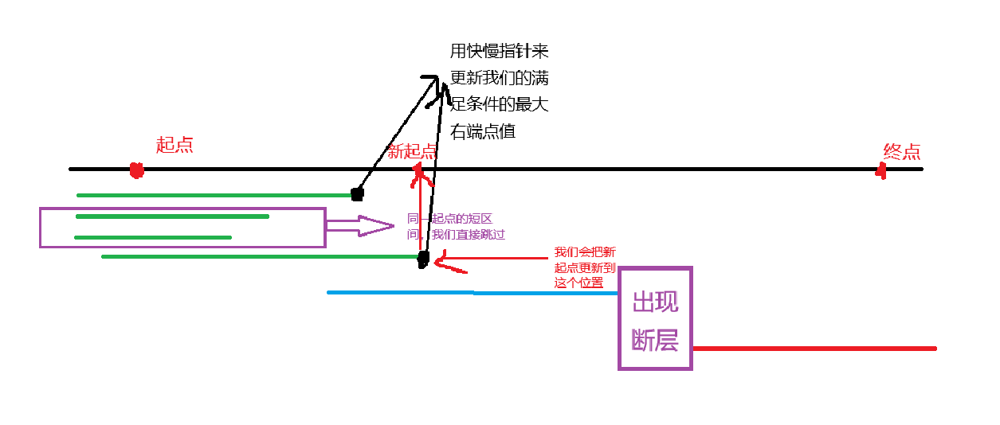

# 区间问题

贪心问题没有什么固定的套路，有时自己的灵光一现，然后带几个样例进去尝试我们就能验证自己“贪”地合不合理，如果合理大胆尝试就行

## 题一



这题的题一如下：在数轴中标记最少的点，使得每个区间至少包含一个点

一般情况下，区间问题我们会进行排序，不同的排序方法可以帮助我们做出不同的题目

此题我们使用y总给的图即可（主要是懒得自己画QAQ）：



例如此题，我们可以以右端点进行从小到大的排序，排序我们使用stl库就行，只不过数据结构上我们需要自己写一个cmp（我觉得自己写更好掌控排序的结果）
***
排序完以后我们就会发现一个性质：第一个区间的右端点值与其他区间的左端点值决定了它们是否在同一区间，即：

1. 在有交集的区间中，最小的右端点值一定比它们的左端点值大
2. 在互相无交集的区间中，上一个最小右端点值一定比它们的左端点值小

***
我们来证明一下，反证法：

假设在有交集的区间中，最小的右端点值一定比它们的左端点值小    
右端点比左端点小，那么它们没有交集，矛盾

假设在互相无交集的区间中，上一个最小右端点值一定比它们的左端点值大
右端点比左端点大，那么它们有交集，矛盾
***
还有一个，为什么判断点是最小的那个右端点呢？

因为当我们的点是最小的右端点时，我能够保证在这个点上，与我有交集的区间最多，这个读者看上图中的1、2、3号区间就能理解
***
**能用贪心去做的题目一般有这么一个必要条件：可以将问题分成若干个小问题，且各个小问题是独立的，之间没有关系，那么每个子问题的最优解的集合一定就是整个问题的最优解**

那么对于此题，我们将区间排序后就能将我们的问题拆分成这样的子问题：寻找能包含最多区间的交集，找到后去掉这几个区间继续寻找下一个，直至没有区间可寻找或寻找最大交集的个数

此时我们找到后就丢到找到的，因为它们都能包含同一个点，那么会不会影响下一次选择呢？并不会，因为我们只关心一个点能最多被几个区间包含，并不关系究竟是哪几个区间，所以如果我们去掉这几个区间后，新的最大值只会小于等于上一个最大。每次都取最大，那总问题就能做到最优解
***
其实这道题目最优的想法是画一个韦恩图，但是区间一多韦恩图会变得及其复杂QAQ

```cpp
#include <iostream>
#include <vector>
#include <algorithm>
#include <utility>

std::vector<std::pair<int, int>> myVec;
int n;

int main()
{
	std::cin >> n;
	for(int i = 0;i<n;i++)
	{
		int l, r;
		std::cin >> l >> r;
		myVec.push_back({ l,r });
	}
	std::sort(myVec.begin(), myVec.end(), [](auto& l, auto& r) {return l.second < r.second; });
	int count = 1;
	int lastIndex = myVec[0].second;
	for(int i = 1;i<n;i++)
	{
		int l = myVec[i].first, r = myVec[i].second;
		if (lastIndex < l)
		{
			count++;
			lastIndex = r;
		}
	}
	std::cout << count;
}
```

y总代码，会快两倍，但最大的影响还是输入输出导致的
```cpp
#include <iostream>
#include <algorithm>

using namespace std;

const int N = 100010;

int n;
struct Range
{
    int l, r;
    bool operator< (const Range &W)const
    {
        return r < W.r;
    }
}range[N];

int main()
{
    scanf("%d", &n);
    for (int i = 0; i < n; i ++ ) scanf("%d%d", &range[i].l, &range[i].r);

    sort(range, range + n);

    int res = 0, ed = -2e9;
    for (int i = 0; i < n; i ++ )
        if (range[i].l > ed)
        {
            res ++ ;
            ed = range[i].r;
        }

    printf("%d\n", res);

    return 0;
}
```

## 题二



这题与上题的数据集相同，但是我们要求的问题出现了变化，我们求的是最多不相交区间，但是....转念一想，我们的题目一求的是什么呢？

用最少的点落在所有区间内

那么如果一个点能落在一个区间集合内，那这个区间集合不就是会相交的吗？那这个区间集合我们是否取一个作为我们在题二中的一个解就可以呢？

想通这个问题，我们就可以 Ctrl + C，Ctrl + V了 XD

这同时也印证了我在题一中写的题解，一个贪心问题可以被转换为多个互不相关的子问题来求每个问题的最优解，而合成整个题目的最优解。

这里就不贴y总的代码了，贴我自己的就ok力，各位想优化时间的话把输入输出改成C标准就可以
```cpp
#include <iostream>
#include <vector>
#include <algorithm>
#include <utility>

std::vector<std::pair<int, int>> myVec;
int n;

int main()
{
	std::cin >> n;
	for(int i = 0;i<n;i++)
	{
		int l, r;
		std::cin >> l >> r;
		myVec.push_back({ l,r });
	}
	std::sort(myVec.begin(), myVec.end(), [](auto& l, auto& r) {return l.second < r.second; });
	int count = 1;
	int lastIndex = myVec[0].second;
	for(int i = 1;i<n;i++)
	{
		int l = myVec[i].first, r = myVec[i].second;
		if (lastIndex < l)
		{
			count++;
			lastIndex = r;
		}
	}
	std::cout << count;
}
```

## 题三



此题用区间看可能不太能看得懂，但我们可以切换一下问题的问法：

区间是时间（别问为什么有负时间，问就是不知道），每个区间代表老师上课的一个时间段，我们最少需要排多少个教室才能使得每个老师都能有教室上课

1. 我们按照左端点进行排序
2. 从前往后处理每个区间
   1. 判断能否将其放到某个现有的组中，判断区间时间开始 > 各个集合中最晚的结束时间
      1. 如果不存在这样的区间：加一间教室，将这个区间放进去
      2. 如果存在这样的区间：将其放进去，并更新当前组的Max_r

此题个人写法TLE，给大家亮出来仅作参考：
```cpp
#include <iostream>
#include <algorithm>

const int N = 100010;
int TimeTable[N];
int n,idx = 0;

struct TimeGrup
{
	int l;
	int r;
	bool operator<(const TimeGrup& other) const
	{
	    return l< other.l;
	}
}TimeGrups[N];

int main()
{
	std::cin >> n;

	for(int i = 0;i<n;i++)
	{
		scanf("%d%d",&TimeGrups[i].l,&TimeGrups[i].r);
	}

	std::sort(TimeGrups, TimeGrups + n);

	TimeTable[idx++] = TimeGrups[0].r;
	for(int i = 1;i<n;i++)
	{
		int& l = TimeGrups[i].l;
		bool p=true;
		for(int j = 0;j<idx;j++)
		{
			if (l > TimeTable[j]){
				TimeTable[j] = TimeGrups[i].r;
				p = false;
				break;
			}
		}
		if(p)
		    TimeTable[idx++] = TimeGrups[i].r;
	}
	printf("%d",idx);
}
```

y总法：维护一个小顶堆来储存每个区间集合的右端点，当我们新加入的区间左端点比这个小顶堆的根节点（右端点最小的区间集合）的值大时就说明可以并到目前已有的至少一个区间集合中，那我们默认将其并到根节点所在的区间，并将根节点pop出去重新更新我们的优先队列。

否则，我们无法将其并入任何一个区间，为它新开一个新区间

```cpp
#include <iostream>
#include <algorithm>
#include <queue>
#include <functional>

const int N = 100010;
int TimeTable[N];
int n,idx = 0;

struct TimeGrup
{
	int l;
	int r;
	bool operator< (const TimeGrup& W)const
	{
		return l < W.l;
	}
}TimeGrups[N];

int main()
{
	std::cin >> n;

	for(int i = 0;i<n;i++)
	{
		scanf("%d%d",&TimeGrups[i].l,&TimeGrups[i].r );
	}

	std::sort(TimeGrups, TimeGrups + n);

	std::priority_queue<int, std::vector<int>, std::greater<int>> heap;
	for(int i = 0;i<n;i++)
	{
		auto& temp = TimeGrups[i];
		int size = idx;
		if ((heap.empty() || heap.top() >= temp.l)) heap.push(temp.r);
		else
		{
			heap.pop();
			heap.push(temp.r);
		}
	}
	std::cout << heap.size();
}
```

未来姐解法：个人认为这是一个很妙的转换，和之前我叙述的教室很像，但是维护的东西所代表的东西不一样，未来姐维护的是同一时间段下使用的教室数，如果在同一时间有多个老师要求上课，那么未了不冲突我们就必须增加教室的数量，如此一来，同时使用的最多的教室数就是我们的答案。

同时未来姐对数据的处理也很有启发性，她将左端点转换为偶数，右端点转换为奇数，然后储存在一个连续的数组当中，然后将其排序。

因为老师上课和下课的时间相对顺序都是不变的，排序后也是一样，所以当我们遇到偶数时，我们开一间教室给老师上课，当我们遇到奇数时，说明有老师下课了，我们关掉一间教室，其中我们的答案就是过程中最大的教室使用量。

**Orz**

```cpp
#include <iostream>
#include <algorithm>

const int N = 100010;

int lines[2 * N],idx = 0;
int main()
{
	int n;
	std::cin >> n;
	for(int i = 0;i<n;i++)
	{
		int l, r;
		std::cin >> l >> r;
		lines[idx++] = l * 2;
		lines[idx++] = r * 2 + 1;
	}
	std::sort(lines, lines + idx);
	int count = 0,res = 0;
	for(int i = 0;i < idx;i++)
	{
		if (!(lines[i] % 2)) count++;
		else count--;
		res = std::max(res, count);
	}
	std::cout << res;
}
```

## 题四



曾经在POJ做过类似题目（其实可以说是一模一样了），现将其题目也贴出让大家参考一下。



两者的区别就是多了一个找起点的问题，简单处理一下即可。

现在讲讲此题贪心思路：

1. 将区间以将区间以左端点优先升序，右端点降序排列，目的是将同一起点但是较短的区间去掉，这样我们就能保证每次取的区间最长，从而保证选到最少的区间
2. 在从不同起点区间选择时，找到能覆盖此时起点的最大右端点区间即可



以下先介绍自己的解法，y总代码贴在最下面，时间复杂度都是O(n)，读者可以复制粘贴跑一遍比较一下，没有区别。

个人解法：

```cpp
#include <iostream>
#include <functional>
#include <algorithm>

const int N = 100010;
int n;

struct line
{
	int l;
	int r;
	bool operator<(const line& other) const
	{
		if (l == other.l)
			return r > other.r;
		return l < other.l;
	}
}lines[N], lineINeed;


int find()
{
	//如果有，那么至少有一个区间
	int count = 1;
	//记录我们的要求空间，但不建议学习我的写法，
	//这样写很容易不小心修改原始数据，
	//解决方法就是不使用引用
	int& l_required = lineINeed.l;
	int& r_required = lineINeed.r;
	//找到我们的起点在哪个区间并把那个区间的右端点值更新为我们新起点的右端点值
	int find_r = INT32_MAX;	

	int i = 0;
	int distance = INT32_MIN;
	for (; i < n; i++)
	{
		int& l = lines[i].l;
		int& r = lines[i].r;

		//先找到我们要求的队列的起点
		if (l <= l_required && l_required <= r)
		{
			//寻找覆盖面积最大的起点
			if (distance < r - l_required)	
			{
				find_r = r;
				distance = r - l_required;
			}
		}
		else if (l > l_required) break;
	}
	//没找到我们的左端点，那自然没有答案，返回-1；
	if (find_r == INT32_MAX)
		return -1;

	//此时我们的find_r的身份发生变化
	//每当我们将区间把我们要求的区间覆盖以后
	//我们要求的区间就变成了find_r --> r_required
	//find_r是我们新区间的起点
	int lastMax_r = find_r;	//用来实时更新最大右端点
	int end = find_r;		//用来记录上一个最大右端点，是判断是否能够覆盖要求区间的重要依据
	while (end < r_required)
	{
		for (; i < n; i++)
		{
			int& l = lines[i].l;
			int& r = lines[i].r;

			//如果左端点相等我们不需要再看，因为按照我们的排序，它是同起点的短区间
			if (l == lines[i - 1].l)
				continue;
			//如果这个区间能够覆盖我们的起点，
			//同时能更多地覆盖我们的要求区间，我们就将右端点更新
			if (l <= find_r)
			{
				if (lastMax_r < r)
					lastMax_r = r;
			}
			else
				break;
		}

		//如果找到了新区间起点仍然等于上一次的右端点
		//则说明出现了断层，lastMax_r一直没有更新
		if (lastMax_r == end)
			return -1;
		count++;
		end = lastMax_r;
		find_r = lastMax_r;
	}
	return count;
}

int main()
{
	scanf("%d%d%d", &lineINeed.l, &lineINeed.r,&n);
	for(int i = 0;i<n;i++) scanf("%d%d", &lines[i].l, &lines[i].r);

	//将区间以左端点优先升序，右端点降序排列，
	//目的是将同一起点但是较短的区间去掉，
	//这样我们就能保证每次取的区间最长，从而保证选到最少的区间
	std::sort(lines, lines + n);	
	
	std::cout << find();
}
```

y总解法：
y总的方法思路和我的差不多，但是其中数据的处理中我的解法通过右端点降序排序而做了部分优化，y总的方法在于更好理解

```cpp
#include <iostream>
#include <algorithm>

using namespace std;

const int N = 100010;

int n;
struct Range
{
    int l, r;
    bool operator< (const Range &W)const
    {
        return l < W.l;
    }
}range[N];

int main()
{
    int st, ed;
    scanf("%d%d", &st, &ed);
    scanf("%d", &n);
    for (int i = 0; i < n; i ++ )
    {
        int l, r;
        scanf("%d%d", &l, &r);
        range[i] = {l, r};
    }

    sort(range, range + n);

    int res = 0;
    bool success = false;
    for (int i = 0; i < n; i ++ )
    {
        int j = i, r = -2e9;
        while (j < n && range[j].l <= st)
        {
            r = max(r, range[j].r);
            j ++ ;
        }

        if (r < st)
        {
            res = -1;
            break;
        }

        res ++ ;
        if (r >= ed)
        {
            success = true;
            break;
        }

        st = r;
        i = j - 1;
    }

    if (!success) res = -1;
    printf("%d\n", res);

    return 0;
}
```