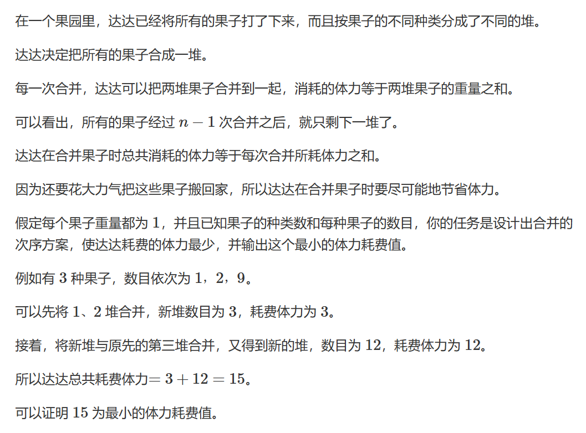
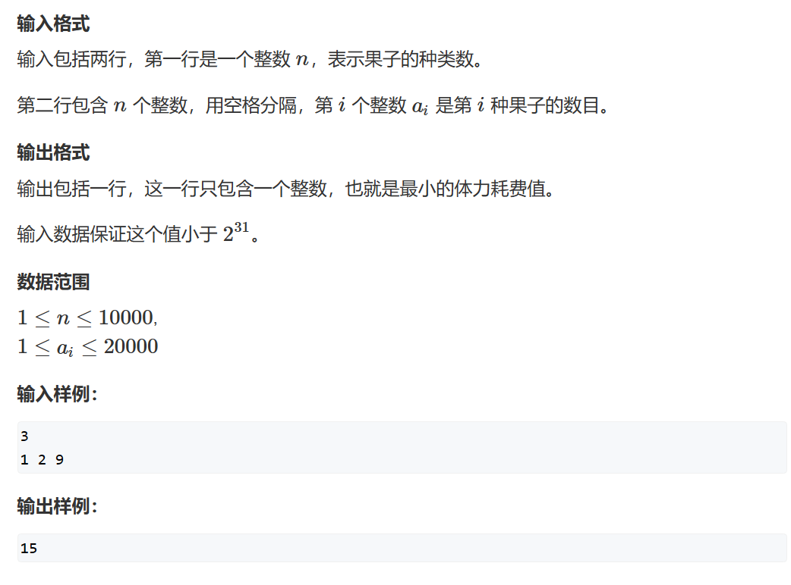

# 哈夫曼树

## 题一




如果读者和我一样是顺着刷过来的，那么此时应该联想到了动态规划里的区间问题的石子合并，导致此题做法不一致的原因就是DP那里添加了石子必须是相邻的才能合并，有了这个限制条件我们就不能使用贪心。

此题主要是能够深刻理解贪心里的一大性质：能用贪心做的题，那么可以将其拆成若干个子问题，而子问题之间互不相关，那么所有子问题的最优解就是题目的最优解

我们思考一下这道题，任意选两堆果子一共有几种选法呢？

$C^{2}_{n}$种，我们对选法没有限制，那么我们就可以将子问题设置成：**选两堆果子合并使得合并代价最小**，那么当我们每次都选择最小的两个堆合并，那么总的合并代价也就是最小的。

那么既然我们每次都需要的是最小值，我们就需要一个小根堆（或小顶堆）来维护我们的果堆即可。

```cpp
#include <iostream>
#include <vector>
#include <queue>
#include <functional>

const int N = 10010;
int n;
std::priority_queue<int,std::vector<int>,std::greater<int>> q;
int main()
{
	std::cin >> n;
	for(int i = 0;i<n;i++)
	{
		int a;
		scanf("%d", &a);
		q.push(a);
	}
	int sum = 0;
	while(q.size()>1)
	{
		//先把两个最小的元素取出来合并，而后放回到堆中
		int temp =q.top();
		q.pop();
		temp += q.top();
		q.pop();
		q.push(temp);
		//合并我们的体力消耗值
		sum += temp;
	}
	std::cout << sum;
}
```

