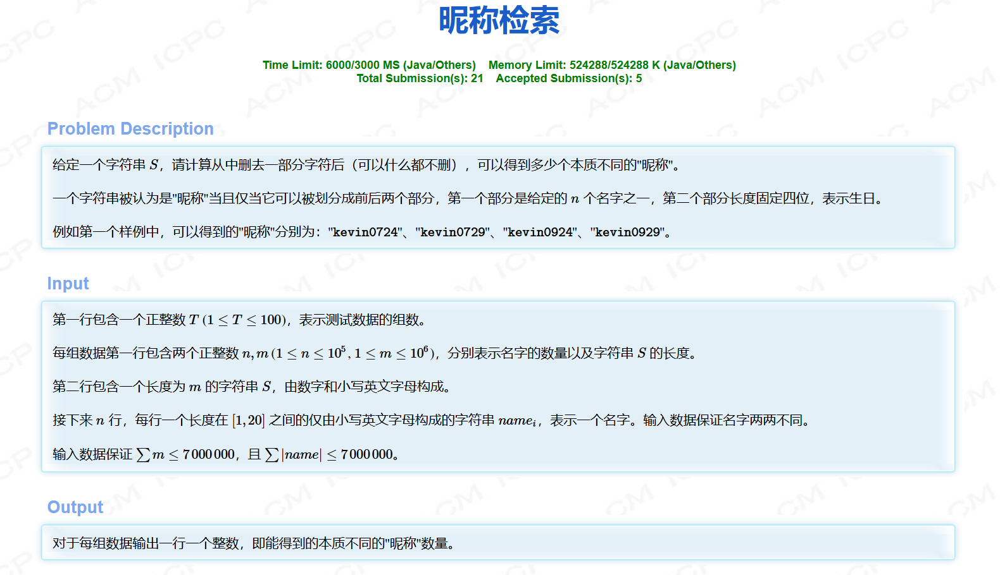

# 排序不等式

## 题一


```cpp
#include <iostream>
#include <algorithm>
using LL = long long;
const int N = 100010;
LL times[N];
int n;

int main()
{
    std::cin>>n;
  
    LL sum = 0;
    for(int i = 1;i<=n;i++) scanf("%d", &times[i]);
    std::sort(times+1,times+n+1);
    for(int i = 1;i<=n;i++) {
        sum += times[i]*(n-i);
    }
    std::cout<<sum;
}
```

## 题二



此题来源于杭电多校第四场，根据题意注意 $0229$ 也是合法的。

题解：首先记录每一个字符出现过的下标值，然后根据题意，分别对 $名字$ 部分从前到后进行字典序最小的二分匹配，对 $生日$ 部分从后到前进行字典序最大的二分匹配，最后根据 $名字$ 部分的尾字符地址和 $生日$ 部分的首字符地址进行计值即可。

```cpp
#pragma GCC optimize(2)
#include <iostream>
#include <map>
#include <cstring>
#include <vector>
#include <algorithm>
#include <string>
using ll = long long;
std::map <char, std::vector<int>> C_index;
std::string strN, strS;
//嘿，来打表哥们
std::string dates[] = {
	"0101","0102","0103","0104","0105",
	"0106","0107","0108","0109","0110",
	"0111","0112","0113","0114","0115",
	"0116","0117","0118","0119","0120",
	"0121","0122","0123","0124","0125",
	"0126","0127","0128","0129","0130",
	"0131","0201","0202","0203","0204",
	"0205","0206","0207","0208","0209",
	"0210","0211","0212","0213","0214",
	"0215","0216","0217","0218","0219",
	"0220","0221","0222","0223","0224",
	"0225","0226","0227","0228","0229",
	"0301","0302","0303","0304","0305",
	"0306","0307","0308","0309","0310",
	"0311","0312","0313","0314","0315",
	"0316","0317","0318","0319","0320",
	"0321","0322","0323","0324","0325",
	"0326","0327","0328","0329","0330",
	"0331","0401","0402","0403","0404",
	"0405","0406","0407","0408","0409",
	"0410","0411","0412","0413","0414",
	"0415","0416","0417","0418","0419",
	"0420","0421","0422","0423","0424",
	"0425","0426","0427","0428","0429",
	"0430","0501","0502","0503","0504",
	"0505","0506","0507","0508","0509",
	"0510","0511","0512","0513","0514",
	"0515","0516","0517","0518","0519",
	"0520","0521","0522","0523","0524",
	"0525","0526","0527","0528","0529",
	"0530","0531","0601","0602","0603",
	"0604","0605","0606","0607","0608",
	"0609","0610","0611","0612","0613",
	"0614","0615","0616","0617","0618",
	"0619","0620","0621","0622","0623",
	"0624","0625","0626","0627","0628",
	"0629","0630","0701","0702","0703",
	"0704","0705","0706","0707","0708",
	"0709","0710","0711","0712","0713",
	"0714","0715","0716","0717","0718",
	"0719","0720","0721","0722","0723",
	"0724","0725","0726","0727","0728",
	"0729","0730","0731","0801","0802",
	"0803","0804","0805","0806","0807",
	"0808","0809","0810","0811","0812",
	"0813","0814","0815","0816","0817",
	"0818","0819","0820","0821","0822",
	"0823","0824","0825","0826","0827",
	"0828","0829","0830","0831","0901",
	"0902","0903","0904","0905","0906",
	"0907","0908","0909","0910","0911",
	"0912","0913","0914","0915","0916",
	"0917","0918","0919","0920","0921",
	"0922","0923","0924","0925","0926",
	"0927","0928","0929","0930","1001",
	"1002","1003","1004","1005","1006",
	"1007","1008","1009","1010","1011",
	"1012","1013","1014","1015","1016",
	"1017","1018","1019","1020","1021",
	"1022","1023","1024","1025","1026",
	"1027","1028","1029","1030","1031",
	"1101","1102","1103","1104","1105",
	"1106","1107","1108","1109","1110",
	"1111","1112","1113","1114","1115",
	"1116","1117","1118","1119","1120",
	"1121","1122","1123","1124","1125",
	"1126","1127","1128","1129","1130",
	"1201","1202","1203","1204","1205",
	"1206","1207","1208","1209","1210",
	"1211","1212","1213","1214","1215",
	"1216","1217","1218","1219","1220",
	"1221","1222","1223","1224","1225",
	"1226","1227","1228","1229","1230",
	"1231",
};

int lastIdx[366];
int T;
int n, m;
int main()
{
	std::ios::sync_with_stdio(false);
	std::cin.tie(0);
	std::cout.tie(0);
	std::cin >> T;
	while(T--)
	{
		memset(lastIdx, -1, sizeof lastIdx);
		ll ans = 0;
		C_index.clear();
		std::cin >> n >> m;
		std::cin >> strS;
		for(int i = 0;i<m;i++)
		{
			C_index[strS[i]].push_back(i);
		}
		//先预处理生日部分
		for(int i = 0;i<366;i++)
		{
			int idx = m; //字符串的结尾后一个数
			int j = 3;
			for(;j>=0;--j)
			{
				auto findit = std::lower_bound(C_index[dates[i][j]].begin(), C_index[dates[i][j]].end(),idx);
			
				if(C_index[dates[i][j]].size() == 0||findit- C_index[dates[i][j]].begin()==0) break;
				idx = *(findit - 1);
				
			}
			if (j == -1)
			{
				lastIdx[i] = idx;
			}
		}
		//排序方便最后二分查找寻找答案
		std::sort(lastIdx, lastIdx + 366);
		//处理名字部分
		for(int i = 0;i<n;i++)
		{
			std::cin >> strN;
			int idx = -1;
			int j = 0;
			for(;j<strN.size();j++)
			{
				auto findit = std::upper_bound(C_index[strN[j]].begin(), C_index[strN[j]].end(), idx);

				if(findit != C_index[strN[j]].end())
				{
					if (idx != *findit)
						idx = *findit;
				}else
				{
					break;
				}
			}
			if(j!=strN.size())
			{
				continue;
			}
			if(m-idx<=3) continue;
			//二分找到名字部分最后一个字符最小能接到哪个生日的首字符后面，从而贪心找出满足的部分
			auto t = std::upper_bound(lastIdx, lastIdx + 366, idx);
			ans += 366 - (t-std::begin(lastIdx));
		}
		std::cout << ans << "\n";
	}
}
```