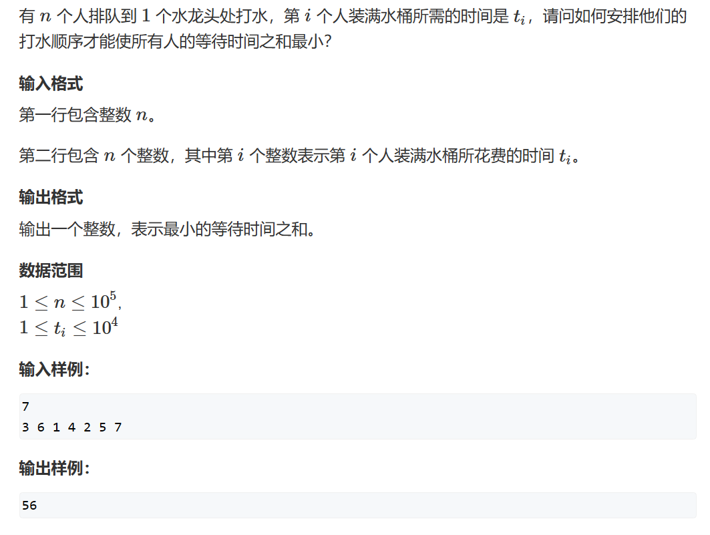

# 排序不等式

## 题一



```cpp
#include <iostream>
#include <algorithm>
using LL = long long;
const int N = 100010;
LL times[N];
int n;

int main()
{
    std::cin>>n;
  
    LL sum = 0;
    for(int i = 1;i<=n;i++) scanf("%d", &times[i]);
    std::sort(times+1,times+n+1);
    for(int i = 1;i<=n;i++) {
        sum += times[i]*(n-i);
    }
    std::cout<<sum;
}
```