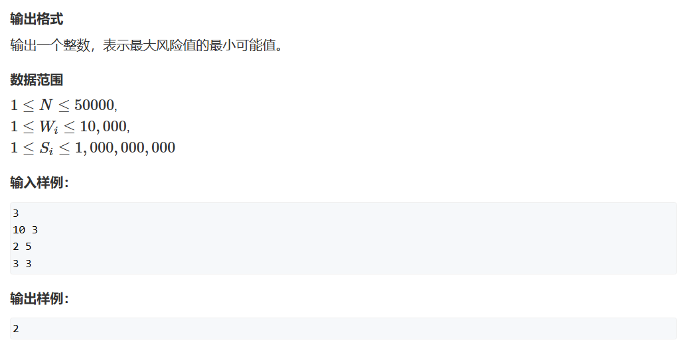

# 推公式

## 题一




题目的含义就是一堆牛竖直叠罗汉，每头牛都有自己的重量和最大耐受重量，危险系数等于这头牛承受的重量w（不包括自己）- 自己的最大耐受重量s，求这个危险系数的最小值

根据题目分类，我们知道我们需要推出一个危险系数关于重量和耐受重量的函数关系式，

$$F(w_i, s_i)$$

假设我们有n头奶牛从上往下顺序编号，那我们第k头奶牛的危险系数为
$$F(w_k, s_i) = w_1+w_2+...+w_{k-1}-s_k$$

那我们要求的答案就是在调整顺序后，使排列中最大的$F(w,s)$最小（使峰值最小）

***

1. 首先我们假设我们随机排好了一个顺序

2. 假设我们交换第i和第i+1头牛：


交换前：
$$F(w_i,s_i) =  w_1+w_2+...+w_{i-1}-s_i$$
$$F(w_{i+1},s_{i+1}) =  w_1+w_2+...+w_{i}-s_{i+1}$$

交换后：
$$F(w_i,s_i) =  w_1+w_2+...+w_{i-1}+w_{i+1}-s_{i}$$
$$F(w_{i+1},s_{i+1}) =  w_1+w_2+...+w_{i-1}-s_{i+1}$$

同时我们可以进行一些排序，我们同时对答案减去$w_1+w_2+...+w_{i-1}$

那么我们可得
$$F(w_i,s_i)_{交换前}=-s_i$$
$$F(w_{i+1},s_{i+1})_{交换前}=w_i-s_{i+1}$$
$$F(w_i,s_i)_{交换后}=w_{i+1}-s_i$$
$$F(w_{i+1},s_{i+1})_{交换后}=-s_{i+1}$$

如此我们可得$F(w_i,s_i)$增加$F(w_{i+1},s_{i+1})$减小

我们假设$F(w_{i+1},s_{i+1})_{交换前}>F(w_i,s_i)_{交换后}$
那么：
$$w_i-s_{i+1}>w_{i+1}-s_i$$
我们交换顺序：
$$w_i+s_i>w_{i+1}+s_{i+1}$$
我们将上式翻译一下，也就是当第i头牛的重量w和耐受值s加起来大于第i+1头时，$F(w_{i+1},s_{i+1})_{交换前}>F(w_i,s_i)_{交换后}$

***
**从而当第i头牛的重量w和耐受值s加起来大于第i+1头时，我们将大的移到下面后：**
$$max(F(w_i,s_i)_{交换前},F(w_{i+1},s_{i+1})_{交换前})>max(F(w_i,s_i)_{交换后},F(w_{i+1},s_{i+1})_{交换后})$$
**也就是我们的最大危险值被有效降低了。**
***

这样，我们就确定了我们的排序顺序，依$w+s$升序排序！

而后我们从前向后遍历每只牛并用前缀和思路求最大的$F(w,s)$值即可

```cpp
#include<iostream>
#include <algorithm>

const int N = 50010;

int n;

struct cow
{
	int w;
	int s;
	bool operator<(const cow& ohter) const
	{
		return (w + s) < (ohter.w + ohter.s);
	}
}cows[N];

int main()
{
	std::cin >> n;
	for (int i = 0; i < n; i++) scanf("%d%d", &cows[i].w, &cows[i].s);
	std::sort(cows, cows + n);
	int res = -cows[0].s;	//用第一头牛初始化，第一头牛啥也没干，有力无地用，是负值
	int w_sum = cows[0].w;
	for(int i = 1;i<n;i++)
	{
		res = std::max(res, w_sum - cows[i].s);
		w_sum += cows[i].w;
	}
	std::cout << res;
}
```

## 题二（01背包问题 + 贪心）

   
    
   


这个问题类似于贪心问题中的推公式类，但是可以通过两者结合的DP来处理这个问题。

***

一、公式推取

我们考虑在集合中任意两个相邻的能量石i 和i + 1（默认杜达还能恰）。

①我们先吃第i 个能量石，那么此时杜达获得的能量为：
$$E_i^{'}+E_{i+1}^{'}-S_iL_{i+1}$$
②我们先吃第i+1 个能量石，那么此时杜达获得的能量为：
$$E_i^{'}+E_{i+1}^{'}-S_{i+1}L_{i}$$

二、比大小

假设方案①杜达获得的能量大于方案②，那么有：
$$S_iL_{i+1}<S_{i+1}L_{i}$$

推一下：
$$\frac{S_i}{L_i}<\frac{S_{i+1}}{L_{i+1}}$$

三、处理数据

由上我们可知，当吃$\frac{S_i}{L_i}$ 最小的能量石时我们能获得相对最大能量

***

y总分析法：

一、状态表示

1. 集合：dp[i][j] 表示所有从前i块能量石中选，且花费时间不超过j的方案
2. 属性：Max

二、状态计算

dp[i][j] = max(d[i - 1][j], dp[i-1][j - s] + std::max(0, e - s[i] - (j - s) * l[i]))

***

朴素法：

经过检验，在朴素法正向遍历中此题不需要赋初始值，因为我们的状态转移并不会涉及到负数部分。

同时，我们也没必要在状态转移时考虑吃进去的石头是否能量已经为0或小于0，因为我们的状态转移只会从正数转移，如果此时dp[i-1][j] 为负数，它加上任何数也都是在减少的状态，故而我们不会选到它。也就是说我们获取的能量石一定是递增的，不会出现递减状态。

```cpp
#include <iostream>
#include <algorithm>
#include <cstring>

const int N = 110,M = 10010;

struct PowerStone
{
	int s;
	int e;
	int l;
	bool operator<(const PowerStone& other) const
	{
		return s * other.l < other.s * l;
	}
}PowerStones[N];
int T;
int dp[N][M];
int main()
{
	scanf("%d", &T);
	for(int t = 1;t<=T;t++)
	{
		int m = 0;
		
		int n;
		scanf("%d", &n);
		for(int i = 0;i<=n;i++) dp[0][i] = 0;
		for (int i = 1; i <= n; i++)
		{
			scanf("%d%d%d", &PowerStones[i].s, &PowerStones[i].e, &PowerStones[i].l);
			m += PowerStones[i].s;
		}
		std::sort(PowerStones + 1, PowerStones + n + 1);

		for(int i = 1;i<=n;i++)
		{
			int s = PowerStones[i].s, e = PowerStones[i].e, l = PowerStones[i].l;
			for(int j = 0;j<=m;j++)
			{
				dp[i][j] = dp[i - 1][j];
				if (j >= s) dp[i][j] = std::max(dp[i][j], dp[i - 1][j - s] + e - (j - s) * l);
			}
	
		}
		int res = 0;
		for (int i = 0; i <= m; i++) res = std::max(res, dp[n][i]);
		printf("Case #%d: %d\n",t, res);
	}
}
```

空间优化法：

```cpp
#include <iostream>
#include <algorithm>
#include <cstring>

const int N = 110,M = 10010;

struct PowerStone
{
	int s;
	int e;
	int l;
	bool operator<(const PowerStone& other) const
	{
		return s * other.l < other.s * l;
	}
}PowerStones[N];
int T;
int dp[M];
int main()
{
	scanf("%d", &T);
	for(int t = 1;t<=T;t++)
	{
		int m = 0;
		
		int n;
		scanf("%d", &n);
		memset(dp,0xcf,sizeof dp);
		dp[0] = 0;
		for (int i = 1; i <= n; i++)
		{
			scanf("%d%d%d", &PowerStones[i].s, &PowerStones[i].e, &PowerStones[i].l);
			m += PowerStones[i].s;
		}
		std::sort(PowerStones + 1, PowerStones + n + 1);

		for(int i = 1;i<=n;i++)
		{
			int s = PowerStones[i].s, e = PowerStones[i].e, l = PowerStones[i].l;
			for(int j = m;j>=s;j--)
			{
				dp[j] = std::max(dp[j], dp[j - s] + e - (j - s) * l);
			}
	
		}
		int res = 0;
		for (int i = 0; i <= m; i++) res = std::max(res, dp[i]);
		printf("Case #%d: %d\n",t, res);
	}
}
```