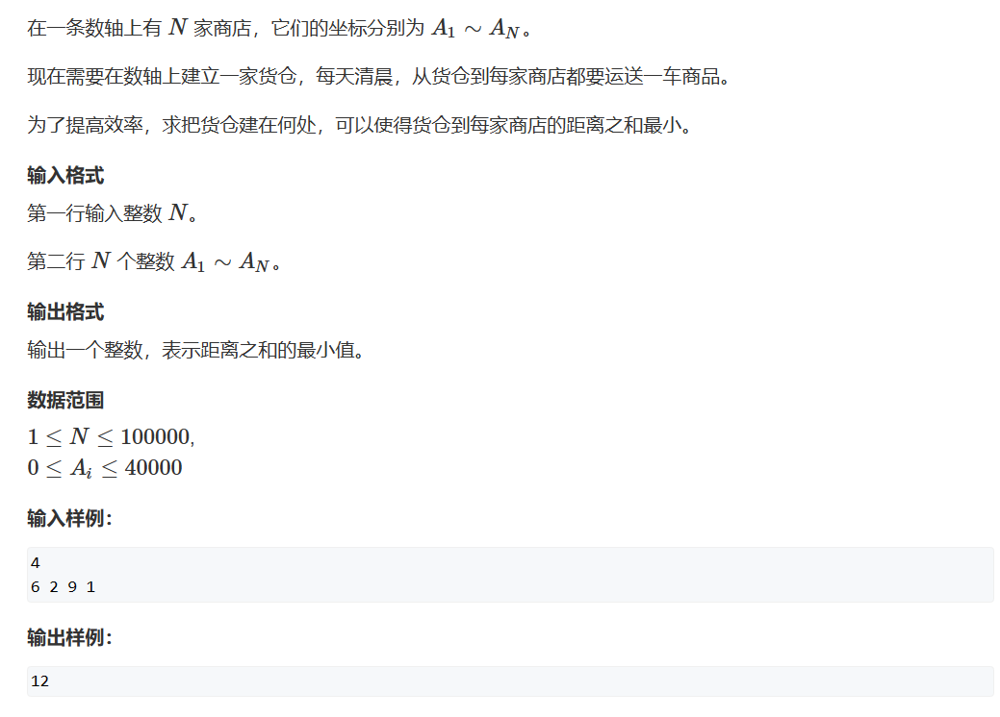

# 绝对值不等式



```cpp
#include <iostream>
#include <algorithm>
#include<cmath>

const int N = 100010;
int dist[N];
int n;

int main()
{
    std::cin>>n;
  
    int sum = 0;
    for(int i = 0;i<n;i++) scanf("%d", &dist[i]);
    
    std::sort(dist,dist+n);
    
    for(int i =0;i<n;i++)   sum += std::abs(dist[i]-dist[n>>1]);
    std::cout<<sum;
}
```