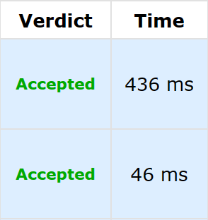

# 涉及算法


## 题A

## 题B

## 题C

## 题D

## 题E

题意：给你一个无序数组，每次可以选一个数乘2，请问最少通过几次这样的操作过后可以使数组变为升序。

***

思路：注意数据范围，如果暴力操作肯定会爆long long，那么需要找一个方法使得不改变原数据的情况下求得我们的答案。

我们改变一下答案数组的表示方法，我们将每个数最终乘上的幂次表示为$x_i$：
$$a_12^{x_1}，a_22^{x_2}，a_32^{x_3}，......，a_k2^{x_k}，......，a_n2^{x_n}$$

那么我们每次都考虑在原数组上$a_i$和$a_{i+1}$之间的相对大小，举个例子：

如果$a_{i-1}<a_i$，那么将$a_{i}$乘上$2^{x_{i}}$后使得$a_{i}>=a_{i-1}$，那么这个$2^{x_{i}}$就是$a_{i-1}$之后所有的数都要乘上去的，然后我们看到下一位，如果$a_{i+1}>a_i$，那么我们需要将对于$x_i$来说多乘上去的数减掉，以免使得$x_i$乘上$2^{x_{i}}$后$a_i2^{x_i}>a_{i+1}2^{x_{i+1}}$

```cpp
#include <iostream>
#include <algorithm>
using namespace std;
const int N = 1000010;
int a[N];
using ll = long long;
int n;
int main() {
	std::ios::sync_with_stdio(false);
	std::cin.tie(0);
	std::cout.tie(0);
	int m;
	std::cin >> m;
	while (m--) {
		cin >> n;
		ll cnt = 0;
		for (int i = 0; i < n; i++) cin >> a[i];
 
		ll ans = 0;
		for (int i = 1; i < n; i++)
		{
			ll l = a[i - 1], r = a[i], ct = 0;//ct 表示是修改次数
			while (l < r) ct--, l *= 2;
			while (l > r) ct++, r *= 2;
 
			cnt = max(0ll, cnt + ct);
			ans += cnt;
		}
 
		cout << ans << endl;
	}
}
```

## 题F

题意：从一个数组中找到一个子数组，使得同堆元素组成的子序列在原数组中唯一。

***
解释一下子数组、子序列：

子数组：由原数组中**连续**的元素构成。   
子序列：由原数组中**相对顺序不变**的元素构成，不需要连续。
***

思路：找一下规律，发现当**子数组**的开头$a_l$的左侧没有和$a_l$相等的数且**子数组**的结尾$a_r$的右侧没有和$a_r$相等的数时，这个子数组元素构成的**子序列**一定是唯一的。

证明很简单，反证法就行：假设$a_l$左侧有和自己相等的数$a_p\quad p < l$，那么在子序列中其他元素不变，可将$a_l$替换为$a_p$ 而子序列不变，故不满足题意。

这里的统计还有一个小技巧——前缀和，在统计的时候我们统计左边第一次出现的数字，如果遇到右边最后一次出现的数字，我们就与每一个统计的左数匹配一次。

```cpp
#include <iostream>
#include <map>
 
const int N = 10e9,M = 100010;
 
int T;
 
int q[M];
int main()
{
	std::ios::sync_with_stdio(false);
	std::cin.tie(0);
	std::cout.tie(0);
 
	std::cin >> T;
	while(T--)
	{
		std::map<int, int> l, r,nums;
		int n;
		std::cin >> n;
		for (int i = 1; i <= n; i++)
		{
			int value;
			std::cin >> value;
			q[i] = value;
			
			if (!nums[value])
			{
				l[value] = r[value] = i;
				nums[value]++;
			}
			else r[value] = i;
		}
		long long sum = 0;
		long long ans = 0;
		for(int i = 1;i<=n;i++)
		{
			if (l[q[i]] == i) sum++;
			if (r[q[i]] == i) ans += sum;
		}
		std::cout << ans << std::endl;
	}
}
```

## 题G1

题意：每次操作从A、B数组各去掉一个数，用最少得操作数使得新的A、B数组满足$A[i]<B[i]$。

***

思路：首先我们考虑贪心，对于A数组，我们每次删掉最大的数，对于B数组，我们每次删掉最小的数，然后检查新数组是否满足要求，若满足结束，不满足继续删除。暴力做法能过，但是很明显能发现我们删除的数的数量是线性的，即可以使用二分去寻找我们删除的数的数量的最小值。

暴力法：

```cpp
#include <iostream>
#include <algorithm>

const int N = 200010;

int A[N], B[N];
int n,m;

bool check(int x)
{
	int k = n - x;
	for (int i = 0; i < k; i++)
		if (A[i] >= B[i+x]) return true;
	return false;
}
int main()
{
	std::ios::sync_with_stdio(false);
	std::cin.tie(0);
	std::cout.tie(0);

	A[0] = 1;
	int T;
	std::cin >> T;
	while(T--)
	{
		std::cin >> n>>m;
		for (int i = 1; i < n; i++) std::cin >> A[i];
		for (int i = 0; i < n; i++) std::cin >> B[i];
		std::sort(A, A + n);
		std::sort(B, B + n);
		int i;
		for(i = 0;check(i);i++)
		{
			
		}
		std::cout << i << std::endl;
	}
}
```

优化法：

```cpp
#include <iostream>
#include <algorithm>
 
const int N = 200010;
 
int A[N], B[N];
int n,m;
 
bool check(int x)
{
	int k = n - x;
	for (int i = 0; i < x; i++)
		if (A[i] >= B[i + k]) return false;
	return true;
}
int main()
{
	std::ios::sync_with_stdio(false);
	std::cin.tie(0);
	std::cout.tie(0);
 
	A[0] = 1;
	int T;
	std::cin >> T;
	while(T--)
	{
		std::cin >> n>>m;
		for (int i = 1; i < n; i++) std::cin >> A[i];
		for (int i = 0; i < n; i++) std::cin >> B[i];
		std::sort(A, A + n);
		std::sort(B, B + n);
		int l = 0, r = n;
		while(l<r)
		{
			int center = l + r + 1 >> 1;
			if (check(center)) l = center;
			else r = center - 1;
		}
		std::cout << n-l << std::endl;
	}
}
```


$$（不要小看二分啊混蛋！）$$

## 题G2

题意：此题与G1不同点在于G1的A[0] = 1，是固定的，而G2的A[0] $\in [1,m]$，求的是所有组合下的总操作数。

***

思路：先不管A[0] 的情况下我们最多能匹配多少对合法对，然后插入A[0]，但是根据统计，我们发现在不插入A[0] 之前B剩下的最大数是否能够与A[0] 匹配，如果不能，我们的操作数就需要+1，如果可以，操作数就是不变的。

```cpp
#include <iostream>
#include <algorithm>
const int N = 200010;
int A[N], B[N];

int n, m;
int main()
{
	std::ios::sync_with_stdio(false);
	std::cin.tie(0);
	std::cout.tie(0);
	
	int T;
	std::cin >> T;
	while (T--)
	{
		bool st[N] = {false};
		std::cin >> n >> m;
		for (int i = 1; i < n; i++) std::cin >> A[i];
		for (int i = 0; i < n; i++) std::cin >> B[i];

		std::sort(A + 1, A + n);
		std::sort(B, B + n);
		int i, j;
		for(i = 1,j=0;i<n&&j<n;i++,j++)
		{
			while (j < n && A[i] >= B[j]) j++;
			if(j>=n) break;
			if (A[i] < B[j]) st[j] = true;
		}
		int haveNoPair = n-i;
		int cut = 0;
		int left = 0;
		for(i = n-1;i>=0;i--)
		{
			if(!st[i])
			{
				cut = std::min(m, B[i] - 1);
				
				break;
			}
		}
		left = m - cut;
		long long ans = 1ll*cut * haveNoPair + 1ll*left * (haveNoPair + 1);
		std::cout << ans << std::endl;
	}
}
```