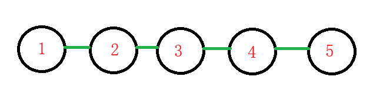
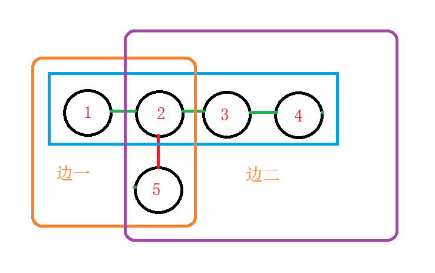

# 涉及算法

## 题A

## 题B

## 题C

## 题D

题意：找到给出数组中满足
$$a_i2^{a_j}=a_j2^{a_i}\qquad (i<j)$$
的配对个数

思路：通过模拟发现，除了当$a_i$与$a_j$分别为1、2或2、1时，其余时刻$a_i=a_j$那么特别统计一下1 和2 的出现个数即可。

```cpp
#include <iostream>
#include <map>
using ll = long long;

int main()
{
	std::ios::sync_with_stdio(false);
	std::cin.tie(0);
	std::cout.tie(0);
	int T;
	std::cin >> T;
	while(T--)
	{
		std::map<ll, ll> mapleft; //统计每个数出现过几次
		int n;
		std::cin >> n;
		ll ans = 0;
		int count1 = 0, count2 = 0; //统计1和2的个数
		for (int i = 1; i <= n; i++)
		{
			ll a;
			std::cin >> a;
			ans += mapleft[a];  //当前的a 可与已有的a 配对
			mapleft[a]++;       //将新的a 加入到数组中
			if(a==1)            //如果a = 1，那么此时这个a 可与每个2 配对一次
			{
				count1++;
				ans += count2;
			}
			if(a == 2)          //如果a = 2，那么此时这个a 可与每个1 配对一次
			{
				count2++;
				ans += count1;
			}
		}
		std::cout << ans<<std::endl;
	}
}
```

## 题E

题意：每次操作将第一个元素移到数组尾部，然后进行升序左冒泡，直至找到比这个元素小的元素停下，求操作数。

思路：此题十分简单，我们不能暴力去模拟排序（TLE），因为我们压根不需要排序。思考这个排序的过程，可以想到的是，当最小元素放到数组最前时我们的排序实际上就终止了，后面的排序均是在循环，那么我们就能想到，原始数组中最小元素的右侧元素是没法进行排序的，所以我们只需要判断原始数组中最小元素的右侧是否为升序即可。

```cpp
#include <iostream>
const int N = 200010;

int q[N],n;
bool check()
{
	for(int i = 1;i<n;i++)
		if(q[i-1]>q[i]) return false;
	return true;
}
void moveit()
{
	int temp = q[0];
	for(int i = 0;i<n-1;i++)
	{
		q[i] = q[i + 1];
	}
	q[n - 1] = temp;
}
int main()
{
	std::ios::sync_with_stdio(false);
	std::cin.tie(0);
	std::cout.tie(0);

	int T;
	std::cin >> T;
	
	while (T--)
	{
		int min = INT32_MAX, idx=0;
		std::cin >> n;
		for (int i = 0; i < n; i++)
		{
			std::cin >> q[i];
			if(min>q[i])
			{
				min = q[i];
				idx = i;
			}
		}
		bool p = true;
		for(int i = idx+1;i<n;i++)
		{
			if(q[i]<q[i-1])
			{
				p = false;
			}
		}
		if (p)
			std::cout << idx << std::endl;
		else
			std::cout << -1 << std::endl;
	}
}
```

## 题F

题意：由参赛者建立一个由n个节点组成的树，输出这个数的连接，对于m个询问$k_i\quad (i<=m)$，通过移动一个节点使得树中含有节点距离为$k_i$的两片叶子。

***

思路：很多人可能卡在怎么建立这个树，其实很简单，此题有点像脑筋急转弯（）。

我们如下建树，假设n为5：


我们只移动节点 5 ，其他根节点的相对位置固定，因为连接会新建一条边，所以我们只需要找到另一个到叶子节点距离为$k-1$的节点，假设我们需要$k = 2$，我们将节点5 与4 断开，连接到节点2 即可，那么此时我们就有两个距离$k$和$n-k$。



```cpp
#include <iostream>

int main()
{
	std::ios::sync_with_stdio(false);
	std::cin.tie(0);
	std::cout.tie(0);
	int t;
	std::cin >> t;
	
	while(t--)
	{
		int n, m;
		std::cin >> n >> m;
		for (int i = 1; i < n; i++)
			std::cout << i <<" " << i + 1 << std::endl;
		int len1 = n - 1,len2 = n-1,fa = n-1;
		for(int i = 0;i<m;i++)
		{

			int requst;
			std::cin >> requst;
			if (len1 == requst||len2 ==requst)
				std::cout << -1 << " " << -1 << " " << -1 << std::endl;
			else if(len1 != requst && len2 != requst)
			{
				std::cout << n << " " << fa << " " << requst << std::endl;
				fa = requst;
				len1 = requst;
				len2 = n - len1;
			}
		}
	}
	
}
```