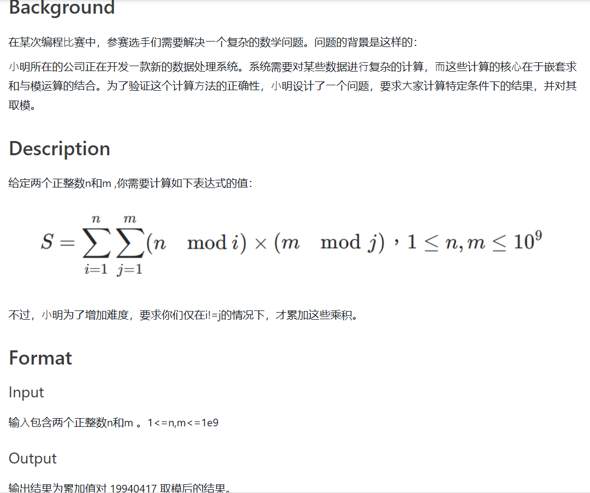
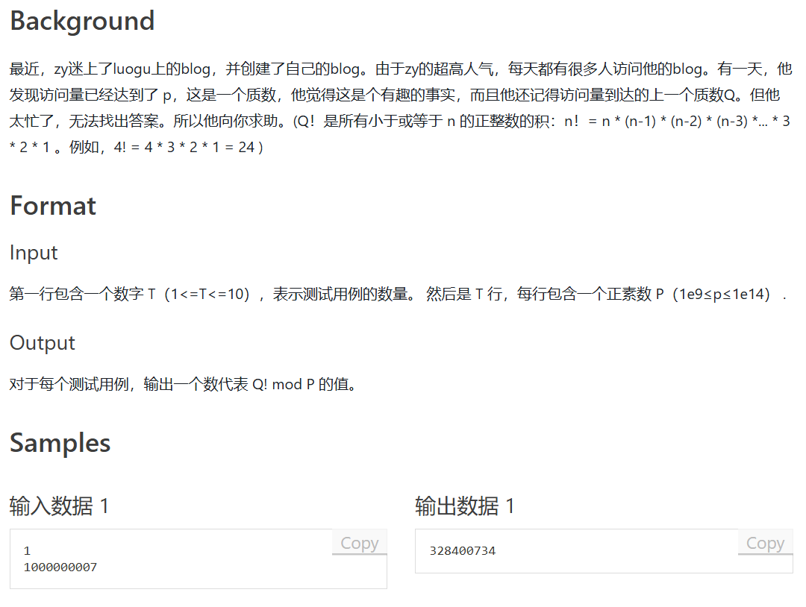

# 个人赛杂题记录

## 数论分块




所以最后我们有

## fan'sblog



根据威尔逊(Wilson)定理，若 $p$ 为质数，那么有：

$$(p-1)!\equiv -1 (mod~p)$$

右边可加上 $p$ 变为 $p-1$ ，然后左右两边约到 $p-1$ 变为

$$(p-2)!\equiv 1 (mod~p)$$

又因为

$$Q!\times (Q+1)\times ...\times (p-2) = (p-2)!\equiv 1~(mod p)$$

此时左右同乘 $(Q+1)\times ...\times (p-2)$的逆元，右侧即是答案。

小于 $p$ 的质数暴力判断一下即可，这里我搬出才学的米勒罗宾的模板，因为两相邻质数之间的距离不大。

```cpp
#include<iostream>

using namespace std;
using LL =long long;

const int Times = 10;

LL gcd(LL a, LL b) 
{
	return b ? gcd(b, a % b) : a;
}
LL multi(LL a, LL b, LL m)  //快速积
{	
	LL ans = 0;
	a %= m;
	while (b)
	{
		if (b & 1)
		{
			ans = (ans + a) % m;
			b--;
		}
		b >>= 1;
		a = (a + a) % m;
	}
	return ans;
}
LL pow(LL a, LL b, LL m)	//快速幂
{
	LL ans = 1;
	a %= m;
	while (b)
	{
		if (b & 1)
		{
			ans = multi(ans, a, m);
			b--;
		}
		b >>= 1;
		a = multi(a, a, m);
	}
	return ans;
}
bool Miller_Rabin(LL n)  
{
	if (n == 2) return true;
	if (n < 2 || !(n & 1)) return false;
	LL m = n - 1;
	int k = 0;
	while ((m & 1) == 0)
	{
		k++;  
		m >>= 1;  
	}
	for (int i = 0; i < Times; i++) 
	{
		LL a = rand() % (n - 1) + 1;  
		LL x = pow(a, m, n);
		LL y = 0;
		for (int j = 0; j < k; j++)
		{
			y = multi(x, x, n);
			if (y == 1 && x != 1 && x != n - 1) return false;
			x = y;
		}
		if (y != 1) return false;
	}
	return true;
}

LL infact(LL a,LL MOD)
{
	return pow(a, MOD - 2, MOD);
}

LL n;

int main()
{
	LL T;
	std::cin >> T;
	while (T--)
	{
		LL ans = 1;
		std::cin >> n;
		LL i = n - 1;
		for (; i >= 2;i--)
			if (Miller_Rabin(i)) break;
		for(i = i+1;i<=n-2;i++)
		{
			ans = multi(ans, infact(i, n), n);
		}
		std::cout << ans<<std::endl;
		
	}
	return 0;
}
```

对于整数 $n$ ，我们设 $(n!)_p$ 表示所有小于等于 $n$ 但不能被 $p$ 整除的正整数的乘积，如下形式：

$(n!)_p = 1\times 2\times  ...\times (p-1)\times \underbrace{1}_p\times (p+1)\times (p+2)\times  ...\times (2p-2)\times (2p-1)\\\times \underbrace{2}_{2p}\times (2p+1)...\times (p^2-2)\times (p^2-1)\times \underbrace{1}_{p^2}\times (p^2+1)\times ...\times n~(mod~p)\\~~~~~~~~~~=1\times 2\times  ...\times (p-1)\times \underbrace{1}_2p\times 1\times 2\times  ...\times (p-1)\times \underbrace{1}_p\times 1\times 2\times  ...\times (p-1)\times \underbrace{1}_{p^2}\times 1\times 2\times  ...\times(n~mod~p)~(mod~p)$

如此，我们将 $(n!)_p$ 分化为 $\lfloor \frac{n}{p}\rfloor$ 相同的块和一个[1,n] 的块

$~~~~~~~~~~=\underbrace{1\times 2\times  ...\times (p-1)\times 1}_{1th}~~~\underbrace{\times 1\times 2\times  ...\times (p-1)\times {2}}_{2th}~~~\underbrace{\times 1\times 2\times  ...\times (p-1)\times 1}_{pth}~~~\underbrace{\times 1\times 2\times  ...\times(n~mod~p)~(mod~p)}_{tail}$
