# 涉及算法

1. 双指针——滑动数组
2. 动态规划——数位统计
3. 线性筛质数
4. 剪枝优化

## 题A

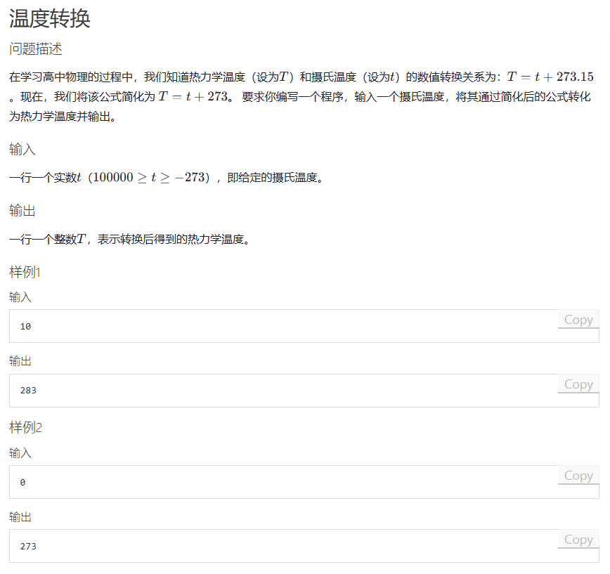

题解：略

```cpp
#include <iostream>
#include <algorithm>
#include <cstring>

int main()
{
	int t;
	scanf("%d", &t);
	printf("%d", t + 273);
	return 0;
}
```

## 题B

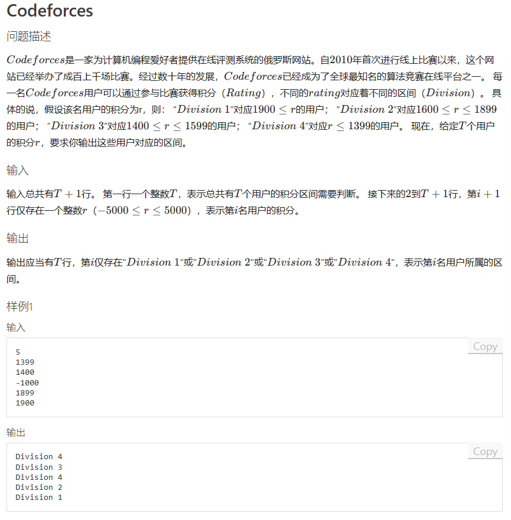

题解：略

```cpp
#include <iostream>
#include <algorithm>
#include <cstring>
int n;
int main()
{
	
	scanf("%d", &n);
	for(int i = 0;i<n;i++)
	{
		int t;
		scanf("%d", &t);
		if (t >= 1900)
			printf("Division 1\n");
		else if (t >= 1600 && t <= 1899)
			printf("Division 2\n");
		else if (t >= 1400 && t <= 1599)
			printf("Division 3\n");
		else
			printf("Division 4\n");
	}
	return 0;
}
```

## 题C

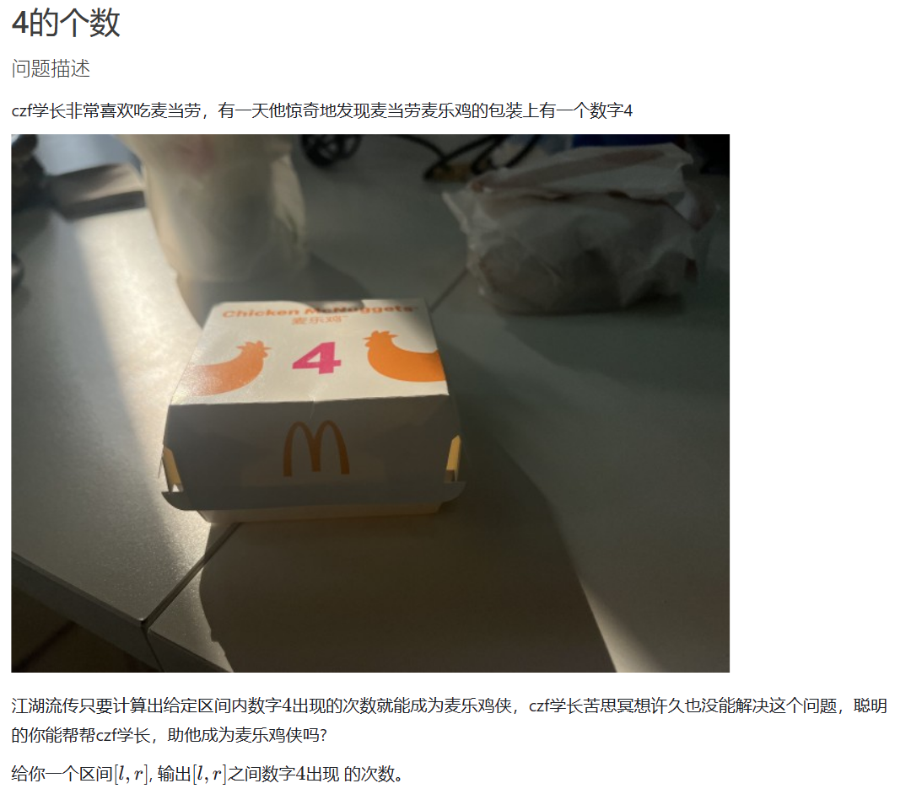   
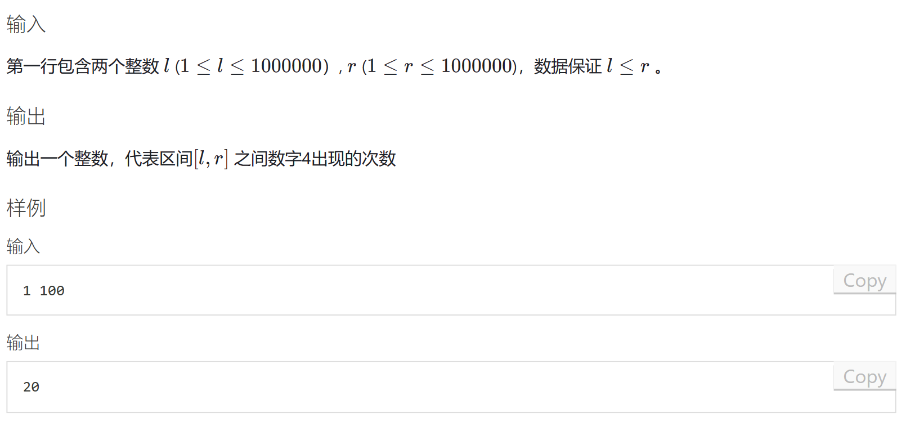

题解：

此题考的是一些**数位统计**的知识点。

此题如果用枚举，那么计算次数一定超过$10^8$，在C++中肯定是TLE了，所以我们介绍这题按位计算的方法。

假设我们有一个7位数 —— a bcd efg，我们求k能以第4位元素的身份在 1 ~ abcdefg中可以出现几次，此时我们将其分为三个部分

1. “$abc$”：    第4位元素左边的数
2. “$d$”  ：    第4位元素
3. “$efg$”：    第4位元素右边的数

此时我们就可以分类讨论了：

一、**0 <= 左边的数 <= abc-1**

   1. k != 0 ：此时我们高位一定高于最大数的高位，无论a等于什么所有的选法都是合法的，故有（0 ~ abc-1）*（0 ~ 999）共**abc * 1000** 个数字在第4位出现 a
   2. k = 0 ：这时我们需要小心，因为在我们定义当中我们找的值必须是有意义的，如果abc此时等于0，那么我们就统计了一个0edf的三位数，前缀0是没有统计意义的，所以我们不予统计，另作一类可能

二、**1 <= 左边的数 <= abc-1**

   1. 此时就是我们所谈到的那个可能，我们将k = 0时拿出来单独讨论，发现它在第一类可能中时需要去除abc = 0的可能，那么少了一种可能，那就共有 （1 ~ abc - 1）*（0 ~ 999）种共 （abc-1）*  1000 个数字在第4位出现k

三、左边的数 = abc
   1. 第四位元素 < k ：无解
   2. 第四位元素 = k ：此时右边的数有0 ~ efg 种取法，共efg + 1
   3. 第四位元素 > k ：此时右边的数可以任选，那就是 0 ~ 999 种取法，共1000种

集合图解
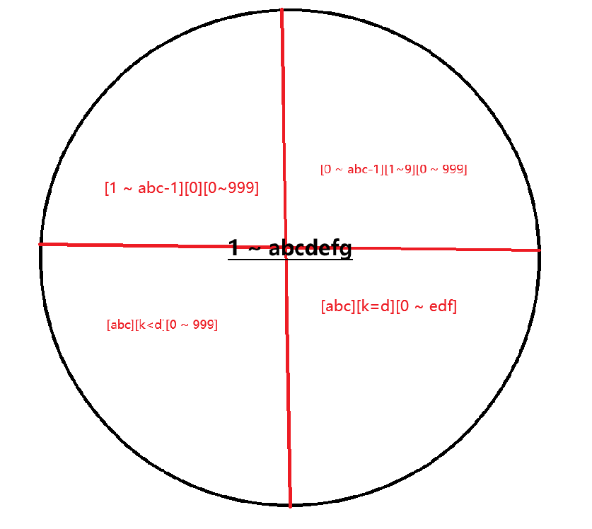

```cpp
#include <iostream>
#include <algorithm>
#include <cmath>

int dgt(int x)
{
	int res = 0;
	while (x)
	{
		x /= 10;
		res++;
	}
	return res;
}
int n, m;
int count(int a, int number)	//计算1 ~  numbers, a出现几次
{
	if (number == 0) return 0;
	int sum = 0;
	const int DGT = dgt(number); //计算number的位数

	for (int i = 1; i <= DGT; i++) //根据位数去寻找
	{
		int p = (int)std::pow(10, i - 1);//先把数量级算出来，方便之后计算
		int d = number / p % 10;    //把d取出来
		int abc = number / p / 10;  //取出左部分数字  
		int efg = number % p;       //取出右部分数字

		if (a) sum += abc * p;      //如果我们需要计算的数字不是0，我们就可以保证能加上abc、efg随便取的部分
		if (!a && abc) sum += (abc - 1) * p;    //如果a为0，且abc不为0，加上1 ~ abc、efg随便取的部分
		if ((d > a) && (abc || a)) sum += p;    //如果d位大于我们统计的数字，那么efg随便选
		if ((d == a) && (abc || a)) sum += efg + 1; //如果d位等于我们统计的数字，那么edf只能从0 选到 efh
	}
	return sum;
}

int main()
{
	std::cin >> n >> m;
	if (n > m) std::swap(n, m);
    //[l, r]的就是[0, r]的数量减去[0, l-1] 的数量 
	std::cout << count(4, m) - count(4, n - 1) << " ";
}
```

## 题D

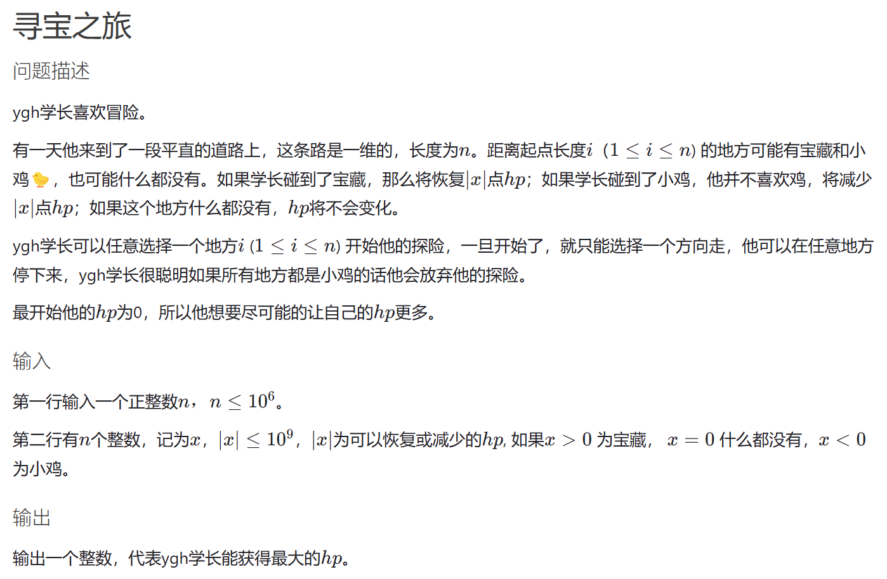   
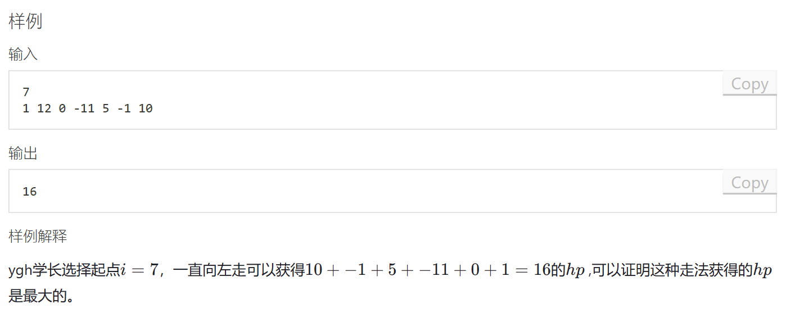

此题很简单，求的是**最大连续子区间和**，往什么方向走并不重要。

分析一下关键字

1. **最大**：开一个数不停维护此时区间内的最大值
2. **连续**：区间必须是连续的

可以很容易想到，如果连续子区间的前缀和<0，那么此时连续区间无论加上什么数，sum是一定减小的，所以当sum<0时，这个连续区间的所有和就已经被我们遍历过了，重新开始下一个连续区间的遍历。

画图模拟更为直观：

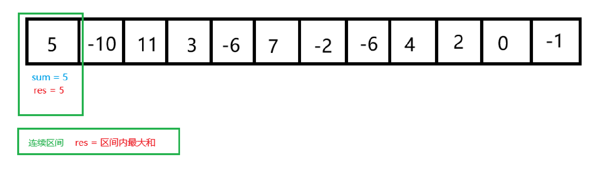

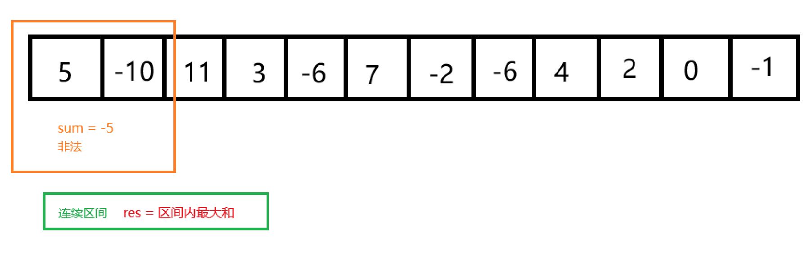

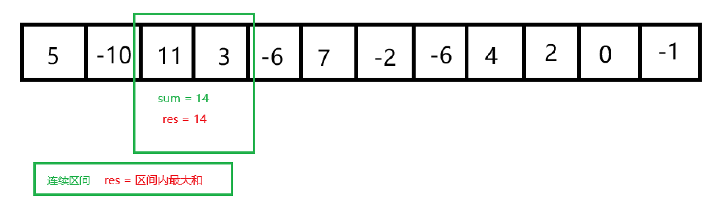

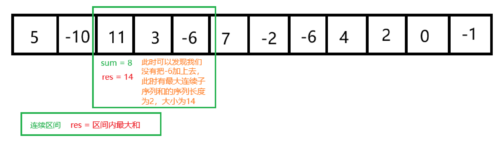

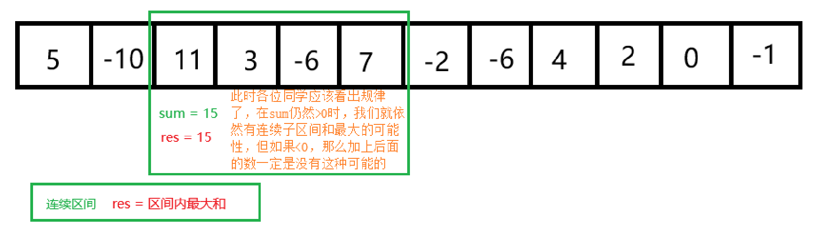


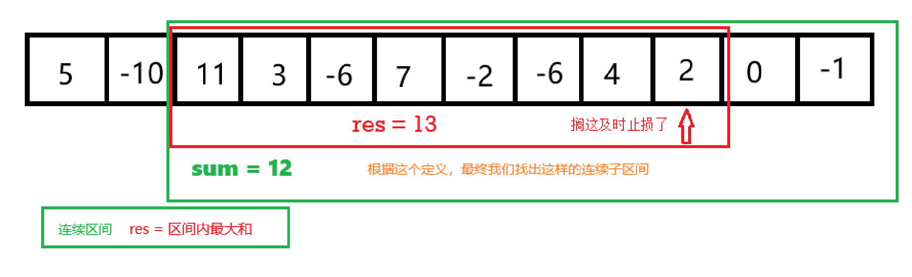

***

```cpp
#include <iostream>

const int N = 1000010;

long long q[N];

int main()
{
	int n;
	scanf("%d", &n);
	for (int i = 0; i < n; i++) scanf("%lld", &q[i]);
	long long sum = 0,res = 0;
	for(int j = 0;j<n;j++)
	{
		sum += q[j];
		if (sum < 0)
		{
			sum = 0;
		}
		res = std::max(res, sum);
	}
	printf("%lld", res);

}
```

## 题E

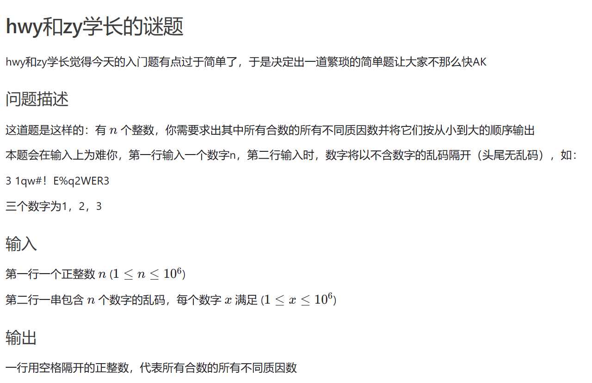   
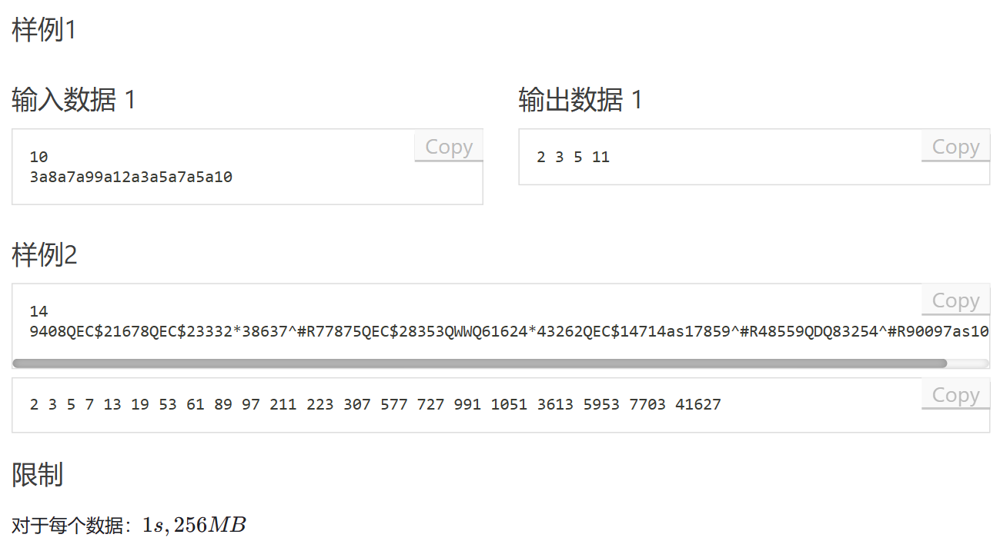

此题TLE，因为什么呢？用了该死的scanf去读单字符QAQ，改成getchar去读就AC了

此题就是输入需要正确处理，使用线性筛将所有质数预处理出来，如此我们只需要检查合数是否能被质数整除即可。

```cpp
#include <iostream>
#include <algorithm>
#include <vector>
#include <set>
const int N = 1000010;

std::vector<int> q;
bool st[N];
int Prime[N];

int count_Prime3(int n)     //线性筛
{
	int cnt = 0;
	for (int i = 2; i <= n; i++)
	{
		if (!st[i]) Prime[cnt++] = i;
		for (int j = 0; Prime[j] <= n / i; j++)  
		{
			st[Prime[j] * i] = true;  
			if (i % Prime[j] == 0) break;
		}
	}
	return cnt;
}
int main()
{
	int count = count_Prime3(1000000);
	int n,cnt = 0;
	scanf("%d", &n);
	for (int i = 0; i < n; i++) {
		char c;
		int num = 0;
		c = getchar();
		while (c < '0' || c > '9')
		{
			c = getchar();
		}
		while (c >= '0' && c <= '9')
		{
			num = num * 10 + c - '0';
			c = getchar();
		}
		if (st[num]) //剪枝，质数不做计算
			q.push_back(num);
	}
	
	//for (int i = 0; i < n; i++)
	//	printf("%d ", q[i]);

	std::sort(q.begin(), q.end());  //排个序，好看一些
	q.erase(std::unique(q.begin(), q.end()),q.end()); //用stl库删掉重复元素
	cnt = 0;
	
    //用stl 库中提供的关联式容器res来记录和自动排序我们的答案，set是有序集合，它不会统计重复的元素
	std::set<int> res;
	for(int i=0;i<q.size();i++)
	{
		for(int j = 0;j<count&&q[i]>=Prime[j];j++)
		{
			if(q[i]%Prime[j]==0)
			{
				res.insert(Prime[j]);
			}
		}
	}
	for (auto& i:res)
		printf("%d ", i);
}
```


```cpp

int q[N],hh,tt = -1,idx;

add()
{
	q[idx++] = ;
}

pop()
{
	q[hh++];
}

```