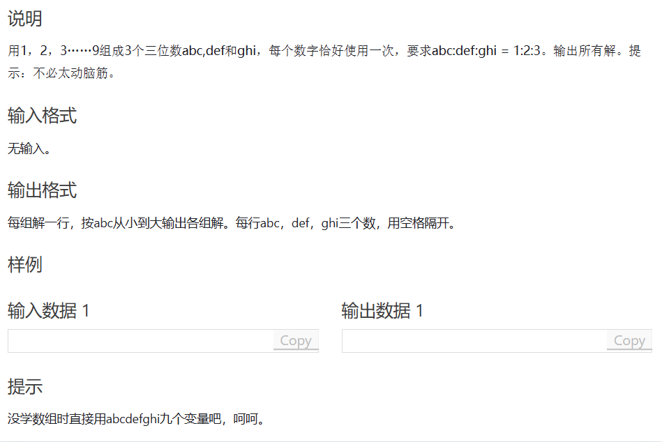
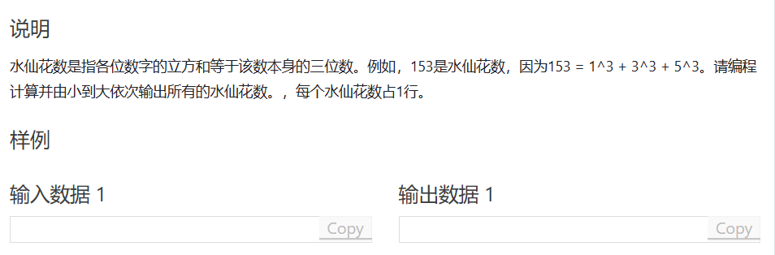
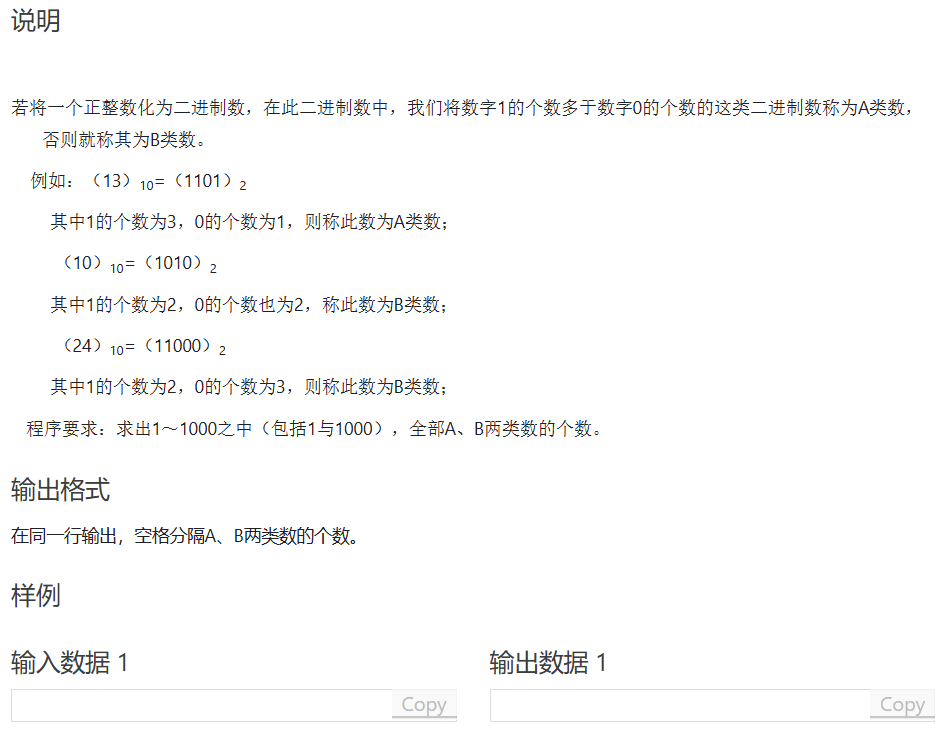
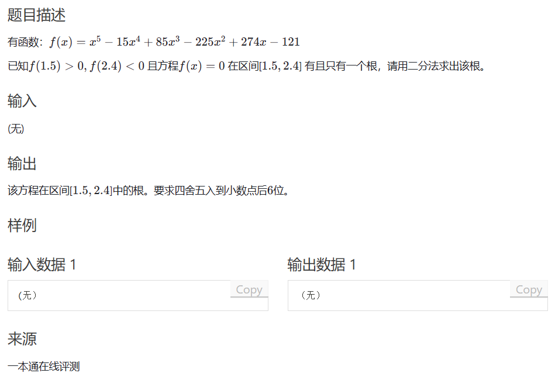
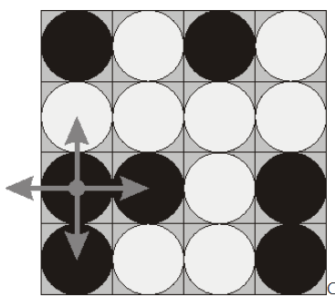

# 涉及算法

1. 浮点数二分
2. DFS

## 题A



题解：略

```cpp
#include <iostream>
#include <cstring>
#include <algorithm>

int main()
{
	std::ios::sync_with_stdio(false);
	std::cin.tie(0);
	std::cout.tie(0);
	for (int i = 100; i < 334; i++)
	{
		bool st[10] = {false};
		bool p = false;
		int a = i * 2;
		int b = i * 3;
		st[i % 10] = true;
		st[i / 10 % 10] = true;
		st[i / 100] = true;
		st[a % 10] = true;
		st[a / 10 % 10] = true;
		st[a / 100] = true;
		st[b % 10] = true;
		st[b / 10 % 10] = true;
		st[b / 100] = true;
		if(st[0]==true) continue;
		for (int k = 1; k < 10; k++)
		{
			if (st[k] == false)
			{
				p = true;
				break;
			}
		}
		if(p) continue;
		std::cout << i << " " << a << " " << b << "\n";
	}
}
```

## 题B



题解：略，为什么要出这题（）

```cpp
#include <iostream>
#include <cstring>
#include <algorithm>
#include <cmath>

int main()
{
	std::ios::sync_with_stdio(false);
	std::cin.tie(0);
	std::cout.tie(0);
	for (int i = 100; i <= 999; i++)
		if (std::pow(i % 10, 3) + std::pow(i / 10 % 10, 3) + std::pow(i / 100, 3) == i)
			std::cout << i << "\n";
}
```

## 题C



题解：略

```cpp
#include <iostream>
#include <algorithm>
#include <cstring>

int main()
{
    int A = 0;
    for(int i = 1;i<=1000;i++)
    { 
        int count1 = 0,count0 = 0; 
        int c = i;
        while(c)
        {
            if(c&1) count1++;
            else count0++; 
            c >>=1;
        }
        if(count1>count0) A++;
    }
    std::cout<<A<<" "<<1000-A;
    return 0;
}
```

## 题D



题解：注意这是浮点数二分，需要标记一个极小数判0即可。

```cpp
#include<iostream>
#include<cmath>
#include<iomanip>

double fx(double x)
{
	return std::pow(x, 5) - 15 * std::pow(x, 4) + 85 * std::pow(x, 3) - 225 * std::pow(x, 2) + 274 * x - 121;
}

double find(double left, double right)
{
	double middle = (left + right) / 2.0;
	double result = fx(middle);
	if (result > 1e-7) return find(middle, right);
	if (result < -1e-7) return find(left, middle);
	return middle;
}

int main()
{
	double result = find(1.5, 2.4);
	std::cout << std::fixed << std::setprecision(6) << result;
	return 0;
}
```

## 题E（poj.1753）

图：略略略



题意：给如图一个4 * 4棋盘，用‘p’ 表示黑棋，‘w’ 表示白棋。翻棋子会将其周围棋子也翻面，求最少操作数使得棋面颜色统一，若无，则输出“Impossible”。

题解：简单的dfs（该死，翻译软件翻译成全翻成白棋）

```cpp
#include <iostream>

const int N = 10;
int map[N][N];

int ans = 0x3f3f3f3f;
bool check()
{
	int right = map[1][1];
	for (int i = 1; i <= 4; i++)
	{
		for(int j = 1;j<=4;j++)
			if (map[i][j] != right) return false;
	}
	return true;
}
void change(int x,int y)
{
	if (map[x][y] == 1) map[x][y] = 0;
	else map[x][y] = 1;

	if (map[x][y + 1] == 1) map[x][y + 1] = 0;
	else map[x][y + 1] = 1;

	if (map[x][y - 1] == 1) map[x][y - 1] = 0;
	else map[x][y - 1] = 1;

	if (map[x - 1][y] == 1) map[x - 1][y] = 0;
	else map[x - 1][y] = 1;

	if (map[x + 1][y] == 1) map[x + 1][y] = 0;
	else map[x + 1][y] = 1;
	
}
void dfs(int x,int y,int cnt)
{
	if(check())
	{
		if (ans > cnt) ans = cnt;
		return;
	}
	if(x>=5) return;

	change(x, y);
	if (y == 4) dfs(x + 1, 1, cnt + 1); 
	else dfs(x, y + 1, cnt + 1);
	change(x, y); 
	if (y == 4) dfs(x + 1, 1,cnt);
	else dfs(x, y + 1, cnt);
}

int main()
{
	for(int i = 1;i<=4;i++)
	{
		for(int j = 1;j<=4;j++)
		{
			char c;
			std::cin >> c;
			if (c == 'b') map[i][j] = 0;
			else map[i][j] = 1;
		}
	}
	
	dfs(1,1,0);
	if (ans == 0x3f3f3f3f) std::cout << "Impossible\n";
	else std::cout << ans<<"\n";
	return 0;
}
```

