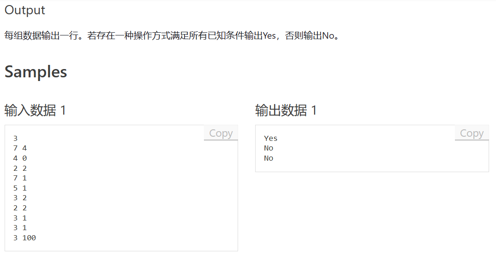
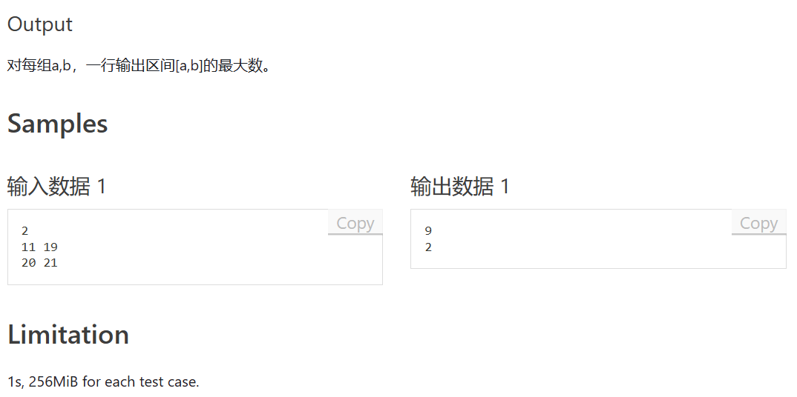

# 涉及算法

1. 贪心
2. 树形DP
3. 数位统计

## 题A





题意：给一个计数器，计数器只有两种操作：+1或归零。给定已知数量的操作数和部分操作下计数器的值，判断是否有满足条件的操作组合。

***

思路：此题只需要判断已知操作是否和已确认操作冲突即可，为了方便判断，我们小贪一下，从最靠前的操作数开始确认。如此排序后，其实问题就变成了判断线段是否有非法重叠部分，输入值为0或其他可以被统一认为是长度为左开右闭的区间。如例题转换为如图：

样例一：


样例二：


样例三：

**3 100？？？？**


```cpp
#include <iostream>
#include <utility>	//pair在这个库里
#include <vector>	//使用vector来存pair，不想用的话用pair数组也可以
#include <algorithm>	//sort函数在这
using ll = long long;
using pii = std::pair<int, int>;

int main()
{
	std::ios::sync_with_stdio(false);
	std::cin.tie(0);
	std::cout.tie(0);

	int T;
	std::cin >> T;
	while(T--)
	{
		bool p = true;	//用于判断是否含有这样的组合，可以写到函数中就不用p来判断了，但我懒
		int n, m;
		std::vector<pii> a1;
		
		std::cin >> n >> m;
		int a, b;
		for(int i = 0;i<m;i++)
		{
			std::cin >> a >> b;
			a1.push_back({ a,b });
		}
		std::sort(a1.begin(), a1.end(), [&](auto& a, auto& b) {return a.first < b.first; });	//lambda语法
		int sum = 0,lastidx = 0,lastsum = 0;
		for(auto& i : a1)
		{
			//这里的判断是重点，下一个线段的圈不难与上一个连续线段的线重合。
			if((i.second==lastsum+i.first-lastidx)||(i.second<i.first-lastidx))
			{
				//没有冲突，跟新起点与终点
				lastsum = i.second;
				lastidx = i.first;
			}
			else
			{
				//冲突，打错跳出循环避免之后的无效检查
				p = false;
				break;
			}
			
		}
		if (p) std::cout << "Yes" << std::endl;
		else std::cout << "No" << std::endl;
	}
}
```

## 题B


此题是CF原题——[CodeForces ECR157 B](https://codeforces.com/contest/1895/problem/B)

我直接从自己题解复制粘贴了（）

思路：思路也很简单，输入的元素全排列，前$n$个元素作为$x$，$[n+1  ，2n]$作为$y$

那么取点的时候以中点对称取即可。

```cpp
#include<iostream>
#include <algorithm>

int a[405];
int main()
{
	int T, n;
	scanf("%d", &T);
	while (T--) 
    {
		scanf("%d", &n);
		for (int i = 1; i <= n * 2; i++)
			scanf("%d", &a[i]);

		std::sort(a + 1, a + 2 * n + 1);
		printf("%d\n", a[n] - a[1] + a[n * 2] - a[n + 1]);

		for (int i = 1; i <= n; i++)
			printf("%d %d\n", a[i], a[n * 2 - i + 1]);
	}
	return 0;
}
```

## 题C


（无向图存储忘了开两倍，最后一发一直WA）

题意：给一棵树，在不能选相邻节点的情况下有多少种选择方案，结果对1e9+7取模。

思路：此题很明显是一道树形DP，是较难的一类DP，需要提前掌握树的多种遍历方法，此题我们使用DFS去遍历求解。首先是使用了链式前向星的方法存储树，而后随意选择一个节点为根节点开始遍历每一个节点。我们使用y总分析法来叙述dp过程：

***
y总分析法：

一、状态表示

1. 集合：   
dp[i][0] 表示遍历到编号为节点 i 时，不选节点 i 的方案个数   
dp[i][1] 表示遍历到编号为节点 i 时，方案中包含节点 i 的方案个数
2. 属性：方案个数，count

二、状态计算

dp[i][0]：不含节点 i 的方案 * （含其子节点的方案数 + 不含其子节点的方案数）   
dp[i][1]：含节点 i 的方案 * 不含其子节点的方案数
***

```cpp
#pragma GCC optimize(2)
#include <iostream>
#include <cstring>
using ll = long long;
const int N = 1e5 + 5, MOD = 1e9 + 7;
int h[2*N], e[2*N], next[2*N], idx;

bool has_father[N], st[N];
ll dp[N][2];
void add(int a, int b)
{
	e[idx] = b, next[idx] = h[a], h[a] = idx++;
}

void dfsCreat(int x)
{
	st[x] = true;	//st数组是为了防止无向图走回头路
	dp[x][1] = dp[x][0] = 1;	//初始化
	for (int i = h[x]; ~i; i = next[i])
	{
		int j = e[i];
		if (!st[j])	
		{
			dfsCreat(j);
			dp[x][1] = (dp[x][1]% MOD * dp[j][0]% MOD) % MOD;
			dp[x][0] = (dp[x][0]% MOD * (dp[j][0]% MOD + dp[j][1]% MOD)% MOD) % MOD;
		}
	}
}

int main()
{
	std::memset(h, -1, sizeof h);
	std::ios::sync_with_stdio(false);
	std::cin.tie(0);
	std::cout.tie(0);
	
	int n;
	std::cin >> n;
	for (int i = 0; i < n - 1; i++)
	{
		int a, b;
		std::cin >> a >> b;
		has_father[a] = true;
		add(b, a);
		add(a, b);
	}
	//定义1为根节点
	int root = 1;

	dfsCreat(root);

	//最后的答案为选择了根节点的方案 + 未选根节点的方案
	std::cout << (dp[root][0]% MOD + dp[root][1]% MOD) % MOD;
}
```

## 题D




题意：给一个范围，求这个范围内最大的一位数字。

思路：此题感觉好像出过两次了（），就是数位统计的内容，掌握模板就可以套进去做了，这里直接把数位统计的题解复制过来。

假设我们有一个7位数 —— a bcd efg，我们求k能以第4位元素的身份在 1 ~ abcdefg中可以出现几次，此时我们将其分为三个部分

1. $abc$    第4位元素左边的数
2. $d$      第4位元素
3. $efg$    第4位元素右边的数

此时我们就可以分类讨论了：

一、 0 <= 左边的数 <= abc-1

   1. k != 0 ：此时我们高位一定高于最大数的高位，无论a等于什么所有的选法都是合法的，故有（0 ~ abc-1）*（0 ~ 999）共abc * 1000个数字在第4位出现 a
   2. k = 0 ：这时我们需要小心，因为在我们定义当中我们找的值必须是有意义的，如果abc此时等于0，那么我们就统计了一个0edf的三位数，前缀0是没有统计意义的，所以我们不予统计，另作一类可能

二、 1 <= 左边的数 <= abc-1

   1. 此时就是我们所谈到的那个可能，我们将k = 0时拿出来单独讨论，发现它在第一类可能中时需要去除abc = 0的可能，那么少了一种可能，那就共有 （1 ~ abc - 1）*（0 ~ 999）种共 （abc-1）* 1000个数字在第4位出现a
   
三、 左边的数 = abc

   1. 第四位元素 < k ：无解
   2. 第四位元素 = k ：此时右边的数有0 ~ efg 种取法，共efg + 1
   3. 第四位元素 > k ：此时右边的数可以任选，那就是 0 ~ 999 种取法，共1000种

集合图解


```cpp
#include <iostream>
#include <algorithm>
#include <cmath>
using ll = long long;
ll dgt(ll x)
{
	ll res = 0;
	while(x)
	{
		x /= 10;
		res++;
	}
	return res;
}
ll n, m;
ll count(ll a,ll number)	//计算1 ~  numbers, a出现几次
{
	if (number == 0) return 0;
	ll sum = 0;
	const ll DGT = dgt(number);
	for(ll i = 1;i<=DGT;i++)
	{
		ll p = (ll)std::pow(10, i - 1);
		ll d = number / p % 10;
		ll abc = number / p/10;
		ll efg = number % p;

		if (a) sum += abc * p;
		if (!a && abc) sum += (abc - 1) * p;
		if ((d > a)&& (abc||a)) sum += p;
		if ((d == a) && (abc || a)) sum += efg+1;
	}
	return sum;
}

int main(){
  int T;
  std::cin>>T;
	while(T--)
	{
    ll n,m;
    std::cin>>n>>m;
		if (n > m) std::swap(n, m);
		for(ll i = 9;i>=0;i--)
		{
      		ll ans = count(i, m) - count(i, n - 1);
      		if(ans>0)
			{
        		std::cout << i;
        		break;
      		}
		}
		std::cout << std::endl;
	}
}
```

## 题E


题意：不会，择机更新 :D
