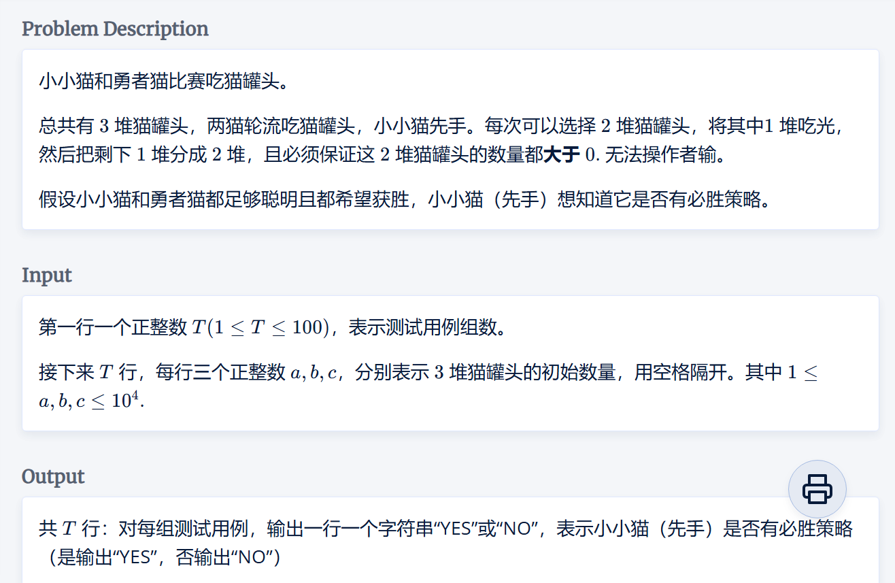
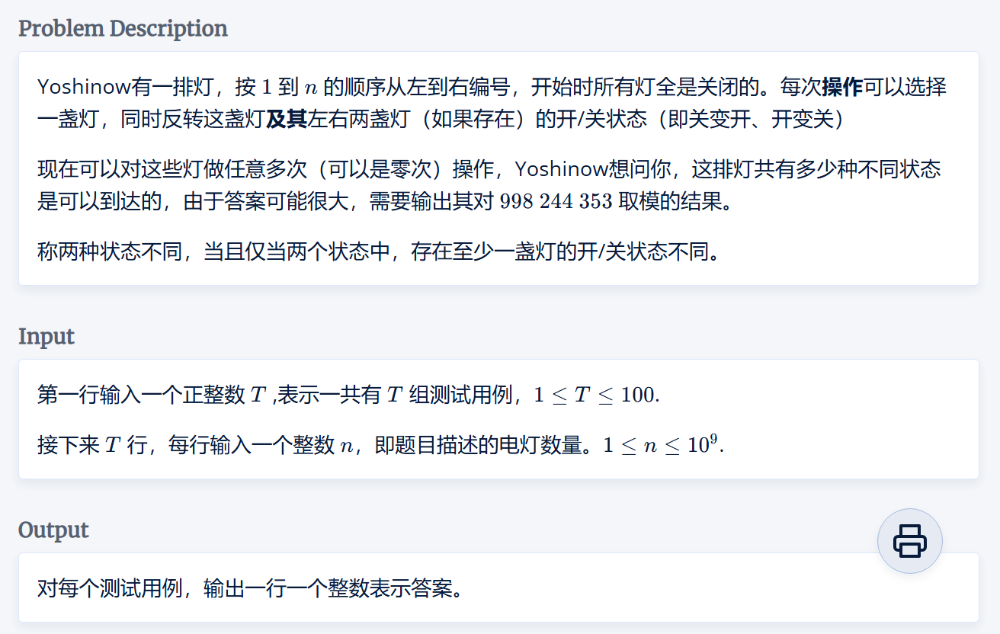
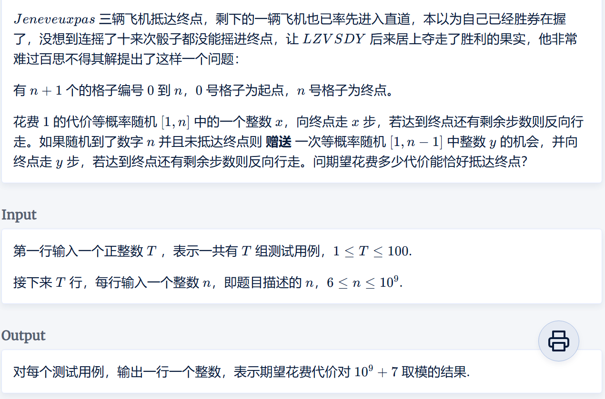
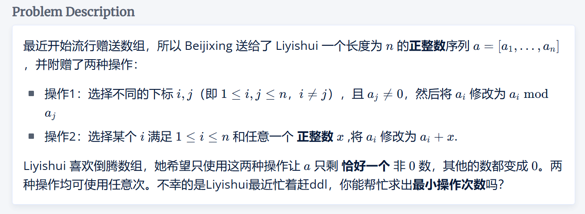
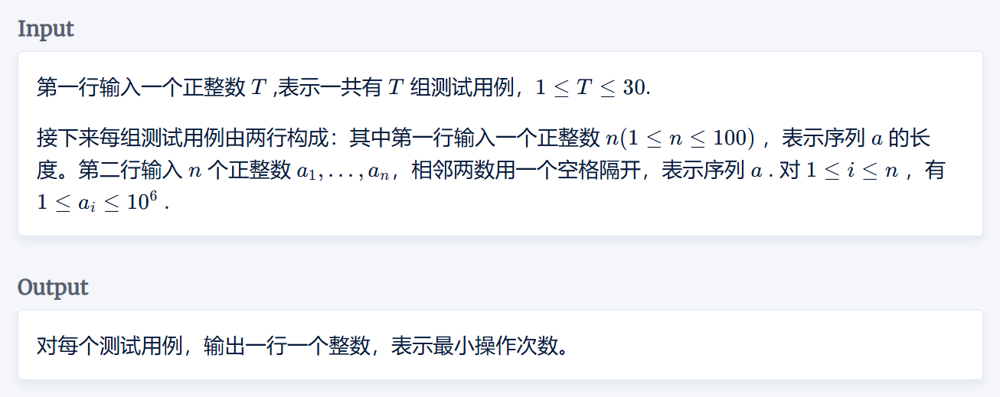

# 杭电多校题目选补

## 猫罐头游戏（博弈论）



```cpp
#include <iostream>
using LL = long long;
LL gcd(LL a, LL b)
{
	return b ? gcd(b, a % b) : a;
}
int T;
int main()
{
	std::cin >> T;
	while(T--)
	{
		LL a, b, c;
		std::cin >> a >> b >> c;
		LL tt = gcd(a, b);
		tt = gcd(tt, c);
		int cnt = 0;
		if (a / tt % 2) cnt++;
		if (b / tt % 2) cnt++;
		if (c / tt % 2) cnt++;
		if(cnt==3)
		{
			std::cout << "NO\n";
		}else
		{
			std::cout << "YES\n";
		}
	}
}
```

## 开关灯（快速幂）



```cpp
#pragma GCC optimize(2)
#include <iostream>
using LL = long long;
const LL MOD = 998244353;

LL multi(LL a, LL b, LL m)  //快速积
{
	LL ans = 0;
	a %= m;
	while (b)
	{
		if (b & 1)
		{
			ans = (ans + a) % m;
			b--;
		}
		b >>= 1;
		a = (a + a) % m;
	}
	return ans;
}
LL pow(LL a, LL b, LL m)	//快速幂
{
	LL ans = 1;
	a %= m;
	while (b)
	{
		if (b & 1)
		{
			ans = multi(ans, a, m);
			b--;
		}
		b >>= 1;
		a = multi(a, a, m);
	}
	return ans;
}

int T;
int main()
{
	std::ios::sync_with_stdio(false);
	std::cin.tie(0);
	std::cout.tie(0);

	std::cin >> T;
	while(T--)
	{
		LL n;
		std::cin >> n;
		if(n%3==2)
		{
			n--;
		}
		LL ans = pow(2, n,MOD) % MOD;
		std::cout << ans << "\n";
	}
}
```

## 飞行棋（推公式、快速幂求逆元）



```cpp
#include <iostream>
int T;
const int MOD = 1e9 + 7;
using LL = long long;
LL multi(LL a, LL b, LL m)  //快速积
{
	LL ans = 0;
	a %= m;
	while (b)
	{
		if (b & 1)
		{
			ans = (ans + a) % m;
			b--;
		}
		b >>= 1;
		a = (a + a) % m;
	}
	return ans;
}
LL pow(LL a, LL b, LL m)	//快速幂
{
	LL ans = 1;
	a %= m;
	while (b)
	{
		if (b & 1)
		{
			ans = multi(ans, a, m);
			b--;
		}
		b >>= 1;
		a = multi(a, a, m);
	}
	return ans;
}

LL infact(LL a, LL MOD)
{
	return pow(a, MOD - 2, MOD);
}
int main()
{
	std::cin >> T;
	while(T--)
	{
		LL n;
		std::cin >> n;
		std::cout <<( n+1*infact(n,MOD) - 1 + MOD) % MOD<<"\n";
	}
}
```

## Array-Gift（最大\小公约数）




题意：如上图

题解：分类讨论发现输出的答案只有 $n-1、n、n+1$ 三种，讨论发现：

1. $n-1$ ：给出的序列出现了与整体 $gcd$ 相同的值
2. $n$ ：有两种，第一种是将序列排序后其最小值小于剩下其他值的 $gcd$ 值。任意选两个值进行操作$1$后得到的余数等于等于剩下值的 $gcd$ 值。
3. $n+1$ ：除以上的其他所有情况，即要先进行一次操作$2$ 后 再进行操作$1$，以得到一个余数$1$。

```cpp
#pragma GCC optimize(2)
#include <iostream>
#include <algorithm>
#include <vector>
#include <cstring>
using LL = long long;
const int N = 110;
int st[N];
LL g[N];
LL q[N];
LL gcd(LL a, LL b)
{
	return b ? gcd(b, a % b) : a;
}
int T;
void solve()
{
	memset(st, 0, sizeof st);
	int n;
	std::cin >> n;
	for (int i = 1; i <= n; i++)
	{
		std::cin >> q[i];
	}
	std::sort(q + 1, q + n + 1);
	for(int i = 1;i<=n;i++)
	{
		if(!st[i])
		{
			for(int j = i+1;j<=n;j++)
			{
				if(q[j]%q[i]==0)
				{
					st[j] = true;
				}
			}
		}
	}
	std::vector<LL> myarr;
	for(int i = 1;i<=n;i++)
	{
		if(!st[i])
		{
			myarr.push_back(q[i]);
		}
	}

	//from here
	LL gg = myarr[0];
	int size = myarr.size();
	for (int i = 1; i < size; i++)
	{
		gg = gcd(gg, myarr[i]);
	}
	if(myarr[0]==gg)
	{
		std::cout << n - 1<<"\n";
		return;
	}
	gg = myarr[1];
	for(int i = 2;i< size;i++)
	{
		gg = gcd(gg, myarr[i]);
	}
	if(gg> myarr[0])
	{
		std::cout << n << "\n";
		return;
	}
	
	for (int i = 0; i < size; i++)
	{
		if (i != 0) gg = myarr[0];
		else gg = myarr[1];
		for(int j = 0;j< size;j++)
		{
			if(i!=j)
			{
				gg = gcd(gg, myarr[j]);
			}
		}
		g[i] = gg;
	}
	for(int i = 0;i< size;i++)
	{
		for(int j = i+1;j< size;j++)
		{
			if(myarr[i]!= myarr[j])
			{
				LL tt = myarr[j] % myarr[i];
				if(tt==g[j])
				{
					std::cout << n << "\n";
					return;
				}
			}
		}
	}
	std::cout << n + 1 << "\n";
}
int main()
{
	std::cin >> T;
	while(T--)
	{
		solve();
	}
}
```
