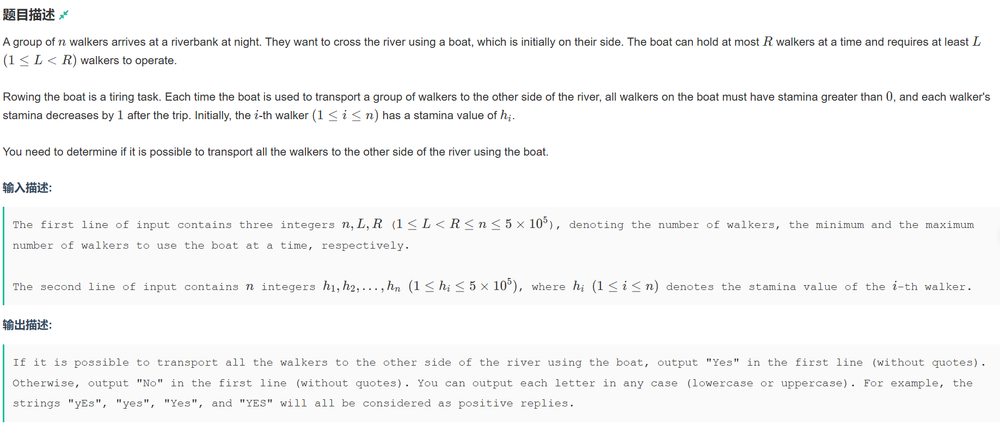
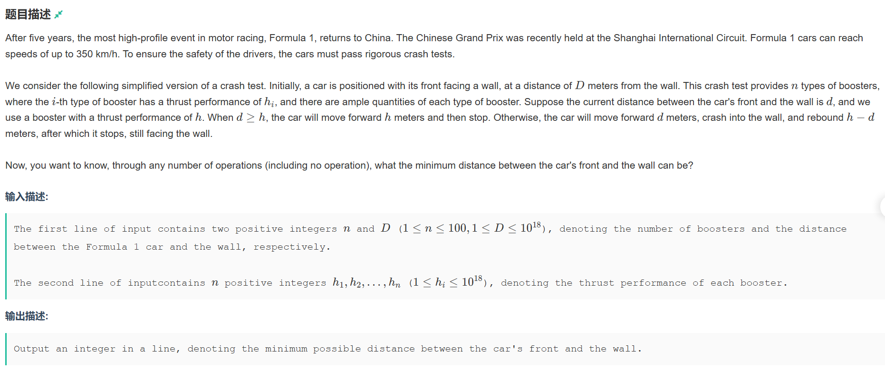

# 牛客多校暑期集训三

## QuestionA



题意：给定n个人和L、R范围值，将这n个人运到对岸，船上的人数规定必须是L~R，每个人都有一个体力值，过一次河消耗一次体力值，求这群人能不能过河。

具体题解在代码中：

```cpp
#include <iostream>
#include <algorithm>
const int N = 5E5 + 7;
int q[N];
int n, L, R;
int player;

int main()
{
	std::cin >> n >> L >> R;
	if(R>=n)
	{
		std::cout << "Yes";
		return 0;
	}
	//第一次运输是一定能成功的，左岸剩下n-R个人
	int leftman = n - R;
	//接下来每次运送能送R-L个人
	int sentevertime = R - L;
	//需要往返的次数为除船夫外的所有人/每次运送的人数(-1是为了防止刚好能整除时造成数据错误)，我们考虑船夫一定能够往返所以需要剪掉他们
	int senttime = (leftman + sentevertime - 1) / sentevertime;
	for (int i = 0; i < n; i++)
	{
		std::cin >> q[i];
		//计算总的能来回的趟数，因为最少需要senttime次，那么这个人的往返次数就不能超过senttime次
		player += std::min((q[i]-1)/2,senttime);
	}
	//std::sort(q, q + n);

	if(player>=senttime * L)
	{
		std::cout << "Yes";
	}
	else
		std::cout << "No";
}
```

## QuestionB



题意：给定车辆距离墙的初始距离 $D$，与 $n$ 个车的助推器可助推距离（助推器可以重复选择），若 $D<H$，那么车辆撞到墙后将会回弹到 $H-D$ 的距离，求最终距离墙的最短距离。

题解：刚开始看这道题想到了贪心、状态转移DP，最后一看数据$1\times10^{18}$。后来想了好久，并且看了过了的人这么多，就寻思着自己可能想复杂了，然后进行了数据打表找规律，最后发现给的样例中似乎$gcd(H_1,H_{i,i,i\in[1,n]})$ 为 1 时均能刚好停到墙前，那么就猜测是否与$gcd$值相关，

```cpp
#include <algorithm>
#include <iostream>
const int N = 110;
using ll = long long;
ll q[N];
ll D;

int n;
ll gcd(ll a,ll b)
{
	while (a % b)
	{
		ll c = a % b;	//c较小
		a = b;
		b = c;
	}
	return b;
}

int main()
{
	std::cin >> n >> D;
	for(int i = 1;i<=n;i++)
	{
		std::cin >> q[i];
	}
	ll t = q[1];
	for(int i = 2;i<=n;i++)
	{
		t = gcd(t, q[i]);
	}
	std::cout << std::min(D % t, std::abs(D % t - t));
}
```
