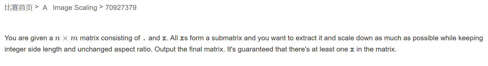
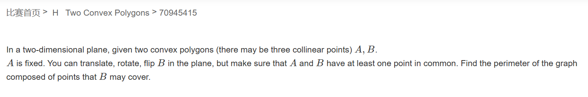
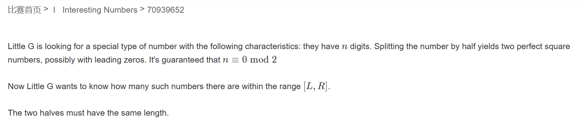
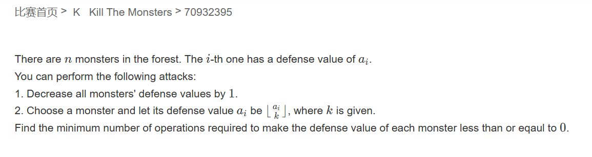

# 牛客多校暑期集训九

## 题A



题意：找到 $x$ 组成的阵列并按其比例不变的情况下的最小缩放

题解：模拟即可

```cpp
#pragma GCC optimize(2)
#include<iostream>
#include<cstring>
const int N=550;
char map[N][N];
int dp[N][N];

int gcd(int a, int b)
{
	return b ? Gcd(b, a % b) : a;
}

int main(){
    int n, m;
    std::cin>>n>>m;
    memset(map, 0, sizeof map);
    for(int i=1; i<=n; ++i){
        std::string str;
        std::cin>>str;
        for(int j=1; j<=m; ++j){
            map[i][j]=str[j-1];
        }
    }
    int x1,y1,x2,y2;
    for(int i=1; i<=n; ++i){
        for(int j=1; j<=m; ++j){
            if(map[i][j]=='x' && map[i-1][j]!='x' && map[i][j-1]!='x'){
                x1=i;
                y1=j;
            }
            if(map[i][j]=='x' && map[i+1][j]!='x' && map[i][j+1]!='x'){
                x2=i;
                y2=j;
            }
        }
    }
    int dx=x2-x1+1;
    int dy=y2-y1+1;

    int ux=dx/gcd(dx, dy);
    int uy=dy/gcd(dx, dy);
    for(int i=1; i<=ux; ++i){
        for(int j=1; j<=uy; ++j){
            std::cout<<'x';
        }
        cout<<"\n";
    }
}
```

## 题H



题意：给两个多边形A和B，A固定，B可以在和A有一个公共点的情况下平移、旋转或翻转，求最终B能组成的图形的周长。

题解：后续出题人给出了忽略B在A内部的情况，如此我们可以想到B的凸包直径为半径且以A为圆心的圆在A上的移动画出的图形的周长即是A的周长加上圆的周长，接下来就是找对算凸包周长和直径的模板即可。

```cpp
#pragma GCC optimize(2)
#include <iostream>
#include <vector>
#include <iomanip>
#include <cstring>
#include <cmath>
#include <algorithm>
#define int long long
#define double long double 
const double PI = std::acos((double) - 1.0);
const int N = 1E6 + 7;
int nB,nA;

const double eps = 1e-10;


int dcmp(double x) {
	return (fabs(x) <= eps) ? 0 : (x < 0 ? -1 : 1);
}
struct Point {
	double x, y;
	Point(double X = 0, double Y = 0) { x = X, y = Y; }
};
struct Vector {
	double x, y;
	Vector(double X = 0, double Y = 0) { x = X, y = Y; }
};
inline Vector operator-(Point x, Point y) {// 点-点=向量
	return Vector(x.x - y.x, x.y - y.y);
}
inline double cross(Vector x, Vector y) { // 向量叉积
	return x.x * y.y - x.y * y.x;
}
inline double operator*(Vector x, Vector y) { // 向量叉积
	return cross(x, y);
}
inline double len(Vector x) { // 向量模长
	return sqrt(x.x * x.x + x.y * x.y);
}

int stk[N];
bool used[N];
int res[N],top;
std::vector<Point> ConvexHull(Point* poly, int n) { // Andrew算法求凸包
	int top = 0;
	memset(used, 0, sizeof(bool) * (n + 4));
	std::sort(poly + 1, poly + n + 1, [&](Point x, Point y) {
		return (x.x == y.x) ? (x.y < y.y) : (x.x < y.x);
		});
	stk[++top] = 1;
	for (int i = 2; i <= n; i++) {
		while (top > 1 && dcmp((poly[stk[top]] - poly[stk[top - 1]]) * (poly[i] - poly[stk[top]])) <= 0) {
			used[stk[top--]] = 0;
		}
		used[i] = 1;
		stk[++top] = i;
	}
	int tmp = top;
	for (int i = n - 1; i; i--) {
		if (used[i]) continue;
		while (top > tmp && dcmp((poly[stk[top]] - poly[stk[top - 1]]) * (poly[i] - poly[stk[top]])) <= 0) {
			used[stk[top--]] = 0;
		}
		used[i] = 1;
		stk[++top] = i;
	}
	std::vector<Point> a;
	for (int i = 1; i <= top; i++) {
		a.push_back(poly[stk[i]]);
	}
	return a;
}

struct Line {
	Point x; Vector y;
	Line(Point X, Vector Y) { x = X, y = Y; }
	Line(Point X, Point Y) { x = X, y = Y - X; }
};

inline double DistanceToLine(Point P, Line x) {// 点到直线的距离
	Vector v1 = x.y, v2 = P - x.x;
	return fabs(cross(v1, v2)) / len(v1);
}


bool mult(Point sp, Point ep, Point op) {
	return (sp.x - op.x) * (ep.y - op.y) >= (ep.x - op.x) * (sp.y - op.y);
}
double RoatingCalipers(std::vector<Point> poly) {// 旋转卡壳
	if (poly.size() == 3) return len(poly[1] - poly[0]);
	int cur = 0;
	double ans = 0;
	for (int i = 0; i < poly.size() - 1; i++) {
		Line line(poly[i], poly[i + 1]);
		while (DistanceToLine(poly[cur], line) <= DistanceToLine(poly[(cur + 1) % poly.size()], line)) {
			cur = (cur + 1) % poly.size();
		}
		ans = std::max(ans, std::max(len(poly[i] - poly[cur]), len(poly[i + 1] - poly[cur])));
	}
	return ans;
}


Point polyA[N];
Point polyB[N];

bool cmp(Point a, Point b) {
	if (a.y == b.y)return a.x < b.x;
	return a.y < b.y;
}

void Graham() {
	int len;
	top = 1;
	std::sort(polyA, polyA + nA, cmp);
	if (nA == 0)return; res[0] = 0;
	if (nA == 1)return; res[1] = 1;
	if (nA == 2)return; res[2] = 2;
	for (int i = 2; i < nA; i++) {
		while (top && mult(polyA[i], polyA[res[top]], polyA[res[top - 1]]))top--;
		res[++top] = i;
	}
	len = top;
	res[++top] = nA - 2;
	for (int i = nA - 3; i >= 0; i--) {
		while (top != len && mult(polyA[i], polyA[res[top]], polyA[res[top - 1]]))top--;
		res[++top] = i;
	}
}


double dist(Point a, Point b) {
	return sqrt((a.x - b.x) * (a.x - b.x) + (a.y - b.y) * (a.y - b.y));
}


int T;
signed main() {
	std::ios::sync_with_stdio(false);
	std::cin.tie(0);
	std::cout.tie(0);
	std::cin >> T;

	while(T--){
		std::cin >> nA;
		for (int i = 0; i < nA; i++) std::cin >> polyA[i].x >> polyA[i].y;
		double ansA = 0;
		Graham();
		for(int i = 0;i<top;i++)
		{
			ansA += dist(polyA[res[i]], polyA[res[i + 1]]);
		}
		//std::cout << ansA << "\n";
		std::cin >> nB;

		for (int i = 1; i <= nB; i++) std::cin >> polyB[i].x >> polyB[i].y;
		double v = RoatingCalipers(ConvexHull(polyB, nB));

		std::cout <<std::fixed<<std::setprecision(15)<< (ansA + 2 * PI * v)<<"\n";
		
	}
	
}
```

## 题I



题意：求区间$[L,R]$中满足数字砍半后左右均是平方数的数字个数。

题解：此题思维上不难，二分找答案即可，但问题在于数字非常大，用C/C++会很难实现，所以借用Python去写。

```py
def sq(n,m):
    l=1
    r=1
    while r**m<=n:
        l=r
        r*=2
    while l<=r:
        mid=(l+r)//2
        if(mid**m<=n):
            l=mid+1
        else:
            r=mid-1
    return r

n=int(input())
l,r=map(int,input().split())
ll=int(str(l)[:(n//2)])
lr=int(str(l)[(n//2):])
rl=int(str(r)[:(n//2)])
rr=int(str(r)[(n//2):])
sum=0

maxsum=int('9'*(n//2))
maxsq=sq(maxsum,2)
rlsq=sq(rl,2)
cntr=0
if(rlsq*rlsq==rl):
    rrsq=sq(rr,2)
    sum=sum+rrsq+1
else:
    sum=sum+maxsq+1

lleft=sq(ll,2)
if(lleft*lleft==ll):
    lrsq=sq(lr,2)
    cntl=1
    if(lrsq*lrsq==lr):
        sum=sum+maxsq-lrsq+1
    else:
        sum=sum+maxsq-lrsq
t=rlsq-lleft-1
sum=sum+t*(maxsq+1)
print(sum)
```

## 题K



题意：可选两个操作，一个是将所有值减一，二是对某个值取$\lfloor \frac{a_i}{k}\rfloor$，求最小的操作数使得整个序列值为0。


```cpp
#pragma GCC optimize(2)
#include <iostream>
#include <queue>

int n, k;

std::priority_queue<int> q;

int main()
{
	std::ios::sync_with_stdio(false);
	std::cin.tie(0);
	std::cout.tie(0);

	std::cin >> n >> k;
	for(int i = 0;i<n;i++)
	{
		int a;
		std::cin >> a;
		q.push(a);
	}
	int cnt = 0;
	int INF = q.top();
	int ans = 0;
	if(k==1)
	{
		std::cout << INF;
		return 0;
	}
	int current = q.top();
	while(1)
	{
		int t = q.top();
		q.pop();
		q.push(t / k);
		cnt++;
		if(cnt>=current) break;
		if(current>=cnt+q.top())
		{
			current = q.top();
			ans += cnt;
			cnt = 0;
		}

	}
	std::cout << ans + current;
}
```