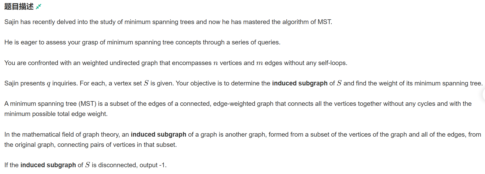
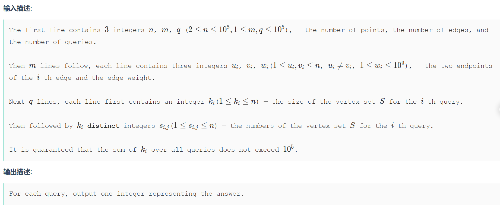
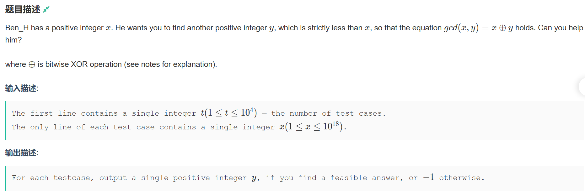
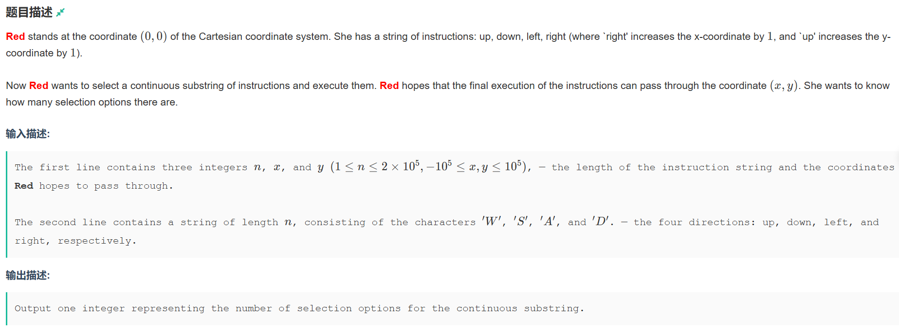
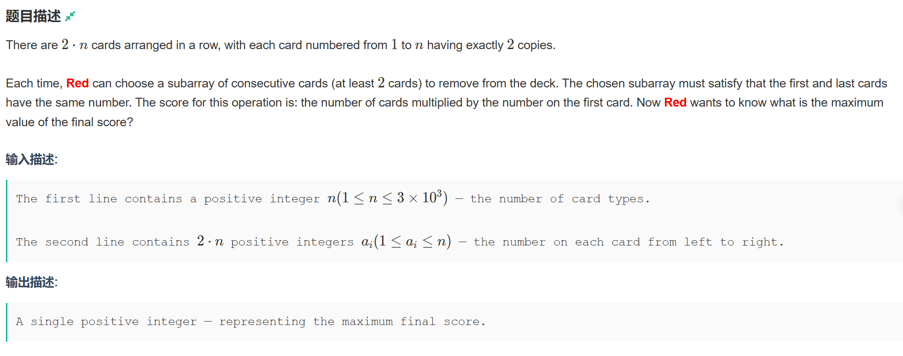

# 牛客多校暑期集训二

## 题B




很裸的最小生成树问题，区别在于求多个子图的生成树的代价，那么就需要更具子图的稠密程度来分算法实现，因为只求生成树代价，那么kruscal可以考虑并查集去优化，而prime需要使用map去存一下图。

```cpp
#pragma GCC optimize(2)
#include <iostream>
#include <algorithm>
#include <cstring>
#include <unordered_set>
#include <cmath>
#include <unordered_map>
using ll = long long;
const ll INF = 1e16;
const int N = 2e5 + 7;
std::unordered_set<int> s;	//prime算法存有效节点
std::unordered_map <int, ll> mp[N];	//prime算法存图
ll dist[N];
int n, m, q,k;

int p[N];
int st[N];

struct node
{
	int a;
	int b;
	int w;
	bool operator<(const node& d) const
	{
		return w < d.w;
	}
}Nodes[2 * N];
int find(int x)     //并查集+路径优化，用于储存各棵树
{
	if (p[x] != x) p[x] = find(p[x]);
	return p[x];
}

void kruscal()
{
	int count = 1;
	ll sum = 0;
	
	memset(p, 0, sizeof p);
	for (int o = 0; o < k; o++)
	{
		int op;
		std::cin >> op;
		p[op] = op;	//同时初始化树，不在子图里的自动初始化为0
	}

	for (int i = 0; count != k && i < m; i++) //如果森林里只剩一棵树了可以提前结束，减少时间消耗
	{
		int a = Nodes[i].a, b = Nodes[i].b, w = Nodes[i].w;
		a = find(a), b = find(b);
		if (a != 0 && b != 0 && a != b)
		{
			sum += w;
			++count;
			p[a] = b;
		}
	}
	if (count < k) std::cout << -1 << std::endl;
	else std::cout << sum << std::endl;
}

void prime()
{
	s.clear();
	int u;
	for (int i = 1; i <= k; i++) {
		std::cin >> u;
		s.insert(u);
	}
	ll res, cnt;

	for (auto& v : s) {
		dist[v] = INF;
	}

	dist[*s.begin()] = 0;
	res = cnt = 0;

	while (s.size()) {

		ll mn = INF;
		int pos = 0;

		for (auto& v : s) {
			if (mn > dist[v]) {
				mn = dist[v];
				pos = v;
			}
		}

		if (pos == 0) break;

		s.erase(pos);
		res += mn;
		cnt++;

		for (auto& v : s) {
			auto it = mp[pos].find(v);
			if (it == mp[pos].end()) continue;
			dist[v] = std::min(dist[v], it->second);
		}

	}

	if (s.size() != 0) std::cout << -1 << std::endl;
	else std::cout << res << std::endl;
}

int main()
{
	std::ios::sync_with_stdio(false);
	std::cin.tie(0);
	std::cout.tie(0);
	std::cin >> n >> m >> q;
	int copy = m;
	for (int i = 0; i < m; i++)
	{
		int a, b, c;
		std::cin >> a >> b >> c;
		mp[a][b] = c;
		mp[b][a] = c;
		if (a != b)
		{
			Nodes[i] = { a,b,c };
		}
	}
	std::sort(Nodes, Nodes + copy);     //以边的长度进行排序
	for (int j = 0; j < q; j++)
	{
		
		std::cin >> k;
		if(k>std::sqrt(n))	//根据图的稠密与否来选择算法
		{
			kruscal();
		}else
		{
			prime();
		}
		
	}
}
```

## 题E



题意为构建一个$x、y$的公约数等于$x\oplus y$ 的值，输出一个即可。

思路：根据题意一次lowbit的值一定满足，若一次lowbit为0即没有这个数。

```cpp
#include <iostream>

using ll = long long;
int n;
ll lowbit(ll x)
{
	return x & -x;
}

int main()
{
	std::cin >> n;
	while(n--)
	{
		ll m;
		std::cin >> m;
		ll low = lowbit(m);
		ll ans = m - low;
		if (ans) std::cout << ans << std::endl;
		else std::cout << -1 << std::endl;
	}
}
```

## 题H



题意为在一个x、y 坐标系中进行‘上’、‘下’、‘左’和‘右’的操作串，目的是经过给定的定点的操作子串集合。

思路：很明显能想到前缀和，先保存以$str[0]$ 为起点的每种子串所能到达的地方。而后我们反向思考，如若从目标点经过某个前缀子串$a$的操作，能够到达另一个前缀子串$b$的终点，那么我们就可以说以子串$a-b$为前缀串的操作串都可以经过目标点，也就是差分的思想，数学表达式即是：
$$[0,r_a] - [0,r_b] = 目标点$$
那我们只需要求这个$[0,r_b]$是否存在
$$[0,r_a] = 目标点 + [0,r_b]$$

```cpp
#include <iostream>
#include <map>
#include <queue>
int n, x, y;
const int N = 2E5 + 7;
int sumX[N], sumY[N];
char str[N];
int X[] = { -1,1 };
int Y[] = { 1,-1, };
std::map<std::pair<int, int>, std::queue<int>> mymap;

int main()
{

	std::cin >> n >> x >> y;
	if(x==0&&y==0)
	{
		std::cout << ((n * (n - 1)) >> 1);
		return 0;
	}
	mymap[{0, 0}].push(0);
	for (int i = 1;i<=n;i++)
	{
		char c;
		std::cin >> c;
		
		if(c=='W')
		{
			sumY[i] = sumY[i - 1] + Y[0];
			sumX[i] = sumX[i - 1];
		}
		else if (c == 'S')
		{
			sumY[i] = sumY[i - 1] + Y[1];
			sumX[i] = sumX[i - 1];


		}else if(c=='A')
		{
			sumY[i] = sumY[i - 1];
			sumX[i] = sumX[i - 1] + X[0];
		}else if(c=='D')
		{
			sumY[i] = sumY[i - 1];
			sumX[i] = sumX[i - 1] + X[1];
		}
		mymap[{sumX[i], sumY[i]}].push(i);
	}
	long long res = 0;
	
	for (int i = 0; i <= n; i++)
	{
		int beginx = x + sumX[i], beginy = y + sumY[i];
		if (!mymap[{beginx, beginy}].empty())
			res += n - mymap[{beginx, beginy}].front() + 1;
		mymap[{sumX[i], sumY[i]}].pop();
	}
	std::cout << res;
}
```

## 题I



题意为给定一个$n$和一个长度为$2n$的序列，序列中$1~n$各出现两次，只可以消去相同数字内的区间内容，消除的代价计算方法是这个数字乘以这个区间的长度，而后更新序列继续操作直至无法操作。

$$代价 = nums[l]*(r-l+1)$$

思路：可以想到的是区间合并问题，但因为每次合并都会造成位置变化，所以需要内部嵌套dp。

步骤：

1. dp[i]定义为合并数字 $i$ 区间 $[l_i,r_i]$ 的代价，可以给每个dp[i]赋初值 $i$。
2. 考虑若存在数字 $j$ 所处区间为 $l_i<l_j<r_j<r_i$ ，那么我们就需要计算是先合并内部再合并外部 还是合并外部忽略内部的值哪个大从而更新dp[i]的值。
3. 根据定义，我们以区间长度从小到达来更新dp
4. 计算最大值 g(k)的 状态转移式为:

$$g(k) = \begin{cases}
	max(g(k-1) + i,g(l_j-1) + dp[j]) ~~~~~~~k = r_j \And l_i<l_j\\
	g(k-1) + point~~~~~~~~~~~~~~~~~~~~~~~~~~~~~~~~~~~~otherwise
\end{cases}$$

5. 根据定义我们知道，$f(i) = g(r_i)$

此题一个小技巧是将首位定为0，那么我们的答案就是dp[0]

```cpp
#include <iostream>
#include <utility>
#include <vector>
#include <queue>
#include <map>
using pii = std::pair<int, int>;
std::map<int,std::vector<int>> mymap; 	//存储每一个i 对应的左右端点下标
using ll = long long;
std::priority_queue<pii,std::vector<pii>,std::greater<>> q;	//以区间长度排序
const int N = 3E3 + 7;
int nums[2 * N];
int dp[N];
int n;

int main()
{
	std::cin >> n;
	for (int i = 0; i <= n; i++) dp[i] = i;
	
	q.push({ 2*n+2,0 });
	mymap[0].push_back(0);
	mymap[0].push_back(2 * n + 1);
	nums[0] = 0;
	nums[2 * n + 1] = 0;
	for (int i = 1; i <= 2 * n; i++)
	{
		int a;
		std::cin >>a;
		nums[i] = a;
		mymap[a].push_back(i);
		if (mymap[a].size() > 1)
		{
			q.push({ mymap[a][1] - mymap[a][0] + 1,a});
		}
	}
	while (q.size()) {
		int point = q.top().second;
		int l_i = mymap[point][0], r_i = mymap[point][1];
		std::vector<int> g(2 * n+2);
		for (int midpoint = l_i; midpoint <= r_i; midpoint++)
		{

			int l_j = mymap[nums[midpoint]][0], r_j = mymap[nums[midpoint]][1];

			if (l_i < l_j && midpoint == r_j)
			{
				g[midpoint] = std::max(g[midpoint - 1] + point, g[l_j - 1] + dp[nums[r_j]]);
			}
			else if(midpoint!=0) g[midpoint] = g[midpoint - 1] + point;
		}
		dp[point] = g[r_i];
		q.pop();
	}
	std::cout << dp[0];
}

```


