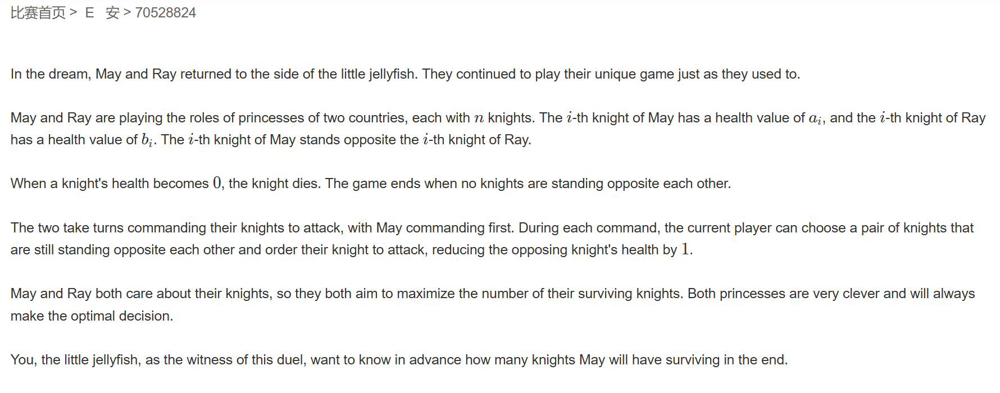
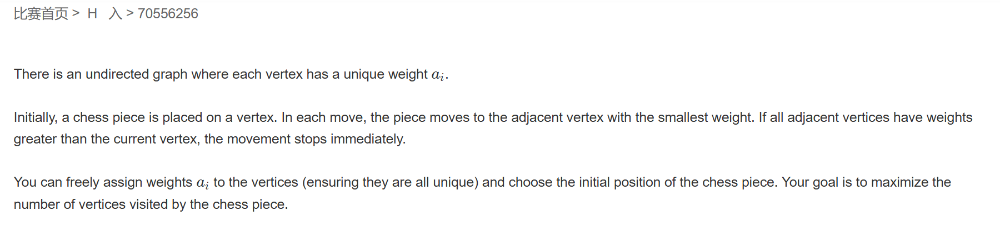

# 牛客多校暑期集训五

## 题E



题意：给两个数组，同一下标为一对敌我，每次操作扣对方一血，求第一个数组最后还剩多少个数字不为 $0$。

题解：博弈论签到，找到比对方血多的，如果有血量相同的累计一下 $+1$ $/2$ 即可

```cpp
#pragma GCC optimize(2)
#include <iostream>
const int N = 1e5 + 7;
int qA[N], qB[N];
int T;
int n;
int main()
{
	std::ios::sync_with_stdio(false);
	std::cin.tie(0);
	std::cout.tie(0);
	std::cin >> T;
	while(T--)
	{
		std::cin >> n;
		int ans = 0;
		for (int i = 0; i < n; i++) std::cin >> qA[i];
		for (int i = 0; i < n; i++) std::cin >> qB[i];
		int same = 0;
		for(int i = 0;i<n;i++)
		{
			if (qA[i] > qB[i]) ++ans;
			else if (qA[i] == qB[i]) ++same;
		}
		std::cout << ans + ((same + 1) >> 1) << "\n";
	}
}
```

## 题H



题意：给一给无向图，而后可自定义给任意节点以任何权值，可自选起点，每次移动到当前节点相连的节点中权值最小的节点，直至无法再移动，求经过的最多的节点数。

题解：这题题眼在于发现走下一步时，该节点一定在与当前节点连接的情况下不会连向已走过的节点。如此进行 $dfs$ 即可。

```cpp
#pragma GCC optimize(2)
#include <iostream>
#include <vector>
const int N = 45;
std::vector<int> g[N];
int st[N];
int n, m;

int ans = 1;
void dfs(int u, int len)
{
	ans = std::max(len, ans);
	for (auto& t : g[u])
	{
		int op = true;
		for(auto&p : g[t])
		{
			if(u!=p&&st[p])
			{
				op = false;
				break;
			}
		}
		if(op)
		{
			if(!st[t])
			{
				st[t] = true;
				dfs(t, len + 1);
				st[t] = false;
			}
		}
	}
}

int main()
{
	std::ios::sync_with_stdio(false);
	std::cin.tie(0);
	std::cout.tie(0);
	std::cin >> n >> m;
	for (int i = 0; i < m; i++)
	{
		int u, v;
		std::cin >> u >> v;
		g[u].push_back(v);
		g[v].push_back(u);

	}
	for (int i = 1; i <= n; i++)
	{
		st[i] = true;
		dfs(i, 1);
		st[i] = false;
		
	}
	std::cout << ans;
}
```