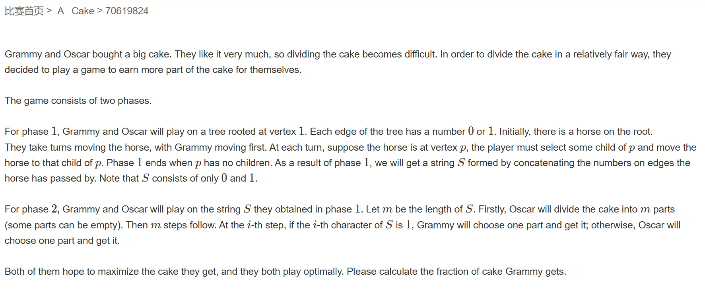
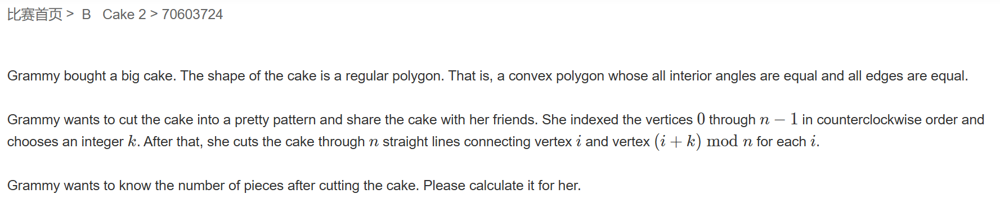
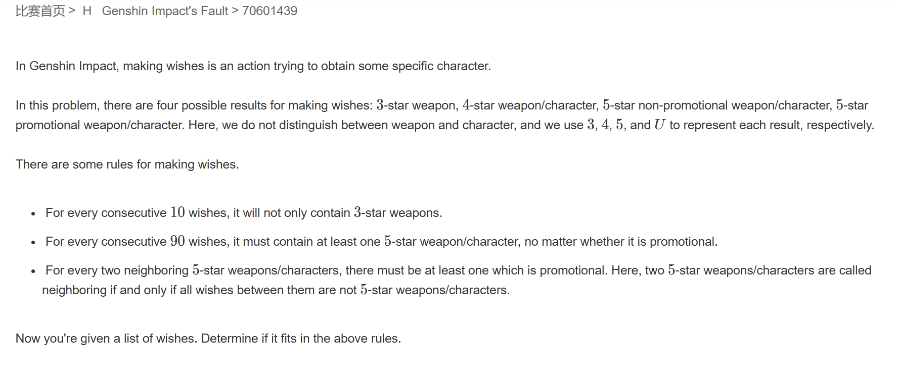

# 牛客多校暑期集训六

## 题A



题意：第一部分，给定一棵树，节点的距离分别为 $0$ 或 $1$，格莱美先选，奥斯卡后选，最后可以得到一个 $01$ 序列 $S$，第二部分由奥斯卡将蛋糕分为 $m$ 份（每一份的大小可以不一样甚至没有），而后根据得到的 $S$ 序列从前向后 $0$ 由奥斯卡拿走其中一份，$1$ 由格莱美拿走其中一份，假设两人都采取最优策略，求格莱美最后得到的蛋糕比例。

题解：一道典型的树形DP，首先我们需要发现终止态由奥斯卡决定，最后奥斯卡得到的蛋糕比例是其所有路径上 $0$ 占比最大的子路径（树根到该节点）。而后我们正向dp记录每个以每个节点为尾的子序列 $0$ 的数量和该节点的深度，而后倒着dp得到 $0$ 占比最大的子路径最大值。

```cpp
#include <iostream>
#include <algorithm>
const int N = 2E5 + 7;
int e[2 * N], ne[2 * N], w[2 * N], h[2 * N], idx,height[2*N];
int dp[N];
double dp2[N];
void add(int a, int b,int c)      //a->b
{
	e[idx] = b;        
	ne[idx] = h[a];     
	w[idx] = c;
	h[a] = idx++;      
}
int T;

bool vis[N];
void dfs(int u,int state)
{
	height[u] = state;
	vis[u] = 1;
	for(int i = h[u];i!=-1;i = ne[i])
	{
		if (vis[e[i]]) continue;
		int j = e[i];
		if (w[i] == 0)
			dp[j] = dp[u] + 1;
		else
			dp[j] = dp[u];
		dfs(j, state + 1);
	}
	vis[u] = 0;
}

void dfs2(int u)
{
	double cans, ans = -1.0;
	if (height[u] == 1)
		cans = 0;
	else
		cans = (double)dp[u] / (height[u] - 1);
	vis[u] = 1;
	for (int i = h[u]; i != -1; i = ne[i])
	{
		
		int j = e[i];
		if(vis[j]) continue; 
		dfs2(j);

		if (height[u] % 2)
		{
			if (ans == -1)ans = dp2[j];
			ans = std::min(ans, dp2[j]);
		}
		else
		{
			if (ans == -1)ans = dp2[j];
			ans = std::max(ans, dp2[j]);
		}
	}
	dp2[u] = std::max(cans, ans);
	vis[u] = 0;
}

void solve()
{
	idx = 0;
	int n;
	std::cin >> n;
	for (int i = 0; i <= n; i++) h[i] = -1;
	for (int i = 0; i < n - 1; i++)
	{
		int a, b, c;
		std::cin >> a >> b >> c;
		add(a, b, c);
		add(b, a, c);
	}
	dfs(1,1);
	dfs2(1);
	printf("%.12f\n",1.0 - dp2[1]);

}
int main()
{
	std::cin >> T;
	while(T--)
	{
		solve();
	}
}
```

## 题B



题意：给一个正 $n$ 边形，连接所有距离为 $k$ 的顶点，求多边形内部被划分成多少个区域。

题解：手搓几个图，发现 $k = \frac{n}{2}$ 时正好可以分为 $n$ 份，其余则为 $n\times min(k，n-k)+1$

```cpp
#include <iostream>
using namespace std;

void mr(){
    long long n,k;
    cin>>n>>k;
    if(n==2*k){
        cout<<n<<"\n";
    }else{
        k=min(k,n-k);
        cout<<n*k+1<<'\n';
    }
}
int main(){
    int t=1;
    while(t--){
        mr();
    }
    return 0;
}
```

## 题H



题意：原神，____！抽奖中每十次必有 $4、5、U$ 其中一种或多种存在，每九十次必有 $5、U$ 其中至少一个出现。规则中若上一次出现的是 $5$ 那么下一次一定出现 $U$。求给的序列是否合法。

题解：模拟即可

```cpp
#pragma GCC optimize(2)
#include <iostream>
#include <string>

std::string str;
int T;


int main()
{
	std::ios::sync_with_stdio(false);
	std::cin.tie(0);
	std::cout.tie(0);
	std::cin >> T;
	while(T--)
	{
		int cnt4 = 10, cnt5 = 90, cntu = 2;
		bool isOK = true;
		std::cin >> str;
		for(int i = 0;i<str.size();i++)
		{
			cnt4--; cnt5--;
			if(str[i]!='3')
			{
				cnt4 = 10;
			}
			if(str[i]=='5')
			{
				cntu--;
				cnt5 = 90;
			}
			if(str[i]=='U')
			{
				cntu = 2;
				cnt5 = 90;
			}
			if(!cnt4||!cnt5||!cntu)
			{
				isOK = false;
				break;
			}
		}
		if (isOK) std::cout << "valid\n";
		else std::cout << "invalid\n";
	}
}
```