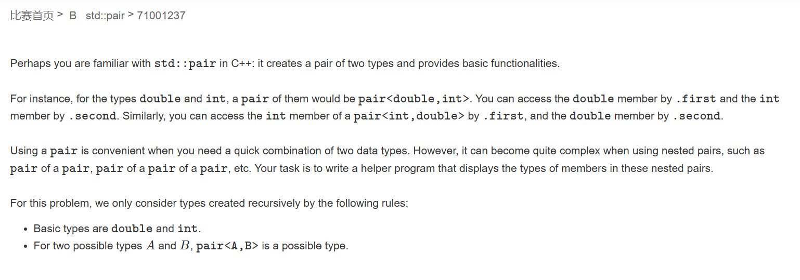

# 牛客多校暑期集训十

## 题A


```cpp
#include <iostream>
using namespace std;

int main(){
    int y=0,n=0;
    for(int i=0;i<5;i++){
        char c;
        cin>>c;
        if(c=='Y')y++;
        else if(c=='N')n++;
    }
    if(y>=4)cout<<"1\n";
    else if(n>=2)cout<<"-1\n";
    else cout<<"0\n";
    return 0;
}
```

## 题B



```cpp
//#pragma GCC optimize(2)
#include <iostream>
#include <vector>
#include <string>
#include <map>
using namespace std;

struct node {
	//string s;
	enum type {
		p, i, d
	};
	type t;
	int l, r;
	node(){}
	//node(node& b) :t(b.t), l(b.l), r(b.r) {};
	node(type t, int l, int r) :t(t), l(l), r(r) {};
};
vector<node> nod[1005];
vector<int> cnt(1005);
map<string, int> var_id;
int dfs(int n, string& s, int& p, int fa) {
	int curr = cnt[n]++;
	
	if (s[p] == 'p') {
		p += 5;
		nod[n].emplace_back(node::p, 0, 0);
		nod[n][curr].l = dfs(n, s, p, curr);
		p++;
		nod[n][curr].r = dfs(n, s, p, curr);
		//nod[n][curr].t = node::p;
		p++;
	}
	else if (s[p] == 'i') {
		p += 3;
		nod[n].emplace_back(node::i, 0, 0);
		//nod[n][curr].t = node::i;
		//nod[n][curr].l = nod[n][curr].r = 0;
	}
	else if (s[p] == 'd') {
		p += 6;
		nod[n].emplace_back(node::d, 0, 0);
	}
	return curr;
}
void check(int n, int curr) {
	switch (nod[n][curr].t) {
	case node::p:
		cout << "pair<";
		check(n, nod[n][curr].l);
		cout << ',';
		check(n, nod[n][curr].r);
		cout << ">";
		break;
	case node::i:
		cout << "int";
		break;
	case node::d:
		cout << "double";
		break;
	}
}
int main(){
	int n, q;
	cin >> n >> q;
	for (int i = 0; i < n; i++) {
		string type_s;
		cin >> type_s;
		int p = 0;
		dfs(i, type_s, p, 0);
		cin >> type_s;
		var_id[type_s.substr(0, type_s.size() - 1)] = i;
		//cout << "get var name = " << type_s.substr(0, type_s.size() - 1) << endl;
	}
	for (int i = 0; i < q; i++) {
		string type_s;
		cin >> type_s;
		auto p = type_s.find(".");
		string name = type_s.substr(0, p);
		int id = var_id[name];
		//cout << "get name = " << name << " id = " << id << endl;
		int curr = 0;
		while (p < type_s.size()) {
			if (type_s[p + 1] == 'f') {
				curr = nod[id][curr].l;
				p += 6;
			}
			else {
				curr = nod[id][curr].r;
				p += 7;
			}
		}
		check(id, curr);
		cout << "\n";
	}
	return 0;
}
```

## 题F


```cpp
#pragma GCC optimize(2)
#include <iostream>
#include <cstring>
#include <vector>
const int N = 1007;
int gcd(int a, int b)
{
	if (b == 0)return a;
	return gcd(b, a % b);
}
struct line
{
	int x1, y1;
	int x2, y2;
	line(int x1,int y1,int x2,int y2)
		:x1(x1),y1(y1),x2(x2),y2(y2)
	{}
};
struct point
{
	int x, y;
	
	point(int x1, int y1)
		:x(x1), y(y1)
	{}
};
int st[N][N];
std::vector<line> lines;
std::vector<point> points;

bool check(int x,int y)
{
	bool op = true;
	for(auto& t : lines)
	{
		if((long long)(y-t.y2)*(t.x1-t.x2)==(long long)(x-t.x2)*(t.y1-t.y2))
		{
			return false;
		}
	}
	return true;
}
std::vector<int> ans;
int main()
{
	std::ios::sync_with_stdio(false);
	std::cin.tie(0);
	std::cout.tie(0);

	int n;
	std::cin >> n;
	for(int i = 1;i<=n*n;i++)
	{
		int x, y;
		std::cin >> x >> y;
		if(!st[x][y]&&check(x,y))
		{
			st[x][y] = 1;
			ans.push_back(1);
			for(auto& t : points)
			{
				lines.push_back({ t.x,t.y,x,y });
				int dy = y - t.y;
				int dx = x - t.x;
				int g = gcd(std::abs(dx), std::abs(dy));
				dx /= g;
				dy /= g;
				for(int tx = x,ty=y;tx<=n&&ty<=n&&tx>=1&&ty>=1;tx+=dx,ty+=dy)
				{
					st[tx][ty] = 1;
				}
				for (int tx = x, ty = y; tx <= n && ty <= n && tx >= 1 && ty >= 1; tx -= dx, ty -= dy)
				{
					st[tx][ty] = 1;
				}

			}
			points.push_back({ x,y });
		}
		else
		{
			ans.push_back(0);
		}
	}
	for (auto& t : ans) std::cout << t;
}
```

## 题H


```cpp
#include <iostream>
using namespace std;
const long long mod=998244353;

long long ksm(long long a, long long b) {
  long long res = 1;
  while (b > 0) {
    if (b & 1) res = res * a % mod;
    a = a * a % mod;
    b >>= 1;
  }
  return res;
}
int main(){
    
    long long a,b;
    cin>>a>>b;
    long long u = ksm(a+b,(mod-2));
    
    cout<<a*u%mod<<" "<<b*u%mod<<"\n";
    return 0;
}
```