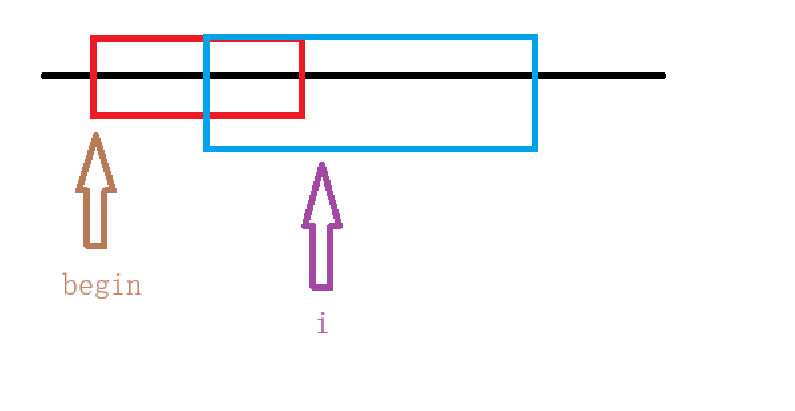

# 牛客多校暑期集训四

这次给的时间限制明显宽松很多，导致很多题一开始想复杂了

## QuestionC


题意：给一个自然数组成的序列（无重复数字与大于$n$的数字），最多选四个元素进行交换请问最少操作数使得序列有序。

题解：这个序列很明显可以进行建环操作，建立一个值对下标的映射，如此我们会找到二元环、三元环、四元环和超四圆环，此题的坑在于二元环的计算要放到最后，因为当我们操作完超四圆环时，很可能出现

## QuestionG


题解：哎，老马啊~~~

```cpp
#include <iostream>
#include <cmath>
#include <iomanip>
const double eps = 1e-9;
double xg, yg, xt, yt;
int T;
int main()
{
	std::cin >> T;
	while(T--)
	{
		std::cin >> xg >> yg >> xt >> yt;

		double dist1 = (xg + xt) * (xg + xt) + (yt - yg) * (yt - yg);
		double dist2 = (xg - xt) * (xg - xt) + (yt + yg) * (yt + yg);

		double ans = std::min(dist1,dist2);
		if (sqrt(ans) - (int)sqrt(ans) <= eps)
			std::cout << sqrt(ans) << std::endl;
		else
			std::cout << std::fixed << std::setprecision(10) << std::sqrt(ans) << std::endl;
	}
}
```

## QuestionH


## QuestionI


题意：给一个无向图，求在有序序列 $1$~$n$ 中有几个 $[l,r]$ 序列中的点是完全图（注意$l\leq r$）。

题解：因为序列有序，我们当成有向图使用链式前向星去存储，而后记录每个点的入度。开一个快慢指针，$begin$ 用来记录满足条件的连续序列的 $l$ ， $i$ 作为满足条件的连续序列的 $r$ 的下一个位置。可以想到，每次我们只需要找到以 $begin$ 为起点最长的序列就可以通过 ${len \choose 2}$ 计算出来（注意 $l$ 可以等于 $r$，统计时为了避免重复统计这个情况长度需要$-1$），此时我们更新 $begin$ 指针，直到序列重新满足入度等于前缀长度时再去更新右指针，同时我们需要在更新时删去前面这部分节点对后面节点入度的贡献，这样我们就能保证这个序列的长度等于最后一个元素的入度，记得更新前删除重复的部分，如图：

1. 找到满足的序列



2. 更新 $begin$ 指针直至再次满足条件


3. 更新 $i$ 指针，直至找到下一个以 $begin$ 为起点的最长序列


```cpp
#include<iostream>
#include <cstring>
const int N = 1e6 + 7;
int h[2 * N], next[2 * N], value[2 * N],idx;
int inD[N];
int n, m;

void add(int a,int b)
{
	value[idx] = b, next[idx] = h[a], h[a] = idx++;
}
int main()
{
	std::cin >> n >> m;
	std::memset(h, -1, sizeof h);
	int a, b;
	for (int i =  1;i <= m;i++)
	{
		std::cin >> a >> b;
		add(a, b);
		++inD[b];
	}
	int ans = 0;
	int begin = 1;
	for(int i = 1;i<=n+1;i++)
	{
		if(i==n+1||inD[i]!=i-begin)
		{
			ans += (i - begin - 1) * (i - begin) / 2 ;
			int j = begin;
			while(j<i&&inD[i] != i - j){
				for (int k=h[j];k!=-1;k=next[k])
				{
					inD[value[k]]--;
				}
				++j;
			}
			begin = j;
			ans -= (i - begin - 1) * (i - begin) / 2;   //减去重复计算的部分
		}
	}
	std::cout << ans + n;   //最后记得加上 l == r 的所有情况
}
```